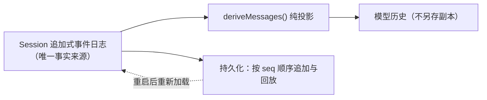

# 第 1 章：事件溯源会话（Event-Sourced Session）——核心之核

> 对应 dsh 真实源码：`packages/core/session`（`docs/subsystems/session.md`）
> 前置：第 00 章。产出文件：`miniharness/miniharness/session.py` + `tests/test_session.py`

## 1.1 本章目标

- 实现一个追加式事件日志 `Session`：`seq` 连续、坏事件进不来、日志不可变
- 实现 `derive_messages()` 纯投影：模型历史只从这里派生，**绝不另存副本**
- 实现 `turn` 括号平衡不变量与崩溃修复

掌握这句话就掌握了 dsh 的根基：

> **模型可见 ⟺ 已记录**。任何进入模型请求的内容，必须能从日志重建；新增任何模型可见输入，必须新增一种 session 事件。

## 1.2 概念：为什么是"事件日志"而不是"消息数组"

普通聊天程序维护一个 `messages: list[Message]`，随对话 append。dsh 不这么做，原因有三：

1. **可回放**：日志是"发生了什么"的完整事实，模型历史只是它的一个投影（projection）。压缩、换模型、修 bug 后重放，历史可重新派生。
2. **单一事实来源**：UI、持久化、回放、模型历史都读同一份日志。不存在"内存消息"和"磁盘消息"两份副本漂移的问题。
3. **可扩展**：新事实（工具结果、上下文注入、目标更新）= 新事件类型。插件用声明合并往 `SessionEventMap` 加类型，不触碰核心。



## 1.3 代码 step-by-step

### 步骤 1：定义事件类型集合

```python
KNOWN_TYPES = frozenset({
    "turn/start", "turn/end", "step/start", "step/end",
    "user/message", "assistant/message", "assistant/chunk",
    "tool/call", "tool/result",
})

SURFACE_TYPES = frozenset({"user/message", "assistant/message", "tool/result"})
```

- `KNOWN_TYPES` 是"仓库级硬规则"：新模型可见输入 = 往这里加新类型 + 定义投影规则。
- `SURFACE_TYPES` 是三种"产生消息"的事件：它们携带 `surfaceOp`（`append` 或 `replace`），决定历史投影的顺序与压缩替换。

### 步骤 2：无损 JSON 强制 + 深度冻结

```python
def is_json_safe(value):
    """无法序列化的值（含 NaN/Infinity）直接判非法。"""
    try:
        json.dumps(value, ensure_ascii=False, allow_nan=False)
        return True
    except (TypeError, ValueError):
        return False

def deep_freeze(value):
    """dict → 只读代理，list → tuple。冻结后任何修改都抛 TypeError。"""
    if isinstance(value, dict):
        return MappingProxyType({k: deep_freeze(v) for k, v in value.items()})
    if isinstance(value, list):
        return tuple(deep_freeze(v) for v in value)
    return value
```

> 真实 dsh 用 `append()` 在源头深度校验并冻结 —— **坏事件永远进不了日志**。这是"日志即真相"的物理保证。

### 步骤 3：Session.append —— 唯一的写入口

```python
class Session:
    def __init__(self, session_id: str):
        self.session_id = session_id
        self._events: list[dict] = []

    @property
    def events(self):
        return tuple(self._events)          # 只读视图，外部拿不到可变列表

    def append(self, event):
        if not isinstance(event, dict) or "type" not in event:
            raise ValueError(f"事件必须是含 type 的 dict: {event!r}")
        etype = event["type"]
        if etype not in KNOWN_TYPES:
            raise ValueError(f"未知事件类型: {etype!r}")
        if etype in SURFACE_TYPES:
            op = event.get("surfaceOp")
            if op not in ("append", "replace"):
                raise ValueError(...)
        if not is_json_safe(event):
            raise TypeError(...)
        record = dict(event, seq=len(self._events))   # seq = 当前长度，连续
        self._events.append(deep_freeze(record))
        return record
```

三个校验对应三个不变量：
- 类型在册（`KNOWN_TYPES`）→ 拒绝未知类型
- 可无损 JSON 序列化 → 拒绝坏数据
- surface 事件必须带合法 `surfaceOp` → 投影才有据可依

`seq = len(self._events)` —— 追加式，历史永不修改。

### 步骤 4：derive_messages —— 纯投影

```python
def derive_messages(events):
    messages = []
    for ev in events:
        etype = ev["type"]
        if etype == "user/message":
            _apply_surface(messages, "user", ev.get("content", ""), ev.get("surfaceOp", "append"))
        elif etype == "assistant/message":
            _apply_surface(messages, "assistant", ...)
        elif etype == "tool/result":
            content = f"[工具 {ev.get('name')} 结果] {ev.get('content')}" \
                if not ev.get("isError") else f"[工具 {ev.get('name')} 失败] {ev.get('error')}"
            _apply_surface(messages, "tool", content, ...)
        # turn/* step/* assistant/chunk tool/call 不参与投影
    return messages

def _apply_surface(messages, role, content, op):
    if op == "append":
        messages.append({"role": role, "content": content})
    elif op == "replace":
        for i in range(len(messages) - 1, -1, -1):   # 整体替换最近一条同 role
            if messages[i]["role"] == role:
                messages[i] = {"role": role, "content": content}
                return
        messages.append({"role": role, "content": content})
```

要点：
- **纯函数**：输入事件列表，输出消息列表；调用多少次结果都一样（测试会钉住这一点）。
- `append`：历史末尾追加一条消息。
- `replace`：上下文压缩时用（`surfaceOp=replace` 整体替换旧消息，`seq` 仍然连续）。
- 控制类事件（`turn/*`、`step/*`）不投影 —— 它们是"括号"，不是"内容"。

### 步骤 5：括号平衡 + 崩溃修复

```python
def turn_balance(events):
    """返回未闭合 turn 数（>=0）。为负说明日志被破坏。"""
    balance = 0
    for ev in events:
        if ev["type"] == "turn/start":
            balance += 1
        elif ev["type"] == "turn/end":
            balance -= 1
            if balance < 0:
                raise ValueError("turn/end 出现在没有对应 turn/start 的位置")
    return balance

def repair_interrupted_turn(events):
    """崩溃恢复：为未闭合 turn 合成 turn/end { reason: 'interrupted' }。"""
    repaired = [dict(ev) for ev in events]
    for _ in range(turn_balance(repaired)):
        repaired.append({"type": "turn/end", "reason": "interrupted"})
    return repaired
```

> 真实 dsh 的崩溃恢复也是"合成 `interrupted`，绝不截断"——大 turn 可能很巨大，截断会丢事实。

## 1.4 不变量清单（测试钉住的就是这些）

1. `seq == len(events) - 1`，且事件一经 append 不可变
2. 未知事件类型 / 非 JSON 数据 / 缺 `surfaceOp` → 直接抛错，不进日志
3. `derive_messages` 是纯函数：同输入同输出
4. `replace` 压缩后历史仍正确（整体替换，不残留旧消息）
5. `turn_balance >= 0`；崩溃日志可被 `repair_interrupted_turn` 修复到平衡

运行验收：

```bash
python -m unittest tests.test_session -v
```

## 1.5 检查点练习

1. **加一种新事件**：仿照 `tool/result` 加 `feedback/rate`（人类反馈，`surfaceOp=replace`，替换最近一条 assistant 消息）。改 `KNOWN_TYPES` + `derive_messages`，再给 `tests/test_session.py` 加一个测试。
2. **证明投影是纯函数**：写一个测试，调用 `derive_messages` 两次并断言结果相等且不改变 `session.events`。
3. **动手数 seq**：给 `Session` 加一个 `__len__`，然后写测试断言 `len(session) == last_seq + 1`。

## 1.6 回到 dsh：真实源码对照

打开 `deepseek-harness/packages/core/session/src`：

- `SessionEventMap`：与我们的 `KNOWN_TYPES` 对应，但它是 TypeScript 接口 + 声明合并扩展
- `append()` 的校验：真实实现还有 event 版本、`ignorable` 标记（第 5 章讲持久化时用）
- `deriveMessages()`：真实实现按"surface 节点"（append/replace 节点序列）投影，语义与我们一致

读 50 行就够：体会"契约一样、实现更严格"。

## 1.7 本章小结

| 概念 | 一句话 |
|---|---|
| 事件溯源 | 日志记录"发生了什么"，历史只是投影 |
| 模型可见 ⟺ 已记录 | 新增模型可见输入 = 新增事件类型 |
| 追加式 + seq | 历史永不修改，`seq` 即序号即长度 |
| 无损 JSON + 冻结 | 坏事件物理上进不来 |
| 崩溃修复 | 合成 `interrupted`，不截断 |