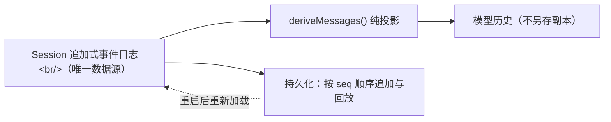

# 第 1 章：事件溯源会话（Event-Sourced Session）

> 对应 dsh 真实源码：`packages/core/session`（`docs/subsystems/session.md`）
> 前置：第 00 章。产出文件：`miniharness/core/session/`（包）+ `tests/test_session.py`

!!! warning "早期简化形态"
    本章代码为**教学简化形态**，与当前实现存在以下差异（学习时以当前实现为准，见 00-setup §0.5 简化表）：

    - **产出位置**：本章演示的单文件 `session.py` 实为 `core/session/` 包（`session.py` + `invariant.py` + `types.py` + `surface.py` + `repair.py`）。
    - **`Session.append` 签名**：本章为 `append(event: dict)`；实现为 `append(type_, data=None, surfaceOp=None, sourceEventSeqs=None)`（`core/session/session.py:201`），信封 `{type, seq, time, data}` 由 `seq == len(log)` 自动编号。
    - **事件词汇表**：本章只讲 8 个核心类型；实现 `KNOWN_TYPES` 共 **30 个**（`core/session/types.py`）：核心 9 类（`user/message`、`assistant/message`（V2 内嵌 `stream`）、`assistant/attempt`（失败/中止 attempt）、`turn/start|end`、`step/start|end`、`tool/call`）+ `tool/result`、`request/header`、`request/context`、`session/end-seed`、`agent/inbox/spliced`、`approval/asked|decided|policy`、`hook/invoked|result`、`llm/retry|retry-started`、`compaction/start|summary|end|prune`、`plan/mode`、`command/run|done`、`goal/change`、`subagent/descriptor`、`sandbox/mode`（上游 alpha.1 全集 **51 类**——生成式 `KNOWN_SESSION_EVENT_TYPES`，已废除 `assistant/chunk`；读真实上游日志遇超集类型时 fail-closed 拒读）。
    - **`derive_messages`**：本章是"扁平字符串消息 + 按 role 替换"；实现是 `ContentBlock` 消息对象 + `surfaceOp: {op:'replace', start, end}` 区间遮蔽（`core/session/surface.py:181` `_surface_nodes` 折叠），replace 遮蔽被替换区间为一个新节点。
    - **`repair_interrupted_turn`**：本章只补 `turn/end` 字符串 reason；实现先为未匹配 tool call 合成 error 结果（`TOOL_NOT_STARTED` / `TOOL_OUTCOME_UNKNOWN`），再补 `step/end` + `turn/end {kind:'interrupted'}`，时间戳复用最后真实事件（`core/session/repair.py:27`）。
    - **"五个硬性规定"**：replace 遮蔽、`session/end-seed` 标记、repair 合成（`{kind:'interrupted'}`）等已由 `tests/test_session.py` 钉死，以测试为最终验收。

## 1.1 这一章要做什么，以及为什么它是整个框架的地基

这一章是整个手册的地基，值得你认真读完。

一个聊天框架的"会话"通常被实现为一个消息数组：把用户消息、模型回复 append 进去，需要上下文时直接读这个数组。dsh 不这么做。看 `packages/core/session` 的源码，第一印象就会非常不同：它没有"消息数组"，只有一个 `SessionEvent` 追加式日志，外加一个 `deriveMessages()` 投影函数。

**dsh 不存"消息数组"，它只存"发生了什么"——一条只追加、永不修改的事件日志。模型看到的对话历史，是每次现算出来的一个投影。**

这个决定会波及下游所有设计：压缩怎么做、崩溃怎么恢复、插件怎么加新东西、持久化怎么和内存保持一致，都能从这个决定推导出来。本章就把这个决定亲手实现一遍。

本章做三件事：

1. 实现 `Session`：一条追加式事件日志。`seq` 连续、坏事件进不来、日志不可变。
2. 实现 `derive_messages()`：从日志派生模型历史的纯函数。历史只从这里来，绝不另存副本。
3. 实现 turn 的"括号平衡"硬性规定，以及崩溃后的修复。

全程就一个核心信念，先记在这里：

> **模型可见 ⟺ 已记录**。任何进入模型请求的内容，必须能从日志重建；想新增任何模型可见的输入，就必须新增一种 session 事件。

## 1.2 概念：为什么是"事件日志"，而不是"消息数组"

先看常规做法的问题，再看 dsh 的选择，对比着理解会清楚得多。

**常规做法**：维护一个 `messages: list[Message]`，每次对话往里面 append。简单、直接，多数场景够用。但它有三个固有短板：

1. **不可回放**。数组只保存"最终状态"，丢了"过程"。压缩上下文之后，旧消息就没了；想换一种压缩策略重放一遍？做不到。
2. **副本漂移风险**。UI 显示一份、持久化落盘一份，往往还有一份"内存里的权威版本"。两份数据对不上时，排查成本很高。
3. **扩展要动核心**。想加一种新的事实（工具结果、上下文注入），得改核心的数据结构，插件很难插进来。

**dsh 的做法**：日志记的是"发生过什么"，这是完整事实；模型历史只是这份事实的一个投影。三个短板对应地变成三个优点：

1. **可回放**。压缩、换模型、修 bug 之后，都可以把同一份日志重放一遍，重新派生历史。日志本身永不丢失内容。
2. **唯一数据源**。UI、持久化、恢复、模型历史都读同一份日志，没有第二份副本，也就没有对不上的问题。
3. **可扩展**。新的事实 = 新的事件类型。而且 dsh 用 TypeScript 的声明合并（`declare module`），插件加事件类型甚至不用改核心包——类型系统本身成了扩展点。

下面是三者关系的图（故意画得简单，05 章持久化会在此基础上展开）：



注意图里日志是唯一的起点，投影和持久化都是它的下游，两者互不直接打交道。这个结构后面会反复出现。

**逐节点走读**（对应上图从上到下）：

1. `Session`（追加式事件日志）是唯一数据源——每个事实都 append 成一条事件，绝不维护一个独立的"消息数组"副本。
2. `deriveMessages()` 是纯函数投影：每次调用都从日志现算模型历史，无缓存副本、不修改日志。
3. `模型历史` 只是投影的结果视图，永远可以从日志重建——这就是上一节"模型可见 ⟺ 已记录"的图表示。
4. `持久化` 同样是日志的下游：按 seq 顺序追加写盘、启动时按序回放重建日志；它只认日志，不认投影出来的消息。
5. 关键约束：投影与持久化**互不直接打交道**——它们各自消费同一份日志，彼此不调用，因此谁改谁都不会破坏另一条链路（解耦）。
6. 崩溃后的恢复闭合了回路：持久化把已落盘的事件回灌回 `Session`，日志恢复后再重新投影出完整历史。

## 1.3 代码 step-by-step

每一步都先说"为什么这么写"，再给代码，然后讨论容易踩的坑。建议边读边敲，而不是复制粘贴。

### 步骤 1：先定事件类型集合

```python
KNOWN_TYPES = frozenset({
    "turn/start", "turn/end", "step/start", "step/end",
    "user/message", "assistant/message", "assistant/attempt",
    "tool/call", "tool/result",
})

SURFACE_TYPES = frozenset({"user/message", "assistant/message", "tool/result"})
```

`KNOWN_TYPES` 是"仓库级硬规则"：日志里只允许出现这些类型。后面写插件加新事件时，改的就是这个集合（加类型）再加上投影规则（步骤 4）。用 `frozenset` 是为了防止运行中不小心改掉它。

`SURFACE_TYPES` 是三种"会产生消息"的事件，单独拎出来是因为它们携带 `surfaceOp`（`append` 或 `replace`），直接决定历史投影怎么排、压缩时怎么替换。其余事件（turn/step 括号、attempt、tool/call）不产生消息，投影时会跳过。

### 步骤 2：先解决"坏事件"问题——无损 JSON 强制 + 深度冻结

日志是唯一真相，那么"坏数据进日志"就是最不能接受的事。坏在哪？两种：没法序列化（比如塞了个对象进去），或者序列化会悄悄丢信息（比如 `NaN`）。先写两个工具函数：

```python
def is_json_safe(value):
    """无损 JSON 强制：无法序列化的值（含非有限浮点数）直接判非法。"""
    try:
        json.dumps(value, ensure_ascii=False, allow_nan=False)
        return True
    except (TypeError, ValueError):
        return False

def deep_freeze(value):
    """深度冻结：dict → 只读代理，list → tuple。冻结后任何修改都抛 TypeError。"""
    if isinstance(value, dict):
        return MappingProxyType({k: deep_freeze(v) for k, v in value.items()})
    if isinstance(value, list):
        return tuple(deep_freeze(v) for v in value)
    return value
```

两个细节值得展开：

- `allow_nan=False`：Python 的 `json.dumps` 默认允许输出 `NaN`，但 `NaN` 不是合法 JSON，别的语言读不了。关掉它，序列化不了的一律抛错。很多 JSON 相关的隐性 bug 都是从这漏出去的。
- `MappingProxyType`：返回的是"只读视图"而不是拷贝。调用方以为能改，一改就抛 `TypeError`。日志一旦写入就不可变，这条后面会被测试钉死。

> 真实 dsh 在 `append()` 源头做同样的深度校验和冻结——坏事件永远进不了日志，这是"日志即真相"的硬保证。

### 步骤 3：Session.append —— 唯一的写入口

```python
class Session:
    """追加式事件日志：唯一事实来源。"""

    def __init__(self, session_id: str):
        self.session_id = session_id
        self._events: list[dict[str, Any]] = []

    @property
    def events(self) -> tuple[dict[str, Any], ...]:
        """只读视图：外部永远拿不到可变的内部列表。"""
        return tuple(self._events)

    def append(self, event: dict[str, Any]) -> dict[str, Any]:
        """源头校验 + 冻结：坏事件永远进不了日志。"""
        if not isinstance(event, dict) or "type" not in event:
            raise ValueError(f"事件必须是含 type 的 dict: {event!r}")
        etype = event["type"]
        if etype not in KNOWN_TYPES:
            raise ValueError(f"未知事件类型: {etype!r}")
        if etype in SURFACE_TYPES:
            op = event.get("surfaceOp")
            if op not in ("append", "replace"):
                raise ValueError(f"surface 事件 {etype} 必须带 surfaceOp=append|replace，得到 {op!r}")
        if not is_json_safe(event):
            raise TypeError(f"事件必须可无损 JSON 序列化: {event!r}")
        record = dict(event, seq=len(self._events))
        self._events.append(deep_freeze(record))
        return record
```

三个校验对应三个硬性规定，缺一不可：

- **类型在册**（`KNOWN_TYPES`）→ 拒绝未知类型，保证日志内容永远可被理解。
- **surface 事件必须带合法 `surfaceOp`** → 保证投影永远有据可依。试想一条 `user/message` 没带 `surfaceOp` 进了日志，投影时是 append 还是 replace？没法判断，所以源头就拦下。
- **可无损 JSON 序列化** → 保证日志永远可落盘、可重放。

然后看最关键的一行：

```python
record = dict(event, seq=len(self._events))
```

`seq` 等于"当前长度"：第一条事件 `seq=0`，第二条 `seq=1`。追加式日志里"序号即长度"，这个巧合让索引非常便宜——05 章讲持久化时，`seq` 还是按序回放的依据。

为什么写入口只有一个？因为"永远只有一个能改日志的地方"意味着任何新增事件都必须过同样的校验。要是到处都能 `session._events.append(...)`，校验就形同虚设。所以 `_events` 藏在类内部，外部只能通过 `events` 属性拿到**元组**——只读，连改的想法都不留。

### 步骤 4：derive_messages —— 纯投影

日志写好了，现在回答：模型历史从哪来？

```python
def derive_messages(events) -> list[dict[str, str]]:
    """纯投影：按 seq 顺序派生模型历史（不修改日志，可重复调用）。"""
    messages: list[dict[str, str]] = []
    for ev in events:
        etype = ev["type"]
        if etype == "user/message":
            _apply_surface(messages, "user", ev.get("content", ""), ev.get("surfaceOp", "append"))
        elif etype == "assistant/message":
            _apply_surface(messages, "assistant", ev.get("content", ""), ev.get("surfaceOp", "append"))
        elif etype == "tool/result":
            if ev.get("isError"):
                content = f"[工具 {ev.get('name')} 失败] {ev.get('error')}"
            else:
                content = f"[工具 {ev.get('name')} 结果] {ev.get('content')}"
            _apply_surface(messages, "tool", content, ev.get("surfaceOp", "append"))
        # turn/* step/* assistant/attempt tool/call 不参与投影
    return messages


def _apply_surface(messages, role: str, content: str, op: str) -> None:
    if op == "append":
        messages.append({"role": role, "content": content})
    elif op == "replace":
        # 压缩替换：整体替换最近一条同 role 的消息；没有则退化为 append
        for i in range(len(messages) - 1, -1, -1):
            if messages[i]["role"] == role:
                messages[i] = {"role": role, "content": content}
                return
        messages.append({"role": role, "content": content})
    else:
        raise ValueError(f"非法 surfaceOp: {op!r}")
```

要点拆开说：

- **纯函数**：输入事件列表，输出消息列表，不改任何东西。调用十次和一次结果完全一样。这个性质值得写测试钉住，因为"投影可重复"是后面"回放 = 重新派生"的前提。而且出了压缩 bug 时，能对着同一份日志反复调用调试，是纯函数最大的红利。
- **`append`**：往历史末尾追加一条消息。
- **`replace`**：从末尾往前找最近一条同 role 的消息，整体替换。这就是上下文压缩落地的机制——压缩不是删日志，而是往日志**追加**一条 `surfaceOp=replace` 的事件，让它替换旧消息的投影。注意关键点：日志本身只是追加，`seq` 依然连续，事实没有丢失，只是投影时被替换。
- **控制类事件不投影**：`turn/*`、`step/*` 是"括号"，不是"内容"。模型不需要看到 `turn/start`，它只关心实际的消息流。`tool/call` 也不投影——模型看到的是 `tool/result` 的汇总文本，看不到内部调用记录。

`_apply_surface` 里有个容易踩的坑：`replace` 找不到同 role 消息时，如果直接 `return`，这条消息就凭空消失了。所以代码里是"退化为 append"——宁可多一条，不能丢一条。这个细节值得写进测试用例。

### 步骤 5：括号平衡 + 崩溃修复

日志里 `turn/start` 和 `turn/end` 必须配对，就像代码里的括号。为什么在意？因为 05 章会讲到，持久化重载时如果发现 turn 没闭合，说明进程在回合中途崩了——日志不完整。

```python
def turn_balance(events) -> int:
    """括号平衡不变量：返回未闭合 turn 数（>=0）。为负说明日志被破坏。"""
    balance = 0
    for ev in events:
        if ev["type"] == "turn/start":
            balance += 1
        elif ev["type"] == "turn/end":
            balance -= 1
            if balance < 0:
                raise ValueError("turn/end 出现在没有对应 turn/start 的位置，日志不平衡")
    return balance


def repair_interrupted_turn(events) -> list[dict]:
    """崩溃恢复：为未闭合的 turn 合成 turn/end { reason: "interrupted" }。"""
    repaired = [dict(ev) for ev in events]
    for _ in range(turn_balance(repaired)):
        repaired.append({"type": "turn/end", "reason": "interrupted"})
    return repaired
```

`turn_balance` 是朴素的计数器：`start` 加一，`end` 减一。减到负数就说明日志被破坏了（`end` 比 `start` 多）。

崩溃修复的做法值得单独讨论：**常规做法是截断或回滚**，dsh 选择**绝不截断**。原因：大 turn 可能非常巨大（一次长会话里可能跑了几十轮工具调用），截断等于把已经发生过的事实悄悄丢掉。dsh 的做法是合成 `turn/end { reason: "interrupted" }` 把括号补平衡。历史保留完整，只是多了一条诚实的标记："这次回合是被打断的，不是正常结束的"。这个 `interrupted` 标记在 04 章讲 agent loop 时还会再见到。

> 上游 `packages/core/session` 的崩溃恢复同样是合成 `interrupted`、绝不截断，连标记名都一致。

## 1.4 写完怎么验收：硬性规定 + 测试

这一章的硬性规定就五个，`tests/test_session.py` 里每一个都有对应的测试：

1. `seq == len(events) - 1`，且事件一经 append 不可变
2. 未知事件类型 / 非 JSON 数据 / 缺 `surfaceOp` → 直接抛错，不进日志
3. `derive_messages` 是纯函数：同输入同输出，不改日志
4. `replace` 压缩后历史仍正确（整体替换，不残留旧消息）
5. `turn_balance >= 0`；崩溃日志可被 `repair_interrupted_turn` 修复到平衡

跑验收：

```bash
python -m unittest tests.test_session -v
```

全绿的话，你已经有了一个可以放心喂给模型的事件日志。

## 1.5 检查点练习（做了才算真的会）

1. **加一种新事件**：仿照 `tool/result` 加 `feedback/rate`（人类反馈，`surfaceOp=replace`，替换最近一条 assistant 消息）。需要改 `KNOWN_TYPES` 和 `derive_messages`，再给 `tests/test_session.py` 加一个测试。做完会体会到"新增模型可见输入 = 新增事件类型"这句话的实际操作。
2. **证明投影是纯函数**：写一个测试，连续调用 `derive_messages` 两次，断言结果相等，且 `session.events` 没有被改动。
3. **动手数 seq**：给 `Session` 加一个 `__len__`，然后写测试断言 `len(session) == last_seq + 1`。

## 1.6 回到 dsh：真实源码对照

现在打开 `deepseek-harness/packages/core/session/src` 对照。建议的读法：先看 `SessionEventMap`（对应本章的 `KNOWN_TYPES`，但它是 TypeScript 接口，靠声明合并扩展），再看 `append()` 的校验（真实实现还有 event 版本字段），最后看 `deriveMessages()`（真实实现按"surface 节点"序列投影，语义和我们一致，但组织方式更正式）。

不用全读，读 50 行就够。目标不是读完，而是体会到一件事：**约定一样，实现更严格**。简化版抓住了设计精髓，真实版在细节上更严密——比如事件版本这类简化版没碰的东西，都是为真实世界的运维场景准备的。

## 1.7 收尾

这一章立起了整座大厦的地基：一条只追加的日志，一个纯投影函数，一组不可违背的硬性规定。下一章在它上面叠第二层——插件上下文与事件总线。到时候会看到，"日志即真相"这个决定让很多东西都变得简单：插件想观察会话？订阅事件即可。插件想改变会话？照常追加事件。没有例外，没有后门。