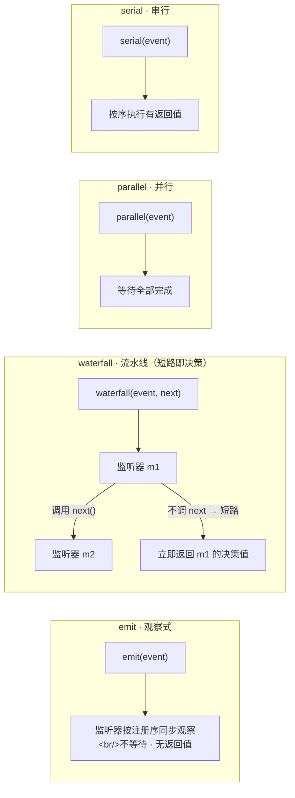

# 第 2 章：插件上下文 + 事件总线（Cordis 的核心思想）

> 对应 dsh 真实源码：`vendor/cordis`（`docs/cordis-primer.md`）+ `packages/core/scope`
> 前置：第 1 章。产出文件：`miniharness/core/scope.py` + `tests/test_bus.py`

## 2.1 这一章要做什么

第 1 章解决了"事实怎么存"，这一章解决"功能怎么插"。dsh 的插件体系基于 Cordis——一个被 vendored（直接放进仓库、可审计）的框架。它要回答的问题，任何插件系统都绕不开：

1. 插件之间怎么互相找到对方提供的服务？（服务仓库 `Context`）
2. 插件怎么在"不互相知道"的前提下协作？（事件总线）
3. 插件卸载、热重载、故障清理时，副作用怎么可靠地撤销？（可逆副作用）

常规的插件系统有两种解法：全局注册表（谁都能注册，谁也管不住谁），或者手工写启动顺序（顺序错了就崩）。dsh 的做法两样都不太一样，两个核心思想先记住：

> **(1) 注册 = 可逆副作用**：一切贡献经 `ctx.effect()` 登记，`dispose()` 时按注册逆序回滚。这是热重载、插件卸载、故障清理能可靠工作的根基。相比之下，常规的"直接往全局表里塞"没有回滚能力。
>
> **(2) waterfall 短路即决策**：流水线事件（`agent/pre-step`、`agent/request-error`、`tools/pre-execute|ask|guards|post-execute`）必须 `next()` 委派；不调 `next` 就短路，返回值就是最终决策。这是"策略插件可以否决"的机制——普通事件广播做不到否决，它没有返回值通道。

## 2.2 概念：四种派发模式



| 模式 | 语义 | 典型用途 |
|---|---|---|
| `emit` | 同步广播，不等待，无返回值 | 通知类：`session/event`、`agent/status` |
| `waterfall` | around-middleware，`next()` 委派，短路即决策 | `agent/pre-step`、`tools/pre-execute`、`llm/stream` |
| `parallel` | 全部并行执行并收集 | 横切动作必须全部生效 |
| `serial` | 按序执行，可带返回值 | 依赖前序结果的变换 |

选哪种模式取决于"这个事件要不要否决权"：通知用 `emit`，审批/决策用 `waterfall`，横切用 `parallel`，有前后依赖的变换用 `serial`。本章教学主体是同步近似：`parallel` 用列表推导模拟；实现另提供 `aemit`/`awaterfall`/`aparallel`/`aserial` 异步变体（第 4 章的 `agent/pre-step`、`agent/request-error` 已走 async 变体），真实 Cordis 是异步的，但短路语义不变。

**逐分支走读**（对应上图四条链）：

- `emit`：`emit(event)` → 监听器按注册序同步观察，`emit` 不等待任何监听器返回值，立即返回 `None`。适合"通知"，如 `session/event`。
- `waterfall`：这是唯一有"否决权"的分支。`waterfall(event)` 把处理权沿链传递：先唤 m1，m1 **调用 `next()`** 才把控制权交给 m2；若 m1 **不调 `next()` 就直接 return**，则链条在此短路，`waterfall` 立即把 m1 的返回值当作最终决策向上返回。这就是"决策点插件"（如 `tools/pre-execute`）只关心"我要不要拦下"的原因——不调 `next` 即拦截。
- `parallel`：`parallel(event)` 并发唤醒所有监听器并等待全部完成，再收集结果。适合"横切动作必须全部生效"。
- `serial`：`serial(event)` 严格按注册序逐个执行可带返回值的监听器，适合"前序结果影响后续"的变换。

短路语义（图里 `w2 -->|"不调 next → 短路"| w4` 这条边）是本章最需要记住的：它把"权限决策"从"线性广播"中区分出来，第 3 章的 `tools/pre-execute` 就靠它实现 deny。

## 2.3 代码 step-by-step

### 步骤 1：Context 骨架 —— 服务仓库 + 作用域链

```python
class Context:
    def __init__(self, parent=None, name="root", *, _fiber=None):
        self.parent = parent                 # 作用域链：子找父
        self.name = name
        self._services = {}                  # 服务仓库
        self._listeners = {}                 # 事件 → 监听器列表
        self._scope_key = None               # create_scope 打标的身份键
        # fiber 承载副作用栈（2.2 的 effect/dispose 都在它上面）
        if _fiber is not None:
            self.fiber = _fiber
        elif parent is None:
            self.fiber = Fiber(0, self, name, is_root=True)
        else:
            self.fiber = parent.fiber

    def provide(self, key, value):
        """提供服务，返回 disposer。同一隔离标签下重复提供 = 冲突（fail loud）。"""
        self._assert_alive()
        label = self._label_of(key)          # 解析 name 的隔离标签
        if label in self.root._reflect_store:
            raise RuntimeError(f"服务 {key} 已在该标签提供")
        self.root._reflect_store[label] = value
        return self.effect(
            lambda: (lambda: self.root._reflect_store.pop(label, None)),
            f"ctx.provide({key})",
        )

    def get(self, key, strict=True):
        """按 key 查找：按隔离标签读全局 store；strict 只返回提供者 ACTIVE 的实现，
        未提供 → None（不再抛 KeyError）。"""
        impl = self._find_impl(key)
        if impl is None:
            return None
        if strict and not impl["fiber"].active:
            return None
        return impl["value"]
```

为什么服务按 **key** 查找而不是直接 import 具体实现？因为插件要依赖的是"接口约定"（Service Definition），不是某个具体类。第 6 章的沙箱、凭据、子 agent 全部是这种模式：消费方只认识 key，具体实现可以替换。

实现存一根**全局 store**，按"name 的隔离标签"键控（对齐上游 `reflect.ts` 的 `ctx[symbols.isolate][name]`）。`_label_of(key)` 沿祖先链找最近的 `isolate(name)` 遮蔽，否则用根默认标签——所以进程级服务（jobs/skills/tools）提供在根上，所有作用域都看得到；per-agent 的 tools/systemPrompt 在各自作用域 `isolate()` 换标签，互不冲撞（第 3 章工具隔离、continuation 子代理都用它）。

注意 `provide` 对同一标签下的重复提供直接抛错（fail loud）。常规的做法是"后注册的覆盖先注册的"，看起来方便，实际会让"谁覆盖了谁"变成谜。dsh 选择大声失败，冲突必须在启动时解决；真需要"每 agent 一套"就用 `isolate()` 换标签，而不是指望覆盖。

### 步骤 2：可逆副作用 —— `effect` 与 `dispose`（fiber 承载）

```python
# 上游语义：execute 立即执行，返回值按形态收集为 disposer
def effect(self, execute, label="anonymous"):
    self._assert_alive()
    return self.fiber.effect(execute, label)
```

这里有个值得停下来看的约定：`effect` 的第一个参数是**执行体**（execute）而不是 disposer。注册的瞬间执行体就被调用，它的返回值决定收集什么：

- 返回 `None` → 无 disposer（什么都不用清理）
- 返回可调用对象 → 该对象就是 disposer，拆解时逆序调用
- 返回 awaitable / 同步生成器 / 异步生成器 → 异步 setup，拆解时先等它完成再清理（setup barrier）
- 返回其它 → `TypeError: Invalid effect`（fail loud）

所以 `provide`、`on` 的写法是"外面包一层 lambda，里面返回真正的清理函数"：

```python
def provide(self, key, value):
    self._services[key] = value
    return self.effect(
        lambda: (lambda: self._services.pop(key, None)),
        f"ctx.provide({key})",
    )
```

为什么 execute 立即执行？因为 setup 本身可能注册更多东西（嵌套 effect、监听器），它们必须在这一步就可见——拆解发生在很久以后，只有把"装了什么"完整记下，卸载时才能原样拆出来。而且**注册先于执行**：wrapper 先进入 fiber 的登记表，再跑执行体，所以执行体中途触发拆解时，拆解器能看到这个"尚未完成 setup"的 effect，先挂一个 setup barrier 等它 setup 结束再清理（对齐上游 `disposeAfter(waitForSetup())` 的重入保护，见测试 `test_registration_before_execute_reentrant_unload`）。

`effect` 返回的 disposer 有两个性质：

1. **单发**：调用一次即进入结算，二次调用 no-op，且返回同一个完成对象；
2. **可 await**：`await disposer()` 会触发（若未触发）并等待结算结束——异步拆解完整落在调用方视线内。

整个机制由一个 **fiber** 承载（上游 `vendor/cordis/src/fiber.ts`）。每个上下文对应一根 fiber，`fiber._disposables` 是它名下的 effect 列表，`fiber.dispose()` 逆序回滚全部：

```python
class FiberState:
    PENDING / LOADING / ACTIVE / FAILED / UNLOADING / DISPOSED
```

- `create_scope` 铸新 fiber：`pending → loading → active`；
- `fiber.dispose()`：`active → unloading → disposed`；
- 每次状态转换派发 `internal/status`（payload `{"fiber", "old"}`）；
- 处于 `unloading`/`disposed` 的 fiber 拒绝一切注册（`INACTIVE_EFFECT`）——"销毁后拒绝注册"是被测试钉死的硬性规定。

`fiber.dispose()` 幂等：重复调用 join 在途的拆解（`inertia` = 在途转换，竞态共享同一完成）。拆解时全部同步 disposer 立即逆序执行（既有同步调用方零破坏）；含异步 disposer 则返回完成对象，需要时 `await`。异步拆解产生的错误被 contained——记入 fiber 的错误表并记日志，既不静默吞掉也不炸掉拆解本身。

### 步骤 3：事件监听 + 四种派发

```python
def on(self, event, fn):
    self._assert_alive()
    self._listeners.setdefault(event, []).append(fn)
    def disposer():
        lst = self._listeners.get(event)
        if lst and fn in lst:
            lst.remove(fn)
    return self.effect(disposer)

def _listeners_for(self, event):
    """收集自身 + 祖先链的监听器（子先于父，各层保持注册序）。"""
    chain = []
    node = self
    while node is not None:
        chain = list(node._listeners.get(event, [])) + chain
        node = node.parent
    return chain

def emit(self, event, payload=None):
    for fn in self._listeners_for(event):
        fn(payload)

def waterfall(self, event, payload=None):
    """around-middleware：fn(payload, next)。不调 next 即短路。"""
    listeners = self._listeners_for(event)
    idx = 0
    def step(cur):
        nonlocal idx
        if idx >= len(listeners):
            return cur
        fn = listeners[idx]
        idx += 1
        return fn(cur, lambda new=cur: step(new))
    return step(payload)

def parallel(self, event, payload=None):
    return [fn(payload) for fn in self._listeners_for(event)]

def serial(self, event, payload=None):
    return [fn(payload) for fn in self._listeners_for(event)]
```

`waterfall` 的实现值得停下来看，核心是这一行：

```python
return fn(cur, lambda new=cur: step(new))
```

- 监听器签名是 `fn(payload, next)`。
- 若监听器调用 `next(new)` → 递归进入下一位，`new` 成为新的 payload。
- 若监听器直接 `return 决策值`（不调 next）→ 整个 waterfall 返回该值，**短路**。
- 若监听器全部调用 next → 返回最后一位的结果。

为什么"短路即决策"？回到 2.1 的问题：普通事件广播没有否决通道，监听器只能看不能拦。waterfall 给每个监听器一个 `next`，不调用它就意味着"到此为止，我的返回值就是结论"。测试里的例子：

```python
ctx.on("w", lambda p, nxt: "DENY")          # 不调 next → 短路
ctx.on("w", lambda p, nxt: nxt("ALLOW"))
assert ctx.waterfall("w", {}) == "DENY"     # 第一位的 DENY 就是决策
```

> 真实 dsh 中 `agent/pre-step` 的"拒绝一次请求"、`tools/pre-execute` 的"拒绝一个工具调用"，都是这个模式：策略插件不调 `next()`，直接返回决策。

### 步骤 4：作用域 —— `create_scope`

```python
def create_scope(self, name):
    """fiber-backed 作用域子上下文：独立身份键 + 独立 fiber。"""
    fiber = Fiber(next_uid, name=name)          # pending
    child = Context(parent=self, name=name, _fiber=fiber)
    child._scope_key = object()                 # 身份键
    fiber.context = child
    fiber._set_state(LOADING)                    # loading
    fiber._set_state(ACTIVE)                     # active
    self.fiber.effect(
        lambda: (lambda: fiber.dispose()),       # 父拆解时收回该作用域
        f"create_scope({name})",
    )
    return child
```

作用域 = 父子链 + 独立 fiber。服务可见性走隔离标签：根上提供的进程级服务所有作用域可见，`isolate(name)` 换标签后 per-agent 各自一套（第 3 章 per-agent 工具隔离、continuation 子代理、会话 owner scope 路由都用它）；拆解该作用域逆序回滚它自己名下的注册，父拆解时经注册的 effect 按序收回全部子作用域。

### 步骤 5：依赖驱动的插件激活（RegistryService）

mini 的真实实现是 `RegistryService`（`ctx.plugin(...)` 装载 fiber）：依赖在 `inject` 声明，apply 期间用 `provide` **动态**登记服务。声明 `inject` 的插件在依赖缺失时保持 `PENDING`（不激活、不报错），提供方一装载就触发 `_notify` → 依赖者 `_check_impl` + `_refresh`（epoch 重载：卸载→重装）。加载顺序由依赖关系本身表达，而不是 boot 脚本里的手写顺序：

```python
# 核心：注册是声明，激活靠依赖满足
fiber = root.plugin({"name": "consumer", "inject": ["svc"],
                     "apply": lambda ctx, cfg: ...})
assert fiber.state == FiberState.PENDING      # 依赖缺失 → 静默等待
provider = root.plugin({"name": "provider",
                        "apply": lambda ctx, cfg: ctx.provide("svc", 42)})
assert fiber.state == FiberState.ACTIVE       # 提供方装载 → 依赖者被唤醒
```

常规插件系统靠手工排启动顺序，依赖关系复杂时极易出错。dsh 反过来：依赖满足才 apply，依赖变化触发 epoch 重载（测试 `test_dependency_wakes_pending_fiber` 钉住：provider 必须先于 consumer）。

两个细节：

- 卸载 = 回滚该插件 apply 期间登记的全部副作用（fiber disposer 栈逆序）；卸载时服务随之消失，strict `get` 回 `None`，依赖者据此重估。
- 环依赖 / 缺失依赖 → 依赖者保持 `PENDING`（静默），不会半激活；boot 层负责在装配结束时检查所有 fiber 都到了终态并明确报错。

## 2.4 验收：硬性规定 + 测试

这一章的硬性规定，`tests/test_bus.py` 与 `tests/test_fiber.py` 每个都有对应测试：

1. 服务按隔离标签提供/查找：同一标签重复提供 = 冲突（fail loud）；缺省返回 `None`；strict 过滤非 ACTIVE 提供者
2. `waterfall` 短路语义：不调 `next` 的监听器返回值就是最终决策
3. 监听器按注册序执行；作用域内子先于父
4. `effect` 调用约定：execute 立即执行，返回值收集为 disposer；返回 `None` 无 disposer
5. `dispose` 逆序回滚全部副作用；销毁后拒绝注册（fiber 置 `INACTIVE_EFFECT`）
6. disposer 单发、可 await；异步拆解逆序 + 并发（fiber 级 `Promise.all` 等价物）
7. fiber 状态机 `pending/loading/active/unloading/disposed` + `internal/status` 派发
8. setup barrier：body 执行中途触发拆解不丢 disposer；body 抛错回滚已收集项后重抛
9. 插件激活顺序由依赖驱动；无法满足时明确报错

```bash
python -m unittest tests.test_bus tests.test_fiber -v
```

## 2.5 检查点练习

1. **写一个"权限策略"插件**：挂到 `tools/pre-execute`（waterfall），对 `name == "rm"` 的工具直接返回 `{"verdict": "deny"}`，其余调用 `next`。写测试断言拒绝路径。
2. **作用域与隔离**：创建 root → scopeA → scopeB，在 root 提供 `svc`，断言 A、B 都看得到；再对 A `isolate("local")` 提供 `local`，断言 B 仍看 root 的 `local`（同一标签共享）、A 的隔离标签互不影响。
3. **热重载模拟**：activate 一个插件 → 记录服务存在 → dispose → 断言服务消失且再次 activate 同名插件不冲突。

## 2.6 回到 dsh：真实源码对照

打开 `deepseek-harness/vendor/cordis/src`：

- `context.ts` + `reflect.ts`：`provide`/`get`/`set`/`isolate`/`effect`/`dispose` 的完整实现——`effect` 的 execute 形态、注册先于执行、`disposeAfter(waitForSetup())` 重入保护、按隔离标签键控的全局 store、`notify` 的标签过滤，我们逐条对齐
- `fiber.ts`：fiber 状态机、`internal/status`、`internal/plugin`、`_setEpoch` 依赖重载、`inertia` 在途转换、`_unload` 的 `Promise.all` 并发拆解——2.2 的 fiber 语义都从这里来（mini 已对齐装载半边与依赖驱动注册表，epoch 热重载经 hmr 与 `watch_user_patches` 路径闭合；已知简化：SessionStore 自持 fiber 未复现）
- `events.ts`：四种派发模式的异步版本
- `vendor/README.md`：18 项本地加固清单——挑 3 项读，体会"框架被 vendored 且可审计"意味着什么：不依赖 npm 供应链，代码就躺在仓库里，任何人都能审计每一行。

## 2.7 收尾

这一章的四个字可以带走：**一切皆回滚**。Context 既是服务仓库又是事件总线又是副作用栈，插件装进去的东西都能原样拆出来。下一章的工具管线就是在这个基础上建起来的——你会看到 `pre-execute` 的否决权就是 2.2 的 waterfall 短路。