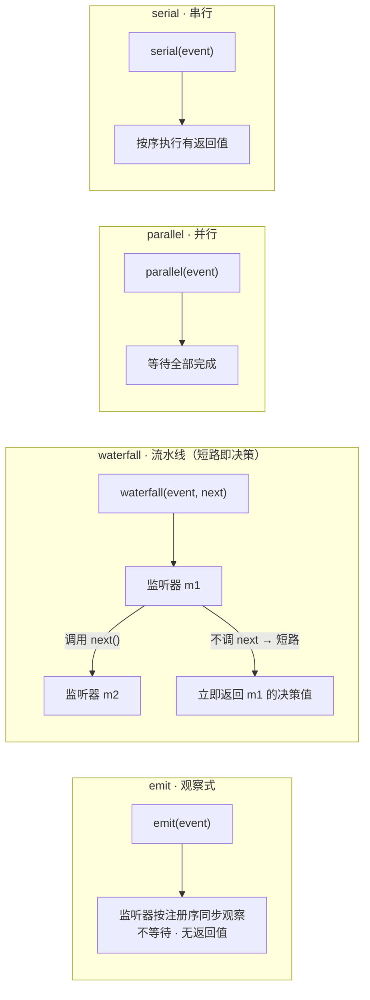

# 第 2 章：插件上下文 + 事件总线（Cordis 的心智模型）

> 对应 dsh 真实源码：`vendor/cordis`（`docs/cordis-primer.md`）+ `packages/core/scope`
> 前置：第 1 章。产出文件：`miniharness/miniharness/bus.py` + `tests/test_bus.py`

## 2.1 本章目标

- 实现 `Context`：服务仓库（`provide`/`inject`）+ 事件总线 + 可逆副作用容器
- 实现**四种派发模式**：`emit` / `waterfall` / `parallel` / `serial`
- 实现作用域（父子链）与**依赖驱动的插件激活**

掌握两个心智模型：

> **(1) 注册 = 可逆副作用**：一切贡献经 `ctx.effect()` 登记，`dispose()` 逆序回滚。这是热重载、插件卸载、故障清理能可靠工作的根基。
>
> **(2) waterfall 短路即决策**：流水线事件（pre-step、request、tools/*）必须 `next()` 委派；不调 `next` 就短路，返回值就是最终决策。

## 2.2 概念：四种派发模式



| 模式 | 语义 | 典型用途 |
|---|---|---|
| `emit` | 同步广播，不等待，无返回值 | 通知类：`session/event`、`agent/status` |
| `waterfall` | around-middleware，`next()` 委派，短路即决策 | `agent/pre-step`、`tools/pre-execute`、`llm/stream` |
| `parallel` | 全部并行执行并收集 | 横切动作必须全部生效 |
| `serial` | 按序执行，可带返回值 | 依赖前序结果的变换 |

> MiniHarness 是同步近似：`parallel` 用列表推导模拟。真实 Cordis 是异步的（`await`），但语义不变。

## 2.3 代码 step-by-step

### 步骤 1：Context 骨架 —— 服务仓库 + 作用域链

```python
class Context:
    def __init__(self, parent=None, name="root"):
        self.parent = parent                 # 作用域链：子找父
        self.name = name
        self._services = {}                  # 服务仓库
        self._listeners = {}                 # 事件 → 监听器列表
        self._disposers = []                 # 可逆副作用栈（逆序回滚）
        self._disposed = False

    def provide(self, key, value):
        """提供服务，返回 disposer。同 key 重复提供 = 冲突（fail loud）。"""
        self._assert_alive()
        if key in self._services:
            raise RuntimeError(f"服务 {key} 已在 {self.name} 提供")
        self._services[key] = value
        return self.effect(lambda: self._services.pop(key, None))

    def inject(self, key):
        """按 key 查找：沿父子链向上（作用域可见性）。"""
        if key in self._services:
            return self._services[key]
        if self.parent is not None:
            return self.parent.inject(key)
        raise KeyError(f"服务 {key} 未提供")
```

- 服务按 **key**（如 `ctx.tools`）查找，而不是 import 具体实现 —— 这是"扩展插件只依赖 Service Definition"的运行时基础。
- `parent` 链就是作用域：子 ctx 能看到祖先的服务，兄弟互不可见（测试钉住这一点）。

### 步骤 2：可逆副作用 —— `effect` 与 `dispose`

```python
def effect(self, fn):
    """登记一个可逆副作用；dispose 时按注册逆序回滚。"""
    self._assert_alive()
    self._disposers.append(fn)
    return fn

def dispose(self):
    if self._disposed:
        return
    for fn in reversed(self._disposers):
        fn()
    self._disposers.clear()
    self._disposed = True
```

`provide`、`on` 的 disposer 都经 `effect` 登记。于是：

- 卸载插件 = 逆序回滚它装的一切
- **销毁后的 ctx 拒绝注册**（`_disposed` 检查）——"之后拒绝注册"不变量

### 步骤 3：事件监听 + 四种派发

```python
def on(self, event, fn):
    self._assert_alive()
    self._listeners.setdefault(event, []).append(fn)
    def disposer():
        lst = self._listeners.get(event)
        if lst and fn in lst:
            lst.remove(fn)
    return self.effect(disposer)

def _listeners_for(self, event):
    """收集自身 + 祖先链的监听器（子先于父，各层保持注册序）。"""
    chain = []
    node = self
    while node is not None:
        chain = list(node._listeners.get(event, [])) + chain
        node = node.parent
    return chain

def emit(self, event, payload=None):
    for fn in self._listeners_for(event):
        fn(payload)

def waterfall(self, event, payload=None):
    """around-middleware：fn(payload, next)。不调 next 即短路。"""
    listeners = self._listeners_for(event)
    idx = 0
    def step(cur):
        nonlocal idx
        if idx >= len(listeners):
            return cur
        fn = listeners[idx]
        idx += 1
        return fn(cur, lambda new=cur: step(new))
    return step(payload)

def parallel(self, event, payload=None):
    return [fn(payload) for fn in self._listeners_for(event)]

def serial(self, event, payload=None):
    return [fn(payload) for fn in self._listeners_for(event)]
```

`waterfall` 的实现要仔细读三遍：

```python
return fn(cur, lambda new=cur: step(new))
```

- 监听器签名是 `fn(payload, next)`。
- 若监听器调用 `next(new)` → 递归进入下一位，`new` 成为新的 payload。
- 若监听器直接 `return 决策值`（不调 next）→ 整个 waterfall 返回该值，**短路**。
- 监听器全部调用 next → 返回最后一位的结果。

测试里的例子：

```python
ctx.on("w", lambda p, nxt: "DENY")          # 不调 next → 短路
ctx.on("w", lambda p, nxt: nxt("ALLOW"))
assert ctx.waterfall("w", {}) == "DENY"     # 第一位的 DENY 就是决策
```

> 真实 dsh 中 `agent/pre-step` 的"拒绝一次请求"、`tools/pre-execute` 的"拒绝一个工具调用"，都是这个模式：某个策略插件不调 `next()`，直接返回决策。

### 步骤 4：作用域 —— `create_scope`

```python
def create_scope(self, name):
    return Context(parent=self, name=name)
```

就这么简单——作用域就是父子链。第 3 章的工具注册表会用到它做"per-agent 工具隔离"。

### 步骤 5：依赖驱动的插件激活（PluginManager）

```python
class PluginManager:
    def __init__(self, root):
        self.root = root

    def activate(self, plugins):
        """inject 满足才 apply；全部激活或明确报错。"""
        remaining = [dict(p) for p in plugins]
        provided = set(self.root._services)
        done = []
        while remaining:
            progressed = False
            for p in list(remaining):
                if all(k in provided for k in p.get("inject", [])):
                    snapshot = len(self.root._disposers)
                    p["apply"](self.root)
                    disposer = self._collect_after(snapshot)
                    done.append((p["name"], disposer))
                    provided.update(p.get("provides", []))
                    remaining.remove(p)
                    progressed = True
            if not progressed:
                raise RuntimeError("插件依赖无法满足: " + ", ".join(p["name"] for p in remaining))
        return done
```

- 插件声明 `inject: [服务key]`；激活器循环扫描，"依赖满足才 apply"。
- **加载顺序由依赖关系表达，而非手工 boot 排序**（测试 `test_plugin_manager_dependency_order` 钉住：provider 必须先于 consumer）。
- 卸载 = 回滚该插件 apply 期间登记的全部副作用（`_collect_after` 从快照点收集）。
- 循环依赖 / 缺失依赖 → 明确报错，绝不静默跳过。

> 简化声明：真实 Cordis 由 apply 期间的 `provide`/`effect` 动态登记；这里用声明式 `provides` 字段近似。语义（依赖驱动、可逆回滚）一致。

## 2.4 不变量清单

1. 服务重复提供 = 冲突（fail loud）；查找沿父子链向上
2. `waterfall` 短路语义：不调 `next` 的监听器返回值就是最终决策
3. 监听器按注册序执行；作用域内子先于父
4. `dispose` 逆序回滚全部副作用；销毁后拒绝注册
5. 插件激活顺序由依赖驱动；无法满足时明确报错

```bash
python -m unittest tests.test_bus -v
```

## 2.5 检查点练习

1. **写一个"权限策略"插件**：挂到 `tools/pre-execute`（waterfall），对 `name == "rm"` 的工具直接返回 `{"verdict": "deny"}`，其余调用 `next`。写测试断言拒绝路径。
2. **作用域隔离**：创建 root → scopeA → scopeB，在 A 里 `provide` 一个服务，断言 B 看不到、A 能看到、root 的子子孙孙都能看到。
3. **热重载模拟**：activate 一个插件 → 记录服务存在 → dispose → 断言服务消失且再次 activate 同名插件不冲突。

## 2.6 回到 dsh：真实源码对照

打开 `deepseek-harness/vendor/cordis/src`：

- `context.ts`：`provide`/`inject`/`effect`/`dispose` 的完整实现（含 fiber 生命周期管理）
- `events.ts`：四种派发模式的异步版本
- `vendor/README.md`：18 项本地加固清单 —— 挑 3 项读，体会"框架被 vendored 且可审计"意味着什么

## 2.7 本章小结

| 概念 | 一句话 |
|---|---|
| Context | 服务仓库 + 事件总线 + 副作用栈，父子链即作用域 |
| 注册 = 可逆副作用 | disposer 逆序回滚，热重载/卸载/故障清理的根基 |
| waterfall | `next()` 委派，短路即决策；流水线事件专用 |
| 依赖驱动激活 | 加载顺序由 inject/provides 表达，不手工排序 |