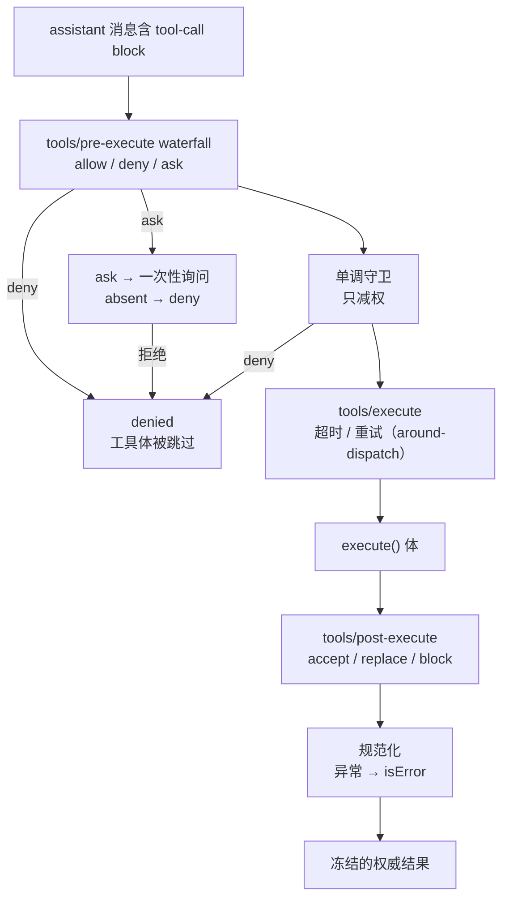

# 第 3 章：工具执行管线（Tool Execution Pipeline）

> 对应 dsh 真实源码：`packages/core/tools`（`docs/subsystems/tools.md`、`docs/tool-execution-pipeline.md`）
> 前置：第 1、2 章。产出文件：`miniharness/miniharness/tools.py` + `tests/test_tools.py`

## 3.1 本章目标

- 实现**作用域化工具注册表**：全局层 + 祖先作用域链 + 自身注册的可见性解析
- 实现**执行管线**：参数物化冻结 → schema 校验 → `pre-execute` → 单调守卫 → `execute`（超时）→ `post-execute` → 规范化 → 冻结结果
- 理解"工具出错的三种形态都规范化为结构化结果，不中断回合"

## 3.2 概念：管线全貌



三条纪律：

1. **参数在策略前一次性无损物化并冻结**——策略和工具体看到的是同一个不可变视图。
2. **守卫只能减权**（单调）：deny 后工具体被跳过；乱序也无法撤销一个已发生的 deny。
3. **任何异常都规范化为 `isError` 的结构化结果**——回合继续，模型拿到错误消息自己处理。

## 3.3 代码 step-by-step

### 步骤 1：JSON Schema 子集校验器

```python
def validate_schema(value, schema):
    """type / properties / required / items / enum 子集校验。"""
    errors = []
    _check(value, schema, "$", errors)
    return errors
```

- `object` 检查 `properties` + `required`；`array` 递归 `items`；`string/number/integer/boolean/null` 类型检查；`enum` 枚举检查。
- 注意要兼容 `MappingProxyType`（参数已被冻结）。
- 真实 dsh 有"16 层容器精确推断后回退 `JsonValue`"的 DSL；我们取子集，够用且诚实。

### 步骤 2：领域对象

```python
@dataclass
class ToolExec:
    """执行上下文：signal 是唯一可替换的字段（超时/取消用）。"""
    signal: threading.Event = field(default_factory=threading.Event)

@dataclass
class Tool:
    name: str
    description: str
    execute: Callable[[dict, ToolExec], Any]
    parameters: dict = field(default_factory=dict)   # JSON Schema
    output: dict = field(default_factory=dict)       # canonical schema
    is_concurrency_safe: bool = False                # False = 串行屏障
    timeout_ms: int | None = None                    # 由管线 wrapper 强制
    present_call: Callable | None = None             # UI 挂起卡片（纯函数）
    present_result: Callable | None = None           # UI 完成卡片（纯函数）

@dataclass(frozen=True)
class ToolResult:
    ok: bool
    content: Any = None
    is_error: bool = False
    error: str | None = None
    meta: dict = field(default_factory=dict)
```

- `frozen=True`：结果不可变 —— "冻结的权威结果"。
- `timeout_ms` 由管线强制，绝不发给模型。

### 步骤 3：作用域化注册表

```python
class ToolRegistry:
    def __init__(self, root):
        self.root = root
        self._tools = {}
        root.provide("tools", self)     # ctx.tools 服务

    def register(self, tool, scope=None):
        bucket = self._bucket(scope)
        if tool.name in bucket:
            raise RuntimeError(f"工具 {tool.name} 已注册")
        bucket[tool.name] = tool
        return lambda: bucket.pop(tool.name, None)   # disposer

    def resolve(self, name, scope=None):
        """可见性：自身 → 祖先作用域链 → 全局层。"""
        node = scope
        while node is not None:
            bucket = getattr(node, "_scoped_tools", {})
            if name in bucket:
                return bucket[name]
            node = node.parent
        return self._tools.get(name)

    def restrict(self, allow=None, deny=None):
        """ToolRestriction：deny 优先，其次 allow 白名单。"""
        def allowed(name):
            if deny and name in deny:
                return False
            if allow is not None and name not in allow:
                return False
            return True
        return allowed
```

- `resolve` 的三段式查找就是第 2 章作用域链的直接应用：**per-agent 工具隔离**。
- `restrict` 是继承过滤谓词：agent 级策略可以"允许白名单 + deny 黑名单"裁剪继承来的工具。

### 步骤 4：执行管线（核心）

```python
def run_pipeline(ctx, tool, args, exec_=None):
    exec_ = exec_ or ToolExec()

    # 1. 参数一次性无损物化 + 深度冻结
    frozen_args = deep_freeze(dict(args))

    # 2. schema 校验
    schema_errors = validate_schema(frozen_args, tool.parameters)
    if schema_errors:
        return ToolResult(ok=False, is_error=True, error="; ".join(schema_errors))

    # 3. pre-execute waterfall（allow | deny | ask）
    decision = ctx.waterfall("tools/pre-execute", {"tool": tool.name, "args": frozen_args})
    verdict = decision.get("verdict", "allow") if isinstance(decision, dict) else "allow"
    if verdict == "deny":
        return ToolResult(ok=False, is_error=True, error="denied by tools/pre-execute")
    if verdict == "ask":
        approved = ctx.waterfall("tools/ask", {"tool": tool.name, "args": frozen_args})
        if approved is not True:
            return ToolResult(ok=False, is_error=True, error="approval refused")

    # 4. 单调守卫（只减权）
    guard = ctx.waterfall("tools/guards", {"tool": tool.name, "args": frozen_args})
    guard_verdict = guard.get("verdict", "allow") if isinstance(guard, dict) else "allow"
    if guard_verdict == "deny":
        return ToolResult(ok=False, is_error=True, error="denied by monotonic guard")

    # 5. execute（超时由管线强制）
    box = {}
    def target():
        try:
            box["value"] = tool.execute(dict(frozen_args), exec_)
        except Exception as e:
            box["error"] = e
    if tool.timeout_ms:
        t = threading.Thread(target=target, daemon=True)
        t.start()
        t.join(tool.timeout_ms / 1000)
        if t.is_alive():
            exec_.signal.set()      # 通知工具体"你超时了"
            return ToolResult(ok=False, is_error=True, error=f"timeout after {tool.timeout_ms}ms")
    else:
        target()

    # 6. post-execute waterfall（accept | block）
    raw = box.get("value")
    post = ctx.waterfall("tools/post-execute", {"tool": tool.name, "result": raw})
    if isinstance(post, dict) and post.get("action") == "block":
        return ToolResult(ok=False, is_error=True, error=post.get("feedback", "blocked"))

    # 7. 规范化：异常 / 非法值 → isError
    if "error" in box:
        e = box["error"]
        return ToolResult(ok=False, is_error=True, error=f"{type(e).__name__}: {e}")
    if isinstance(raw, ToolResult):
        return raw
    if isinstance(raw, dict) and raw.get("isError"):
        return ToolResult(ok=False, content=raw.get("content"), is_error=True, error=raw.get("error"))
    if not is_json_safe(raw):
        return ToolResult(ok=False, is_error=True, error="工具返回了不可 JSON 序列化的值")

    # 8. 冻结的权威结果
    return ToolResult(ok=True, content=deep_freeze(raw))
```

逐段要点：

- **步骤 3-4 是第 2 章 waterfall 的实际应用**：策略插件不调 `next()` 即 deny。第 4 章 Agent Loop 会把 `tool/call`、`tool/result` 事件挂在步骤 1 和 8 前后。
- **超时**：用线程 + `join(timeout)` 强制；超时后设置 `exec_.signal`（工具体可协作取消）。真实 dsh 挂在 `tools/execute` 的 around-dispatch 上，语义相同。
- **规范化**：抛异常、返回 `isError` dict、返回非 JSON 值——三种"出错形态"全部收敛为 `ToolResult(is_error=True)`。回合不中断。

## 3.4 不变量清单

1. 参数在策略前冻结；schema 违规 = 结构化错误（不进回合）
2. `pre-execute` deny / approval 拒绝 → 工具体被跳过
3. 超时被强制执行，且绝不把 timeout 配置发给模型
4. 异常 / 非法值规范化成 `isError`，不抛出
5. 结果冻结不可变；作用域注册卸载后不可见

```bash
python -m unittest tests.test_tools -v
```

## 3.5 检查点练习

1. **并行屏障**：实现一个简化版 `is_concurrency_safe` 调度——安全工具并行（线程池），非安全工具串行。给注册表加 `names(scope)` 之外的一个 `concurrency_batches()`，并写测试。
2. **重试 wrapper**：写一个挂在 `tools/execute` waterfall 上的监听器，对第一次失败自动重试一次（around-dispatch 语义：`nxt` 包住真实执行）。断言最终结果。
3. **限制工具集**：用 `restrict` 给一个作用域做"只允许 bash + read_file"的白名单，写测试断言白名单外工具被过滤。

## 3.6 回到 dsh：真实源码对照

打开 `deepseek-harness/packages/core/tools/src` + `docs/tool-execution-pipeline.md`：

- `tools/pre-execute` / `execute` / `post-execute` 三个 waterfall 的真实事件契约
- 注册表外层规范化的真实位置（snapshot 异常 → isError）
- `finalizeContent`：最后一个内容只读不变量（我们简化掉了，值得知道它存在）

## 3.7 本章小结

| 概念 | 一句话 |
|---|---|
| 作用域化注册表 | 自身 → 祖先链 → 全局；卸载即回滚 |
| 参数冻结 | 策略与工具体看同一个不可变参数 |
| 单调守卫 | 只减权；deny 无法被撤销 |
| 规范化 | 三种出错形态统一为 `isError`，回合不中断 |