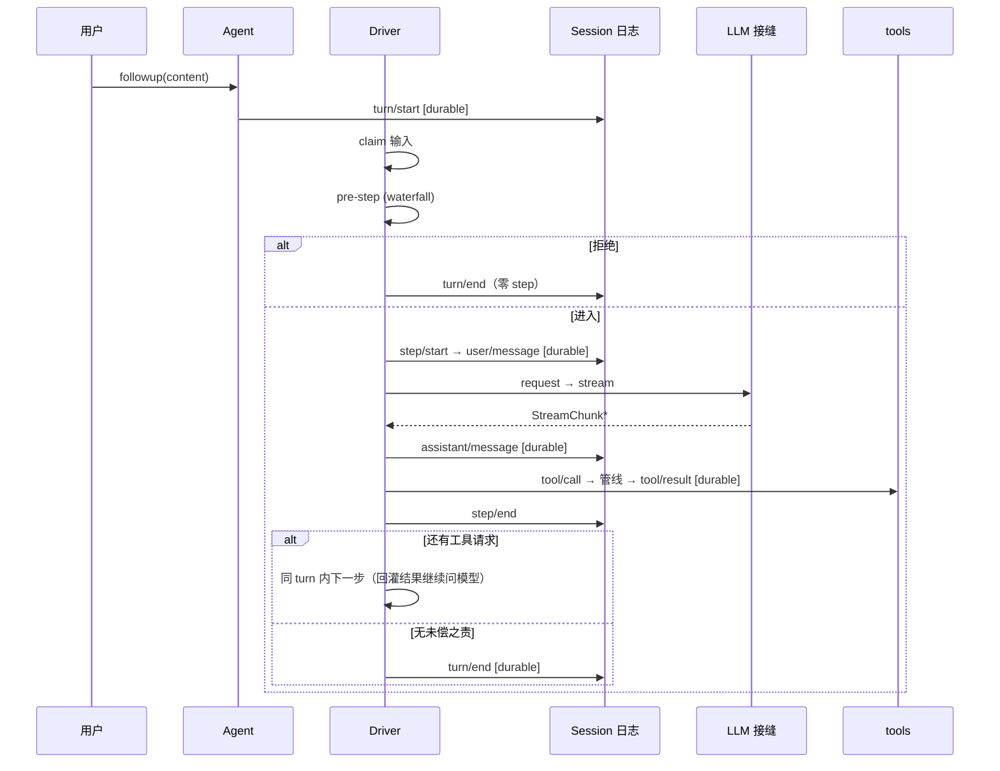

# 第 4 章：Agent Loop 状态机 + LLM 流式

> 对应 dsh 真实源码：`packages/core/agent-loop` + `packages/llm/llm` + `packages/llm/llm-deepseek`
>（`docs/agent-lifecycle.md`、`docs/subsystems/llm-streaming.md`）
> 前置：第 1~3 章。产出文件：`miniharness/miniharness/llm.py`、`loop.py` + `tests/test_loop.py`

## 4.1 本章目标

- 实现 `StreamChunk` 统一流协议 + `LlmAdapter` 接口 + DeepSeek 官方 SSE 适配器（纯 stdlib）
- 实现 turn/step 状态机：inbox、pre-step 拒绝、工具回灌继续、turn 括号闭合
- 用 `FakeLlmAdapter` 无 key 跑通"文本 + 工具调用"完整回合

## 4.2 概念：turn/step 时序



三个要点：

1. **turn 打开于认领输入之前**——"被拒绝的尝试"也留下 `turn/start + turn/end` 持久化记录（可审计）。
2. **step = 一次模型请求 + 它调用的工具**；工具结果回灌后，同一 turn 内自动再问一次模型（`_continue`）。
3. **模型可见 ⟺ 已记录**：`user/message` 在 pre-step 通过后才 append。

## 4.3 代码 step-by-step（llm.py）

### 步骤 1：StreamChunk 统一协议

```python
STREAM_CHUNK_KINDS = frozenset({
    "block-start", "text-delta", "reasoning-delta",
    "tool-call-delta", "block-end", "usage", "finish",
})

class StreamChunk(dict):
    def __init__(self, kind, **payload):
        if kind not in STREAM_CHUNK_KINDS:
            raise ValueError(f"未知 chunk kind: {kind}")
        super().__init__({"kind": kind, **payload})
```

协议不变量（真实 dsh 逐条遵守）：

- `block-end` 携带完整块；`usage` 必须在 `finish` 之前；`finish` 之后不再有值
- 块索引关联交错增量（多块并行 delta 用 `index` 区分）

### 步骤 2：接口 + 错误收口

```python
class LlmFailure(Exception):
    """统一错误收口：授权 / 请求 / 上下文溢出。"""
    def __init__(self, code, message):
        super().__init__(message)
        self.code = code

class LlmAdapter:
    """Service Definition：Consumer（agent-loop）只依赖这个协议。"""
    provider = "base"
    def stream(self, messages, tools):
        raise NotImplementedError
```

> 真实 dsh 的授权错误路径统一为 `LlmFailure`，上下文溢出编码 `CONTEXT_WINDOW_EXCEEDED`，空响应编码 `EMPTY_RESPONSE`（可重试）。

### 步骤 3：FakeLlmAdapter —— 无 key 也能跑回合

```python
class FakeLlmAdapter(LlmAdapter):
    provider = "fake"

    def __init__(self, tool_call=None, final_text="任务完成。"):
        self._tool = tool_call
        self._text = final_text
        self.calls = 0

    def stream(self, messages, tools):
        self.calls += 1
        if self._tool and self.calls == 1:
            yield StreamChunk("block-start", index=0, block_kind="assistant")
            yield StreamChunk("tool-call-delta", index=0, name=self._tool["name"], arguments=self._tool.get("arguments", {}))
            yield StreamChunk("block-end", index=0, block={"role": "assistant", "tool_calls": [self._tool]})
            yield StreamChunk("finish", finish_reason="tool_calls")
        else:
            yield StreamChunk("block-start", index=0, block_kind="assistant")
            yield StreamChunk("text-delta", index=0, delta=self._text)
            yield StreamChunk("block-end", index=0, block={"role": "assistant", "content": self._text})
            yield StreamChunk("finish", finish_reason="stop")
```

### 步骤 4：DeepSeekAdapter —— 官方 SSE（stdlib urllib）

```python
class DeepSeekAdapter(LlmAdapter):
    provider = "deepseek-official"

    def __init__(self, api_key=None, base_url=None, model="deepseek-chat"):
        self._key = api_key if api_key is not None else os.environ.get("DEEPSEEK_API_KEY", "")
        self._base = (base_url or os.environ.get("DEEPSEEK_BASE_URL", "https://api.deepseek.com")).rstrip("/")
        self._model = model

    def stream(self, messages, tools):
        body = {"model": self._model, "messages": messages, "stream": True}
        if tools:
            body["tools"] = [t["schema"] for t in tools]
        req = urllib.request.Request(self._base + "/chat/completions",
            data=json.dumps(body).encode(),
            headers={"Content-Type": "application/json", "Authorization": "Bearer " + self._key})
        try:
            resp = urllib.request.urlopen(req, timeout=120)
        except urllib.error.HTTPError as e:
            detail = e.read(200).decode("utf-8", "replace")
            code = "AUTH_ERROR" if e.code in (401, 403) else "REQUEST_ERROR"
            raise LlmFailure(code, f"HTTP {e.code}: {detail}") from e

        # tool-call 增量按块流式：name 与 arguments 分片到达，需累积
        pending = {}
        for raw in resp:
            line = raw.decode("utf-8", "replace").strip()
            if not line.startswith("data:"):
                continue
            data = line[5:].strip()
            if data == "[DONE]":
                break
            piece = json.loads(data)
            for choice in piece.get("choices", []):
                delta = choice.get("delta", {})
                if delta.get("reasoning_content"):
                    yield StreamChunk("reasoning-delta", index=choice["index"], delta=delta["reasoning_content"])
                if delta.get("content"):
                    yield StreamChunk("text-delta", index=choice["index"], delta=delta["content"])
                for tc in delta.get("tool_calls") or []:
                    slot = pending.setdefault(tc["index"], {"name": "", "arguments": ""})
                    fn = tc.get("function", {})
                    slot["name"] += fn.get("name", "")
                    slot["arguments"] += fn.get("arguments", "")

        if pending:
            calls = []
            yield StreamChunk("block-start", index=0, block_kind="assistant")
            for idx, slot in sorted(pending.items()):
                calls.append({"id": f"call_{idx}", "type": "function", "function": slot})
                yield StreamChunk("tool-call-delta", index=idx, name=slot["name"], arguments=slot["arguments"])
            yield StreamChunk("block-end", index=0, block={"role": "assistant", "tool_calls": calls})
        yield StreamChunk("finish", finish_reason="tool_calls" if pending else "stop")
```

- 这就是报告里 `llm-deepseek` 适配器的简化版：`fetch + SSE`，逐块翻译成统一协议。
- `baseURL / apiKey` 从环境变量读取——配置只存引用，绝无明文（第 6 章凭据接缝再深入）。

## 4.4 代码 step-by-step（loop.py）

### 步骤 1：状态与入口

```python
class AgentLoop:
    def __init__(self, session, adapter, tools, ctx, system_prompt="你是一个助手。", max_steps=50):
        self.session = session
        self.adapter = adapter
        self.tools = tools
        self.ctx = ctx
        self.system_prompt = system_prompt
        self.max_steps = max_steps
        self.status = "idle"
        self.inbox = deque()        # 排队输入（唯一入口）
        self._turn_open = False
        self._continue = False      # 工具回灌后是否继续

    def followup(self, content, source="user"):
        """用户输入：先进 inbox，pre-step 通过后才 append 进日志。"""
        self.inbox.append({"role": "user", "content": content, "source": source})
        self._pump()

    def run(self, content):
        self.followup(content)
        return self.last_response()
```

### 步骤 2：turn 生命周期

```python
    def _open_turn(self):
        if self._turn_open:
            return
        self.status = "running"
        self.session.append({"type": "turn/start"})
        self._turn_open = True

    def _close_turn(self, reason="completed"):
        if not self._turn_open:
            return
        self.session.append({"type": "turn/end", "reason": reason})
        self._turn_open = False
        self.status = "idle"
```

### 步骤 3：主循环

```python
    def _pump(self):
        steps = 0
        while self.inbox or self._continue:
            steps += 1
            if steps > self.max_steps:
                raise RuntimeError(f"超过最大 step 数 {self.max_steps}，疑似死循环")
            self._open_turn()
            claimed = self.inbox.popleft() if self.inbox else None
            self._run_step(claimed)
            if not self.inbox and not self._continue:
                self._close_turn()
```

- 循环条件：有排队输入，或有工具回灌待继续（`_continue`）。
- `max_steps` 是死循环守卫（测试 `test_max_steps_guard`：模型永远调工具 → 报错而不是挂死）。

### 步骤 4：一个 step

```python
    def _run_step(self, claimed):
        if claimed is not None:
            decision = self.ctx.waterfall("agent/pre-step", {"messages": [claimed]})
            if isinstance(decision, dict) and decision.get("verdict") == "reject":
                return   # 零 step 尝试：turn 照常闭合
            self.session.append({"type": "step/start"})
            self.session.append({"type": "user/message", "content": claimed["content"],
                                 "surfaceOp": "append", "source": claimed.get("source", "user")})
        else:
            self.session.append({"type": "step/start"})   # 工具回灌后的继续

        history = derive_messages(self.session.events)
        messages = [{"role": "system", "content": self.system_prompt}] + history
        chunks = list(self.adapter.stream(messages, self._tool_definitions()))
        text = "".join(c.get("delta", "") for c in chunks if c["kind"] == "text-delta")
        tool_calls = [c for c in chunks if c["kind"] == "tool-call-delta"]

        self.session.append({"type": "assistant/message", "content": text,
                             "surfaceOp": "append",
                             "toolCalls": [{"name": c["name"], "arguments": c.get("arguments", "")} for c in tool_calls]})
        for call in tool_calls:
            self._run_tool(call["name"], call.get("arguments", ""))
        self.session.append({"type": "step/end"})
        self._continue = bool(tool_calls)
```

- **pre-step 拒绝**：waterfall 返回 `{"verdict": "reject"}` → 不落 `step/start`，turn 直接闭合——这正是报告第 5.1 节的"零 step turn"。
- 历史 = `derive_messages(日志)` + system prompt，绝不另存。
- `_continue = bool(tool_calls)`：有工具调用 → 同 turn 内再问模型（第 2 次 adapter 调用看到 tool/result 消息）。

### 步骤 5：工具执行与落日志

```python
    def _run_tool(self, name, arguments):
        tool = self.tools.resolve(name)
        if tool is None:
            result = ToolResult(ok=False, is_error=True, error=f"未知工具: {name}")
        else:
            if isinstance(arguments, str):
                try:
                    arguments = json.loads(arguments)
                except json.JSONDecodeError:
                    arguments = {}
            self.session.append({"type": "tool/call", "name": name, "arguments": arguments})  # 执行前先记录
            result = run_pipeline(self.ctx, tool, arguments)
        self.session.append({"type": "tool/result", "name": name, "content": result.content,
                             "isError": result.is_error, "error": result.error, "surfaceOp": "append"})
```

`tool/call` 在**执行前**落日志（durable），`tool/result` 是唯一模型面向的结果——和第 3 章管线无缝对接。

## 4.5 不变量清单

1. `turn/start` 与 `turn/end` 成对且 `turn_balance == 0`
2. 拒绝的尝试：有 `turn/start + turn/end`，无 `step/start`
3. 工具调用回合：`tool/call → tool/result` 相邻且都 durable；模型在同 turn 内被请求 ≥2 次
4. 历史永远从日志派生；`max_steps` 防死循环
5. StreamChunk 协议：`finish` 是最后一个 chunk

```bash
python -m unittest tests.test_loop -v
```

## 4.6 用真实 API 跑一次（可选）

```python
from miniharness import Context, Session, ToolRegistry, Tool, AgentLoop, DeepSeekAdapter

session = Session("real-001")
ctx = Context()
reg = ToolRegistry(ctx)
reg.register(Tool(name="bash", description="Run a shell command.",
                  parameters={"type": "object", "properties": {"cmd": {"type": "string"}}, "required": ["cmd"]},
                  execute=lambda args, e: f"stdout: {args['cmd']}"))
loop = AgentLoop(session, DeepSeekAdapter(model="deepseek-chat"), reg, ctx)
print(loop.run("用 bash 执行 echo hello，然后告诉我结果。"))
print([e["type"] for e in session.events])
```

需要环境变量 `DEEPSEEK_API_KEY`（可选 `DEEPSEEK_BASE_URL` 指向兼容代理）。

## 4.7 检查点练习

1. **加拒绝理由**：让 pre-step 的 reject 带 `reason`，reject 时把它写进 `turn/end` 的 `reason` 字段，并断言日志可审计。
2. **chunk 落盘**：把 `assistant/chunk` 逐条 append（当前简化只落合并消息），再验证 `derive_messages` 不受 chunk 影响。
3. **并发工具**：给 `_run_tool` 加 `is_concurrency_safe` 并行执行（线程），非安全工具串行——跑通测试。

## 4.8 回到 dsh：真实源码对照

打开 `deepseek-harness/packages/core/agent-loop/src`：

- 主 Driver 的 `_run_step` 对应我们的 `_run_step`——真实实现更复杂（交错工具批、屏障、回灌顺序）
- `docs/agent-lifecycle.md` 顶部的 Mermaid 时序图：与我们 4.2 的图逐条对应

## 4.9 本章小结

| 概念 | 一句话 |
|---|---|
| turn/step | turn = 括号，step = 一次模型请求 + 工具 |
| 零 step turn | 拒绝的尝试也要持久化留痕 |
| `_continue` | 工具结果回灌后同 turn 内继续问模型 |
| StreamChunk | 统一流协议；usage 在 finish 前，finish 后无值 |