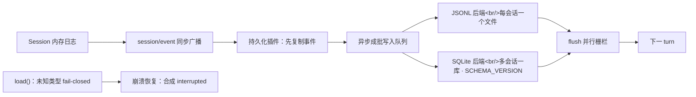

# 第 5 章：持久化 + 崩溃恢复 + 组合加载

> 对应 dsh 真实源码：`packages/session/session-persistence` + `packages/boot`
>（`docs/subsystems/persistence.md`、`docs/subsystems/session-projection.md`）
> 前置：第 1~4 章。产出文件：`miniharness/core/session/persistence.py`、`miniharness/boot/boot.py`、`example_plugins.py` + `tests/test_persistence_boot.py`

!!! warning "早期简化形态"
    本章代码为**教学简化形态**，与当前实现存在以下差异（学习时以当前实现为准，见 00-setup §0.5 简化表）：

    - **JSONL 片段**：实现每文件 header 行 + 事件行，`SESSION_FORMAT_VERSION = 2` 不符即拒读（fail-closed）；torn 尾部的**截断发生在读路径**——`read_prepared` / `_load_checked` 识别 torn 后即调 `_truncate_to` 落盘截断（`core/session/persistence.py:846,874`），随后 `commit_repair` 只**追加** recovered 事件 + closers 并 fsync（`core/session/persistence.py:965`，对齐上游 commitRepair）。
    - **`repair_and_replay`**：本章为逐条 `append` 重放；实现为 seed 回放——从 `session/end-seed` 标记重放，且修复合成的 closers 经 `commit_repair` 持久化落盘（`core/session/persistence.py`，基类接口 + JSONL 后端实现）。
    - **`turn/end` reason**：本章差异表写 `reason = "interrupted"` 字符串；实现为对象 `{kind:'interrupted'}`（配合 `repair_interrupted_turn` 合成 closers，见第 1 章横幅）。
    - **崩溃演示**：本章 §5.2"kill 进程"实为手动构造未闭合回合来模拟崩溃尾部，非真实 kill（`tests/test_persistence_boot.py` 可复核）。
    - **简化载体**：配置为 YAML（pyyaml 硬依赖承载）+ `!!js` 仅 `process.env.<NAME>` 子集。JSONL 载体**已对齐上游默认形态**：zstd 拼接帧容器 + 一行一事件（V2，模型流内嵌 `assistant/message`）+ format.ts 目录布局（`root/--<projectKey(cwd)>--/<encodeSegment(id)>/session.v2.jsonl[.zstd]`——generation 版本化文件名，v0 旧名 `session.jsonl` 保留拒读；编码互斥/遗留布局响亮拒绝），见 `zstd_frames.py` 与 `tests/test_persistence_zstd.py`。

## 5.1 这一章要做什么

前四章的 `Session` 都在内存里，进程一退什么都没了。这一章解决两件事：

1. **持久化**：`SessionPersistence` 扩展口 + 一整套纪律：`flush` 栅栏、fail-closed 加载、`interrupted` 崩溃修复。上游当前基线（alpha.1）的持久化后端只有 JSONL 一种（`session-persistence-jsonl`）；本章为演示「扩展口可换实现」，教学 artifact 额外给了一个 SQLite 第二后端（教学扩展，非上游对齐物——上游的 SQLite 只在 `session-query` 检索域使用）。
2. **组合加载**：`boot()` 把配置、补丁、插件串成一次启动：加载配置 → 按 id 打补丁 → 依赖驱动激活 → 断言全部就绪。

本章的验收是端到端的：**kill 一个进行中的回合再重启，日志平衡、可继续对话**。`python -m miniharness.demo` 演示的就是这个。

## 5.2 概念：持久化扩展口



常规做法是"每次消息变化立刻写库"——慢，而且写库失败会直接打断对话。dsh 的持久化不直接碰 Session，而是订阅 `session/event` 广播，把事件**复制**进自己的写入队列，异步成批落盘。四条纪律（与真实 dsh 一致）：

1. **append 先复制事件、异步成批写入**；`flush` 是"等待的栅栏"——认领下一个普通 turn 之前，所有事件必须落盘。
2. **格式拒绝，不迁移**：版本落后 = 升级 harness；版本超前 = 用更新的 harness 打开。
3. **fail-closed（带 ignorable 豁免）**：未知事件类型**除非带 `ignorable: true` 标记否则拒绝加载**（alpha.2 回滚）——不认识的、又未被写方标 `ignorable` 的事件宁可不打开也不能静默丢事件改变解读；被标 `ignorable`（纯信息记录，丢失不影响重建）的放行保留。
4. **崩溃恢复只合成，不截断**：`turn/end { reason: interrupted }` 保持括号平衡。

为什么是"扩展口"而不是直接写在 Session 里？因为存储策略（文件、数据库、未来可能的对象存储）不该和会话语义耦合。第 6 章会看到同样的思路在沙箱、凭据、子 agent 上重复出现。

**逐节点走读**（对应上图两条链）：

写路径（上排 `S → EVT → P → Q → J/QL → F → NEXT`）：

1. `Session 内存日志` append 一条新事件，同步触发 `session/event` 广播（发布/订阅，Session 自己不碰存储）。
2. 持久化插件 `P` 监听该广播，先把事件**复制**进自己的内部写入队列 `Q`——绝不直接修改 Session。
3. `Q` 异步成批写入后端：JSONL 后端 `J`（每会话一个文件按 seq 追加）或 SQLite 后端 `QL`（多会话一库、`SCHEMA_VERSION` 单调）。
4. `F`（flush 并行栅栏）是"等待点"：认领下一个普通 turn 前，`flush` 等待所有已入队事件真正落盘——这是崩溃恢复的落点前提。
5. 落盘完成才 `NEXT` 进入下一 turn。

读路径（下排 `LOAD → INT`）：

6. `load()`：读取日志，**未知事件类型除非带 `ignorable: true` 否则拒绝**（fail-closed，带豁免）——宁可不打开，不能静默丢事件改变解读；`ignorable` 纯信息记录跳过保留。
7. `INT` 崩溃恢复：发现未闭合回合时只**合成** `turn/end {kind:'interrupted'}`，保持括号平衡，绝不截断已写事件。
8. （torn 尾部）：若读到残帧/残行，读路径先截断 torn tail，`commit_repair` 再把恢复事件 + closers 追加落盘——见本节横幅差异表。

两条链相加：写入永远平衡、读取永远 fail-closed、恢复永远只合成不截断。

## 5.3 代码 step-by-step（persistence.py）

### 步骤 1：扩展口接口

```python
class SessionPersistence:
    """接缝接口：append / load / flush。"""
    def append(self, session_id, event): raise NotImplementedError
    def load(self, session_id): raise NotImplementedError
    def flush(self): raise NotImplementedError
```

三个方法就是全部约定。谁实现这个接口，谁就能当后端的"可替换点"。

### 步骤 2：JSONL 后端

```python
class JsonlPersistence(SessionPersistence):
    def __init__(self, root):
        self.root = Path(root)
        self.root.mkdir(parents=True, exist_ok=True)
        self._pending = {}          # 复制事件，异步成批写入

    def _path(self, session_id):
        safe = session_id.replace("/", "_").replace("\\", "_")
        return self.root / f"{safe}.jsonl"

    def append(self, session_id, event):
        self._pending.setdefault(session_id, []).append(event)

    def flush(self):
        for sid, events in self._pending.items():
            with open(self._path(sid), "a", encoding="utf-8") as f:
                for ev in events:
                    f.write(json.dumps(ev, ensure_ascii=False) + "\n")
        self._pending.clear()

    def load(self, session_id):
        path = self._path(session_id)
        if not path.exists():
            return []
        events = []
        with open(path, encoding="utf-8") as f:
            for line in f:
                line = line.strip()
                if line:
                    events.append(json.loads(line))
        return events
```

`append` 只进 `_pending` 队列，真正的写盘发生在 `flush`。这样一个回合里几十条事件可以一次批量写，不用每条都碰一次磁盘。每会话一个文件，`session_id` 里的路径分隔符做替换，防止目录穿越。

### 步骤 3：SQLite 后端（单调 SCHEMA_VERSION）

```python
class SqlitePersistence(SessionPersistence):
    SCHEMA_VERSION = 1

    def __init__(self, root):
        self.root = Path(root)
        self.root.mkdir(parents=True, exist_ok=True)
        self._conn = sqlite3.connect(self.root / "sessions.sqlite")
        self._conn.execute("CREATE TABLE IF NOT EXISTS meta (key TEXT PRIMARY KEY, value TEXT)")
        row = self._conn.execute("SELECT value FROM meta WHERE key='schema_version'").fetchone()
        if row is None:
            self._conn.execute("INSERT INTO meta VALUES ('schema_version', ?)", (str(self.SCHEMA_VERSION),))
            self._conn.commit()
        elif int(row[0]) != self.SCHEMA_VERSION:
            self._conn.close()
            raise RuntimeError(f"SQLite 库版本 {row[0]} 与当前 {self.SCHEMA_VERSION} 不一致，拒绝加载")
        self._conn.execute("CREATE TABLE IF NOT EXISTS events (session_id TEXT, seq INTEGER, type TEXT, data TEXT, PRIMARY KEY (session_id, seq))")
        self._conn.commit()
        self._pending = {}

    def flush(self):
        for sid, events in self._pending.items():
            base = self._conn.execute("SELECT COALESCE(MAX(seq), -1) FROM events WHERE session_id=?", (sid,)).fetchone()[0]
            rows = [(sid, base + 1 + i, ev["type"], json.dumps(ev, ensure_ascii=False)) for i, ev in enumerate(events)]
            self._conn.executemany("INSERT INTO events VALUES (?, ?, ?, ?)", rows)
        self._conn.commit()
        self._pending.clear()
    # load()：SELECT data ORDER BY seq
```

`(session_id, seq)` 主键保证同一会话内 seq 单调不重——磁盘上的序号和内存里的序号由数据库直接保证。

版本检查是关键：`SCHEMA_VERSION` 不符就**拒绝加载**（fail loud）。为什么不自动迁移？因为迁移意味着"改写历史"，而改写历史意味着可能丢事实。dsh 的原则是"格式拒绝，不迁移"：版本落后去升级 harness，版本超前用更新的 harness 打开。这是把决策权交给用户而不是代码。

### 步骤 4：fail-closed 加载 + 崩溃修复 + 回放

```python
def load_events_checked(raw_events):
    """fail-closed（带 ignorable 豁免）：未知事件除非带 ignorable 标记否则拒绝。"""
    for ev in raw_events:
        if ev.get("type") not in KNOWN_TYPES and ev.get("ignorable") is not True:
            raise RuntimeError(
                f"未知事件类型 {ev.get('type')!r}，且未标 ignorable，拒绝加载")
    return raw_events

def repair_and_replay(persistence, session_id, session):
    """load → 校验 → 崩溃修复 → 回放进内存 Session（重启后继续对话）。"""
    raw = load_events_checked(persistence.load(session_id))
    repaired = repair_interrupted_turn(raw)   # 第 1 章的硬性规定
    for ev in repaired:
        session.append(ev)
    return session
```

`load_events_checked` 的 fail-closed 值得展开：磁盘上有一条未知类型的事件，说明它来自更新版本的 harness（或有人手改了文件）。两条路：跳过它继续加载（省事，但解读被悄悄改变：事件序列断了一个环节），或者整体拒绝（严格，但保证解读不变）。**alpha.2 起 dsh 在中间加了 `ignorable` 豁免**：不认识的、但写方显式标了 `ignorable: true` 的事件（纯信息记录、丢失不影响重建）放行保留；其余未知事件照样 fail-closed 拒绝。mini 同款（`persistence.py` `load_events_checked`：「未知事件 `ignorable is True` 放行否则拒绝」，`session.py` `_replay_seed` 校验 `ignorable` 值只允许 true 或缺省）。

`repair_and_replay` 就是第 1 章 `repair_interrupted_turn` 的消费方：load → 校验 → 补括号 → 重新 append 进内存 Session。回放 = 重新派生，`derive_messages` 自动重建历史，第 1 章的"回放 = 重新派生"在这里落地。

## 5.4 代码 step-by-step（boot.py）——启动与组合

### 步骤 1：补丁算法（纯函数）

```python
def apply_patch(entries, patches):
    """补丁算法：replace 按 id 整段替换 config；insert 插入新条目。"""
    out = [dict(e) for e in entries]
    for patch in patches:
        if "replace" in patch:
            target_id = patch["replace"]["id"]
            new_cfg = patch["replace"]["config"]
            for e in out:
                if e["id"] == target_id:
                    e["config"] = dict(new_cfg)
                    break
            else:
                raise KeyError(f"patch 目标 id={target_id} 不存在")
        elif "insert" in patch:
            out.extend(dict(e) for e in patch["insert"])
        else:
            raise ValueError(f"未知补丁操作: {patch}")
    return out
```

两个操作：`replace` 按 id 整段替换某条配置，`insert` 追加新条目。为什么 replace 用 id 定位而不是"替换同名插件"？因为同一个插件可能被实例化多次（不同 config），id 才是唯一标识。目标 id 不存在时直接抛错——补丁写错了要当场知道，而不是静默无效。

> 报告《流程》篇 §5.5（`docs/report/03-flows.md`）的关键设计：组合、`--dump-config`、标志派发共用同一个补丁算法（纯函数），三者永不漂移。我们把它写成模块级纯函数，测试直接钉住。

### 步骤 2：boot()

```python
def load_plugin(entry):
    """从 'module' 导入插件：模块内须定义 apply(ctx, **config)。"""
    module = importlib.import_module(entry["module"])
    return {
        "name": entry.get("id", module.__name__),
        "inject": entry.get("inject") or getattr(module, "inject", None),
        "apply": lambda ctx, config, m=module: m.apply(ctx, **config),
    }

def boot(config_path, *patch_paths, env=None):
    """boot()：加载配置 → 依序应用补丁 → 动态激活插件 → 断言全部就绪。"""
    env = env or {}
    with open(config_path, encoding="utf-8") as f:
        config = json.load(f)
    entries = list(config.get("plugins", []))
    for pp in patch_paths:
        with open(pp, encoding="utf-8") as f:
            patches = json.load(f)
        entries = apply_patch(entries, patches)

    root = Context(name="root")
    for key, value in env.items():
        root.provide(key, value)

    fibers = [root.plugin(load_plugin(e), e.get("config", {})) for e in entries]
    _drain(fibers)                                 # 异步 body 排空在途转换
    _assert_entries_activated(fibers, entries)     # 终态断言（对齐上游）
```

插件不再声明 `provides`：服务在 apply 期用 `ctx.provide()` 动态登记（与真实 Cordis 一致）。依赖 `inject` 缺失的插件保持 `PENDING`，boot 结束时 `_assert_entries_activated` 点名缺失的注入服务并明确报错——"插件没生效"绝不会是运行期谜题。

`boot()` 的职责链条对应报告里的层叠顺序：`boot(config, *patches)` 的补丁按参数顺序应用——bundle 层 → profile 级 → home 级 → `--patch` overlay，越靠后越优先。

最后一步是**启动断言**：启动结束必须"条目已加载 + 已激活"，否则 fail loud。常规做法是"尽力而为"——加载失败记个 warning 继续跑，结果插件没生效，等运行期才爆。dsh 选择启动时就把话说死。

> 载体说明：真实 dsh 用 YAML（cordis.yml）；mini 的 `boot()` 同时支持 `.json` 与 `.yaml/.yml`（pyyaml 硬依赖）。YAML 里的 `!!js` 表达式（上游 `loadOverlayPatches` 语义：tag → `{__jsExpr}` 节点、激活时求值）在 mini 中仅支持 `process.env.<NAME>` 完整匹配、读取时求值，其它表达式 fail loud（上游是 JS eval 全量表达式，mini 不求值 JS —— 简化标注）。补丁语义（id 定位整段替换 / insert / 插值）与 JSON 载体完全一致。组合 dump（`--dump-config` / `--dump-default-config`，见 07 章 CLI）与 `boot()` 共用同一补丁算法。

## 5.5 端到端验收（无 key）

```bash
python -m miniharness.demo
```

演示脚本做的事：跑一个带工具的回合 → 打印事件日志与模型历史 → 模拟崩溃（只写了 `turn/start` 没写 `turn/end`）→ 重启 load + 修复 → 从日志回放并继续对话。

```bash
python -m unittest tests.test_persistence_boot -v
```

## 5.6 验收：硬性规定 + 测试

`tests/test_persistence_boot.py` 钉住的规定：

1. `flush` 之前 `load` 看不到数据（栅栏语义）
2. 双后端可互换：同一扩展口接口，同样的 seq 单调性
3. SQLite 版本不符 → 拒绝加载
4. 未知事件类型 → fail-closed，除非带 `ignorable: true`（豁免放行）
5. 崩溃后 `turn_balance == 0` 且最后事件是 `turn/end reason=interrupted`
6. 补丁算法纯函数：replace 整段替换 / insert 追加 / 目标缺失报错
7. boot 结束所有条目已激活，否则报错

## 5.7 检查点练习

1. **活会话恢复**：真实 dsh 里"活会话 load 等待权威内存快照持久化"。实现一个 `wait_for_flush(session)`：新事件 append 后 `flush()` 必须立即执行一次（栅栏），写测试验证。
2. **流记录损坏拒读**：构造带内嵌 `stream` 的 `assistant/message` 事件并落盘，把流里一条 run 记录改成非法形状（如删掉 `type` 字段），断言 `load()` fail-closed 拒读；恢复合法记录后，断言 `expand_assistant_stream` 往返还原。
3. **多补丁层叠**：写 3 个 patch 文件依次应用，断言最后一层覆盖前面的（对应 profile/home/overlay 层叠）。

## 5.8 回到 dsh：真实源码对照

打开 `deepseek-harness/packages/session/session-persistence`：

- 双后端真实实现（JSONL zstd 帧容器一行一事件、SQLite SCHEMA_VERSION 单调演进）
- `session/flush` 事件的真实语义：等待的并行栅栏
- `docs/subsystems/persistence.md` 的"格式拒绝，不迁移"原则

与上游的细节差异（简化但值得知道）：

| 细节 | 真实 dsh | 我们的简化 |
|---|---|---|
| JSONL 存储 | 默认 checksum + Zstandard 拼接帧容器（可选原始行） | **已对齐**：默认 zstd 帧容器 + 一行一事件（V2），明文模式可配（本章教学代码仍为明文逐行） |
| SQLite 后端 | 上游 alpha.1 **无 SQLite 持久化后端**（唯一后端是 JSONL；SQLite 仅用于 session-query 检索域） | 教学扩展：本章 SQLite 第二后端仅演示扩展口可换实现，非上游对齐物 |
| `time` 字段 | 每个事件 epoch 毫秒 | 教学 SQLite 后端无（JSONL 后端已对齐） |
| `sourceEventSeqs` | `assistant/message` 内嵌流且不能携带 `sourceEventSeqs`（fail-closed 拒绝）；其余 surface 事件可带非空引用 | 无（教学投影为扁平字符串） |
| 可回放起点 | `session/end-seed` marker：fork 子会话恒 `{inherited:true}`、restore/普通 seed 补 `{}`；`inherited_cut` 由最后一个 marker 的 seq 派生（seeded 无 marker / unseeded 有 marker 双向 corrupt） | **已对齐**（`persistence.py inherited_cut`） |
| 活会话 load | 等权威内存快照持久化后才允许加载 | 未实现（检查点练习 1 的方向） |
| `locate(meta)` | 多会话按元数据定位 | 无 |

## 5.9 收尾

持久化这章想清楚一件事：**崩溃不是特例，是常态**。所以加载路径上每个决定（版本、未知类型、未闭合 turn）都是"宁可拒绝，不可篡改"。下一章看三个扩展口：沙箱、凭据、子 agent——它们展示 dsh 如何把"能力"本身做成可替换的。