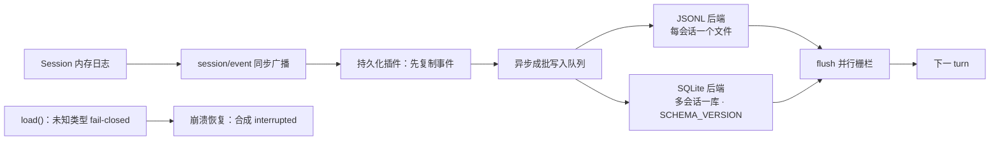

# 第 5 章：持久化 + 崩溃恢复 + 组合加载

> 对应 dsh 真实源码：`packages/session/session-persistence` + `packages/boot`
>（`docs/subsystems/persistence.md`、`docs/subsystems/session-projection.md`）
> 前置：第 1~4 章。产出文件：`miniharness/miniharness/persistence.py`、`boot.py`、`example_plugins.py` + `tests/test_persistence_boot.py`

## 5.1 本章目标

- 实现 `SessionPersistence` 接缝 + **JSONL / SQLite 双后端**（可互换）
- 实现 `flush` 栅栏、fail-closed 加载、`interrupted` 崩溃修复
- 实现 `boot()`：配置加载 → 按 id 补丁 → 依赖驱动激活 → 断言全部就绪

本章验收（端到端）：**kill 一个进行中的回合再重启，日志平衡、可继续对话**。

## 5.2 概念：持久化接缝



四条纪律（与真实 dsh 一致）：

1. **append 先复制事件、异步成批写入**；`flush` 是"等待的栅栏"——认领下一个普通 turn 之前，所有事件必须落盘。
2. **格式拒绝，不迁移**：版本落后 = 升级 harness；版本超前 = 用更新的 harness 打开。
3. **fail-closed**：未知事件类型（未带 `ignorable`）整体拒绝加载——宁可不打开，不能静默丢事件改变解读。
4. **崩溃恢复只合成，不截断**：`turn/end { reason: interrupted }` 保持括号平衡。

## 5.3 代码 step-by-step（persistence.py）

### 步骤 1：接缝接口

```python
class SessionPersistence:
    """接缝接口：append / load / flush。"""
    def append(self, session_id, event): raise NotImplementedError
    def load(self, session_id): raise NotImplementedError
    def flush(self): raise NotImplementedError
```

### 步骤 2：JSONL 后端

```python
class JsonlPersistence(SessionPersistence):
    def __init__(self, root):
        self.root = Path(root)
        self.root.mkdir(parents=True, exist_ok=True)
        self._pending = {}          # 复制事件，异步成批写入

    def _path(self, session_id):
        safe = session_id.replace("/", "_").replace("\\", "_")
        return self.root / f"{safe}.jsonl"

    def append(self, session_id, event):
        self._pending.setdefault(session_id, []).append(event)

    def flush(self):
        for sid, events in self._pending.items():
            with open(self._path(sid), "a", encoding="utf-8") as f:
                for ev in events:
                    f.write(json.dumps(ev, ensure_ascii=False) + "\n")
        self._pending.clear()

    def load(self, session_id):
        path = self._path(session_id)
        if not path.exists():
            return []
        events = []
        with open(path, encoding="utf-8") as f:
            for line in f:
                line = line.strip()
                if line:
                    events.append(json.loads(line))
        return events
```

### 步骤 3：SQLite 后端（单调 SCHEMA_VERSION）

```python
class SqlitePersistence(SessionPersistence):
    SCHEMA_VERSION = 1

    def __init__(self, root):
        self.root = Path(root)
        self.root.mkdir(parents=True, exist_ok=True)
        self._conn = sqlite3.connect(self.root / "sessions.sqlite")
        self._conn.execute("CREATE TABLE IF NOT EXISTS meta (key TEXT PRIMARY KEY, value TEXT)")
        row = self._conn.execute("SELECT value FROM meta WHERE key='schema_version'").fetchone()
        if row is None:
            self._conn.execute("INSERT INTO meta VALUES ('schema_version', ?)", (str(self.SCHEMA_VERSION),))
            self._conn.commit()
        elif int(row[0]) != self.SCHEMA_VERSION:
            self._conn.close()
            raise RuntimeError(f"SQLite 库版本 {row[0]} 与当前 {self.SCHEMA_VERSION} 不一致，拒绝加载")
        self._conn.execute("CREATE TABLE IF NOT EXISTS events (session_id TEXT, seq INTEGER, type TEXT, data TEXT, PRIMARY KEY (session_id, seq))")
        self._conn.commit()
        self._pending = {}

    def flush(self):
        for sid, events in self._pending.items():
            base = self._conn.execute("SELECT COALESCE(MAX(seq), -1) FROM events WHERE session_id=?", (sid,)).fetchone()[0]
            rows = [(sid, base + 1 + i, ev["type"], json.dumps(ev, ensure_ascii=False)) for i, ev in enumerate(events)]
            self._conn.executemany("INSERT INTO events VALUES (?, ?, ?, ?)", rows)
        self._conn.commit()
        self._pending.clear()
    # load()：SELECT data ORDER BY seq
```

- `(session_id, seq)` 主键保证同一会话内 seq 单调不重。
- 版本不符 → **拒绝加载**（fail loud），绝不迁移。

### 步骤 4：fail-closed 加载 + 崩溃修复 + 回放

```python
def load_events_checked(raw_events):
    """fail-closed：未知事件类型（未带 ignorable）整体拒绝加载。"""
    for ev in raw_events:
        if ev.get("type") not in KNOWN_TYPES and not ev.get("ignorable"):
            raise RuntimeError(f"未知事件类型 {ev.get('type')!r}，拒绝加载")
    return raw_events

def repair_and_replay(persistence, session_id, session):
    """load → 校验 → 崩溃修复 → 回放进内存 Session（重启后继续对话）。"""
    raw = load_events_checked(persistence.load(session_id))
    repaired = repair_interrupted_turn(raw)   # 第 1 章的不变量
    for ev in repaired:
        session.append(ev)
    return session
```

- 用第 1 章的 `repair_interrupted_turn` —— 崩溃恢复不截断，只补括号。
- 回放 = 重新 append 进内存 Session，然后 `derive_messages` 自然重建历史。

## 5.4 代码 step-by-step（boot.py）——启动与组合

### 步骤 1：补丁算法（纯函数）

```python
def apply_patch(entries, patches):
    """补丁算法：replace 按 id 整段替换 config；insert 插入新条目。"""
    out = [dict(e) for e in entries]
    for patch in patches:
        if "replace" in patch:
            target_id = patch["replace"]["id"]
            new_cfg = patch["replace"]["config"]
            for e in out:
                if e["id"] == target_id:
                    e["config"] = dict(new_cfg)
                    break
            else:
                raise KeyError(f"patch 目标 id={target_id} 不存在")
        elif "insert" in patch:
            out.extend(dict(e) for e in patch["insert"])
        else:
            raise ValueError(f"未知补丁操作: {patch}")
    return out
```

> 报告第 5.5 节的关键设计：组合、`--dump-config`、标志派发共用同一个补丁算法（纯函数），三者永不漂移。我们把它写成模块级纯函数，测试直接钉住。

### 步骤 2：boot()

```python
def load_plugin(entry):
    """从 'module' 导入插件：模块内须定义 apply(ctx, **config)。"""
    module = importlib.import_module(entry["module"])
    return {
        "name": entry.get("id", module.__name__),
        "inject": entry.get("inject") or getattr(module, "inject", []),
        "provides": entry.get("provides") or getattr(module, "provides", []),
        "apply": lambda ctx, m=module, c=entry.get("config", {}): m.apply(ctx, **c),
    }

def boot(config_path, *patch_paths, env=None):
    """boot()：加载配置 → 依序应用补丁 → 激活插件 → 断言全部就绪。"""
    env = env or {}
    with open(config_path, encoding="utf-8") as f:
        config = json.load(f)
    entries = list(config.get("plugins", []))
    for pp in patch_paths:
        with open(pp, encoding="utf-8") as f:
            patches = json.load(f)
        entries = apply_patch(entries, patches)

    root = Context(name="root")
    for key, value in env.items():
        root.provide(key, value)

    manager = PluginManager(root)                    # 第 2 章的依赖驱动激活
    activations = manager.activate([load_plugin(e) for e in entries])

    activated_ids = {name for name, _ in activations}
    missing = [e["id"] for e in entries if e["id"] not in activated_ids]
    if missing:
        raise RuntimeError(f"启动断言失败：以下条目未激活: {missing}")
    return root, activations
```

- **层叠顺序**：`boot(config, *patches)` 的补丁按参数顺序应用——对应报告里的"bundle 层 → profile 级 → home 级 → --patch overlay"。
- **断言**：启动结束必须"条目已加载 + 已激活"，否则 fail loud（真实 dsh 同款纪律）。

> 简化声明：真实 dsh 用 YAML（cordis.yml），我们为保持零依赖用 JSON；补丁语义（id 定位整段替换 / insert / 插值）完全一致。

## 5.5 端到端验收（无 key）

```bash
python -m miniharness.demo
```

演示脚本做的事：跑一个带工具的回合 → 打印事件日志与模型历史 → 模拟崩溃（只写了 `turn/start` 没写 `turn/end`）→ 重启 load + 修复 → 从日志回放并继续对话。

```bash
python -m unittest tests.test_persistence_boot -v
```

## 5.6 不变量清单

1. `flush` 之前 `load` 看不到数据（栅栏语义）
2. 双后端可互换：同一接缝接口，同样的 seq 单调性
3. SQLite 版本不符 → 拒绝加载
4. 未知事件类型 → fail-closed；带 `ignorable: true` → 放行
5. 崩溃后 `turn_balance == 0` 且最后事件是 `turn/end reason=interrupted`
6. 补丁算法纯函数：replace 整段替换 / insert 追加 / 目标缺失报错
7. boot 结束所有条目已激活，否则报错

## 5.7 检查点练习

1. **活会话恢复**：真实 dsh 里"活会话 load 等待权威内存快照持久化"。实现一个 `wait_for_flush(session)`：新事件 append 后 `flush()` 必须立即执行一次（栅栏），写测试验证。
2. **packed chunk 行**：给 JSONL 后端加 `meta` 行（如 `# meta: {"session_id": ...}`），load 时跳过。写测试。
3. **多补丁层叠**：写 3 个 patch 文件依次应用，断言最后一层覆盖前面的（对应 profile/home/overlay 层叠）。

## 5.8 回到 dsh：真实源码对照

打开 `deepseek-harness/packages/session/session-persistence`：

- 双后端真实实现（JSONL packed chunk、SQLite SCHEMA_VERSION 单调演进）
- `session/flush` 事件的真实语义：等待的并行栅栏
- `docs/subsystems/persistence.md` 的"格式拒绝，不迁移"原则

## 5.9 本章小结

| 概念 | 一句话 |
|---|---|
| 接缝 | `SessionPersistence` 接口 + 可互换后端 |
| flush 栅栏 | 下一 turn 前所有事件必须落盘 |
| fail-closed | 未知事件宁可不打开，不静默丢事实 |
| interrupted | 崩溃恢复只合成括号，不截断日志 |
| boot + patch | 补丁算法纯函数；启动断言全部激活 |