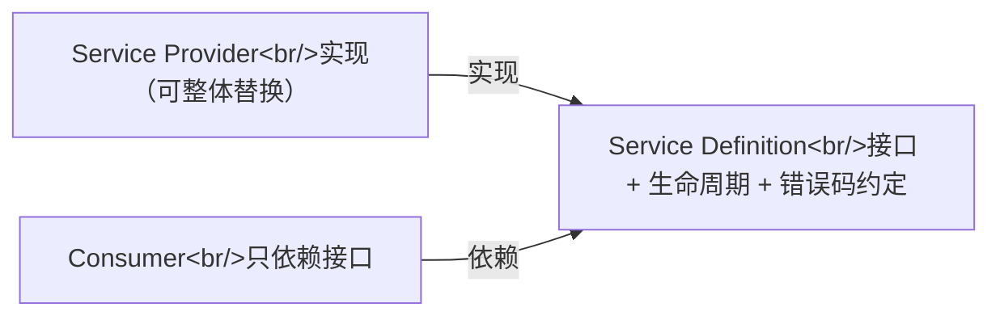

# 第 6 章：进阶扩展口（选做，任选其一深入）

> 对应 dsh 真实源码：`docs/capability-seams.md` + 各子系统页（sandbox / credentials / subagent）
> 前置：第 1~5 章。产出文件：`miniharness/seams/subagent/`（基础三件套）+ `seams/sandbox_local.py`、`seams/credentials_local.py`（真后端）+ `tests/test_seams.py`、`tests/test_stage6.py`

## 6.1 这一章要做什么

前面几章反复出现一个模式：接口 + 可替换实现 + 只依赖接口的消费方。这一章把这个模式正式化——"能力扩展口三角色"，并且亲手实现三遍，每一遍都在验证同一句话：

> **换一个 Provider，不改 Consumer，即换行为。**

三个扩展口，任选其一做深（各自 2~3 天工作量）：

1. **沙箱**：`Sandbox` 接口 + `wrap(argv)`——把 argv 包裹进受限执行环境
2. **凭据**：`CredentialProvider` 接口 + `resolve(key)`——配置只存引用，每次操作解析
3. **子 agent**：`SubAgentProvider` 工厂接口 + `spawn(name, prompt)`

## 6.2 概念：扩展口三角色



一个角色单独不构成扩展口。新增能力 = 同时设计三个角色：定义接口（Service Definition）、提供实现（Provider）、写消费逻辑（Consumer）。三者缺一，替换性就不成立——没有接口，Consumer 直接依赖具体实现，一换就炸。

还有一个联动值得知道：**共享执行世界**。dsh 里 FS 与 subprocess 的 Provider 指向远程沙箱后，Bash / PTY / LSP 会全部跟随迁移——因为它们共享同一个"执行世界"对象，换一次配置，所有相关能力一起搬家。

## 6.3 扩展口 1：沙箱（Sandbox）

```python
class Sandbox:
    """Service Definition：把 argv 包裹进受限执行环境。"""
    def wrap(self, argv):
        raise NotImplementedError

class PassthroughSandbox(Sandbox):
    """本地直通（danger：不设防，等同 danger-full-access）。"""
    def wrap(self, argv):
        return argv

class ReadOnlySandbox(Sandbox):
    """模拟只读沙箱：含写操作标志的命令直接拒绝（失败即拒）。"""
    WRITE_MARKERS = ("-w ", "--write", "-o ", ">", ">>", "rm ", "mv ", "touch ", "mkdir ")

    def wrap(self, argv):
        cmd = " ".join(argv)
        if any(marker in cmd for marker in self.WRITE_MARKERS):
            raise PermissionError(f"只读沙箱拒绝写操作: {cmd}")
        return argv

class CommandConsumer:
    """Consumer：只依赖 Sandbox 接口。换 Provider 即换行为。"""
    def __init__(self, sandbox):
        self._sandbox = sandbox

    def run(self, command):
        if os.name == "nt":
            argv = self._sandbox.wrap([command])
            proc = subprocess.run(argv[0], shell=True, capture_output=True, text=True, timeout=10)
        else:
            argv = self._sandbox.wrap(shlex.split(command))
            proc = subprocess.run(argv, capture_output=True, text=True, timeout=10)
        return proc.stdout.strip() or proc.stderr.strip()
```

常规做法是把安全策略写死在工具内部（"这个工具自己小心点"）。dsh 反过来：策略是独立的 Provider，工具（Consumer）只声明"我要执行一个命令"，至于在什么环境里执行，由注入的沙箱决定。

`PassthroughSandbox` 对应 `danger-full-access`（不设防），`ReadOnlySandbox` 对应 `read-only` 的简化模拟。验收测试的关键是 Consumer 代码一字不改：

```python
passthrough = CommandConsumer(PassthroughSandbox())
readonly = CommandConsumer(ReadOnlySandbox())
# Consumer 代码不变，只换 Provider
with self.assertRaises(PermissionError):
    readonly.run("echo a > tmp_evil.txt")
assert passthrough.run("echo ok") == "ok"
```

注意 `ReadOnlySandbox` 的"失败即拒"（deny on failure）：检测到写操作标志直接抛错，而不是"试试看能不能写"。dsh 的真实约定也是如此——无法确认安全就拒绝执行。

> 真实 dsh：`sandbox-local` 用 bwrap / Landlock / Seatbelt / Windows ACL 后端；`native/landlock-run` 是独立发布的原生 launcher（C 源码包）。失败即拒是共同约定。

## 6.4 扩展口 2：凭据（Credentials）

```python
class CredentialProvider:
    """Service Definition：按操作解析凭据；配置只存引用，绝无明文。"""
    def resolve(self, key):
        raise NotImplementedError

class EnvCredentialProvider(CredentialProvider):
    """env-over-.env：配置项 -> 环境变量名（引用），每次调用解析。"""
    def __init__(self, mapping=None):
        self._mapping = mapping or {"api_key": "DEEPSEEK_API_KEY"}

    def resolve(self, key):
        env_name = self._mapping[key]
        value = os.environ.get(env_name, "")
        if not value:
            raise KeyError(f"凭据 {key}（环境变量 {env_name}）未配置")
        return value
```

常规做法是配置文件里直接写 key（或者至少把 key 读进内存常驻）。dsh 的纪律是：配置里存的是 `apiKeyEnv` 这样的**引用**，不是明文；`ctx.credentials` 让 API key **每次调用**解析——改环境变量不用重启进程，而且配置仓库里永远找不到一个真实的 key。

第 4 章 `DeepSeekAdapter` 里 `os.environ.get("DEEPSEEK_API_KEY")` 就是 `EnvCredentialProvider` 的雏形；这里把它升级成接口，是为了给 `.env` 文件、keyring、提示注入等来源留位置。

## 6.5 扩展口 3：子 agent（SubAgent）

```python
class SubAgent:
    def run(self, task): raise NotImplementedError

class SubAgentProvider:
    """Service Definition：子 agent 工厂。"""
    def spawn(self, name, system_prompt): raise NotImplementedError

class InProcessSubAgentProvider(SubAgentProvider):
    """in-process Provider：复用主循环（真实还有 fork / ACP / Codex / Claude Code）。"""
    def __init__(self, make_loop):
        self._make_loop = make_loop
    def spawn(self, name, system_prompt):
        return _InProcessSubAgent(self._make_loop(system_prompt))

class _InProcessSubAgent(SubAgent):
    def __init__(self, loop):
        self._loop = loop
    def run(self, task):
        self._loop.followup(task)
        return self._loop.last_response()
```

子 agent 的 Provider 选择直接决定"子 agent 跑在哪"：同进程复用主循环（in-process）、独立进程（fork）、外部协议（ACP）、甚至另一个商业 CLI（Codex / Claude Code）。Consumer（`subagent` 工具）只依赖 `spawn + run`，不知道也不关心子 agent 背后是什么。

> 真实 dsh 的 `ctx.subagents` Provider 有 in-process / fork / ACP / Codex / Claude Code / dsh-sdk 六个。把我们的 `InProcessSubAgentProvider` 换成任何一个，`spawn + run` 的调用方代码一字不改。

## 6.6 验收

```bash
python -m unittest tests.test_seams -v
```

## 6.7 检查点练习（挑一个做深）

1. **沙箱**：实现 `DenyListSandbox`（基于 deny 黑名单）与 `AllowListSandbox`（基于 allow 白名单）两个 Provider，共享一个测试套件证明 Consumer 不变。
2. **凭据**：实现 `FileCredentialProvider`（从 `.env` 文件读取，逐行 `KEY=VALUE`），与 `EnvCredentialProvider` 共用同一接口测试。
3. **子 agent**：用第 4 章的 `DeepSeekAdapter` 实现 `RemoteSubAgentProvider`（真实 API），跑一次"主 agent 派发任务给子 agent"的完整链路。

## 6.8 回到 dsh：真实源码对照

打开 `deepseek-harness/docs/capability-seams.md`：

- 完整扩展口列表与每个扩展口的三角色实例
- "共享执行世界"的迁移机制（FS/subprocess Provider 指向远程沙箱 → Bash/PTY/LSP 跟随迁移）

三个扩展口与上游的接口差异（简化命名，语义一致）：

| 扩展口 | 我们的接口 | 上游真实接口 | 备注 |
|---|---|---|---|
| 沙箱 | `Sandbox.wrap(argv)` | `SandboxProvider.confine(argv): ConfinedArgv`（含 runner/profile/分离符 + `allowedExitCodes`/`fatalSignatures`/`denialSignatures`） | `SandboxMode`：`read-only` / `workspace-write` / `danger-full-access`；"失败即拒"约定一致 |
| 凭据 | `CredentialProvider.resolve(key)` | `resolve(ref): ResolvedCredential`（值 + 来源层）+ `describe(ref)`；本地 provider 层：`env` / `file` / `project-env` / `user-env` | 引用是带 brand 的 POSIX 环境变量名语法；每次操作重新解析 ✓ |
| 子 agent | `SubAgentProvider.spawn(name, prompt)` | `SubagentProvider.start(...)` + `prepareContinuable`（可继续对话）+ `SubagentCapabilities` 能力门（不支持则 `UNSUPPORTED_CAPABILITY` 拒绝） | 六个真实 Provider：in-process / fork / ACP / Codex / Claude Code / dsh-sdk |

## 6.9 进阶实现：真后端 / 四层凭据 / 远程三通道

基础三件套讲清"换 Provider 不改 Consumer"；进阶三件把每个接缝推向与 dsh 对齐的形态（产出：`miniharness/seams/sandbox_local.py` + `credentials_local.py` + `subagent/providers.py` + `subagent/worker.py`，验收测试在 `tests/test_stage6.py`）。

**沙箱真后端**（`sandbox_local.py` + `landlock_run.py`，对应上游 `sandbox/sandbox-local` 与 `native/landlock-run`）：按平台选链（linux `bwrap → landlock`、darwin `seatbelt`、win32 `windows-acl`），多候选由功能探测仲裁、单候选免探测；候选全不可用 → `SandboxUnavailableError`（`SANDBOX_UNAVAILABLE`）fail closed，命令绝不裸跑。`confine(argv, policy)` 返回 `ConfinedArgv`：包裹后的 argv + `enforcement`（full/partial）+ 该后端专属的 denial 方言与 runner 失败规则——"命令没跑起来"与"被沙箱拦住"可区分。三个 profile 生成器与上游 `profiles.ts` 逐条对齐（bwrap 挂载、landlock grant、seatbelt SBPL 剖面，可写根与进程内 fs fence 共用 `writable_roots` 同一推导）。landlock 梯队由 `seams/landlock_run.py` ctypes 自限制执行器真执行：上游 `native/landlock-run` 是 C11 launcher 二进制，mini 以 `python -m miniharness.seams.landlock_run` 复刻同一 CLI 契约（`--ro/--rw/--/--probe`、launcher 失败 exit 125 绝不 exec、probe 报告行逐字一致），内核侧走 Landlock UAPI（ABI 协商 → PATH_BENEATH 规则 → `PR_SET_NO_NEW_PRIVS` → `restrict_self` → `execvp`；full ⟺ 内核 ABI ≥ 5，否则 partial 但仍受限；非 Linux 宿主干净退出 125）。

**windows-acl 真后端**（`seams/sandbox_windows_acl/`，对应上游 `sandbox/sandbox-windows-acl` 的进程内 koffi FFI）：ctypes 直调 Win32 三件——`CreateRestrictedToken` 铸 `WRITE_RESTRICTED` 受限令牌，`SetEntriesInAclW` + `SetNamedSecurityInfoW` 把能力 SID 的可写 ACE 物化到授权目录（workspace 常驻、会话私有 temp 可撤销），`CreateProcessAsUserW` 在该令牌下 spawn 子进程。runner 以 `python -m miniharness.seams.sandbox_windows_acl.runner --workspace <dir> --temp <dir> --mode <m> [--write-sid … --temp-write-sid …] -- <argv>` 包裹命令，自身任何失败打印 `windows-acl-run: <detail>` 并 exit 127——消费者靠「127 + fatal 行」双条件区分"没跑起来"与"跑起来后被拒"。约定测试经 `internals` 注入钩子验证链选择与包裹形状；真内核行为由门控 e2e（`MINIHARNESS_INTEGRATION_WINDOWS_ACL=1`）覆盖。

理解这个后端只需要一块内核知识：**受限令牌的两遍求值**。

1. `CreateRestrictedToken(..., WRITE_RESTRICTED)` 产生一个派生令牌：常规组保持原样，额外携带一张**限制列表**。mini 放进三个 SID：本次登录会话的 logon SID、Everyone、以及一个凭空合成的能力 SID（形如 `S-1-4-<hash>`，不对应任何账号）。
2. 内核对每次访问对同一 DACL 做两遍求值：第一遍以常规组为主体，第二遍以限制列表为主体。**写类访问必须两遍全部放行**；读/执行类只看第一遍。这就是"WRITE_RESTRICTED 只限写"的全部机制。
3. 能力 SID 的唯一用途就是在第二遍求值中匹配我们授予的 allow ACE——"给目录授能力 SID 写 ACE"即"把目录加入该子进程的白名单"，撤销 ACE 即收回授权。合成 SID 在第二遍完全有效，不需要是真实的组或账号。
4. 反直觉推论一：**OWNER RIGHTS ACE（S-1-3-4）对受限进程无效**。文件属主自己的非受限令牌能借它拿到全权，但两遍求值都不会把它算给受限主体。
5. 反直觉推论二：**目录怎么生出来，与授什么 ACE 同等重要**。DACL 里若没有任何一条能让"常规组"过第一遍的 ACE，第二遍再完美也白搭。

用同一受限令牌对不同 DACL 跑 `AccessCheck`，矩阵一目了然（目标位 `FILE_GENERIC_WRITE`，限制列表 `[logon, Everyone, CAP_B]`）：

| 目录 DACL | 非受限令牌 | 受限令牌 |
|---|---|---|
| 仅 `CAP_B:(F)` | 拒 | 拒 |
| `CAP_B` + 用户 SID `:(F)` | 过 | 过 |
| `CAP_B` + Everyone `:(F)` | 过 | 过 |
| `CAP_B` + OwnerRights `:(F)` | 过 | **拒** |

"仅 CAP_B 连非受限都被拒"正是第 5 条：这个 DACL 里没有用户侧的第一遍通路。而 CPython 恰好有个坑踩在这里——`tempfile.mkdtemp(0o700)` 会显式构造安全描述符（SYSTEM/Administrators/**OWNER RIGHTS** 三条，唯独没有用户自己的 ACE），于是用它创建的沙箱目录永远过不了第一遍；上游 node 的 `fs.mkdtempSync` 不构造描述符、纯继承父目录 DACL，%TEMP% 链路自带的 `user:(I)(F)` 天然喂饱第一遍。所以 mini 的 runner 私有 temp 与 provider 会话 temp 都用继承式 `os.mkdir` 创建。Everyone 与 logon SID 同时出现在两个列表里，一条 `Everyone:(F)` 能同时喂饱两遍——这正是上游文档标注 enforcement=partial（Everyone 边界）的由来。这条经验超出本例：在 Windows 上做沙箱或临时目录，先问"DACL 从哪继承"，再谈授什么 ACE。

**沙箱策略服务 + bash 消费者**（`seams/sandbox_policy.py` + `shell/`，对应上游 `sandbox/sandbox-policy`、`session-mode.ts` 与 `shell/bash-sandbox`）：策略与强制分属两个服务——ctx.sandboxPolicy 是唯一的共享策略家（Config `{mode: 缺省 read-only, workspaceRoot}` fail-loud 校验；`resolve()` 决议完整策略：显式 mode > 会话日志最后一条 `sandbox/mode` > 部署缺省；workspace 根先 canonical 后词法规范化，会话 cwd 即 workspace-write 边界），ctx.sandbox 把模式物化为 runner argv。会话覆盖以会话日志为存储：`set_sandbox_mode` 追加恰一条 `sandbox/mode` log-only 事件，`effective_sandbox_mode` 纯 fold 逆序取最后——切换即事件本身，重放即状态。三档策略文案经 systemPrompt `.context('sandbox:policy', order=110)` 进模型可见上下文（loop 侧投影在上下文变化时把快照铸成 durable user 消息注入对话流，见 `core/agent_loop/runtime_context.py`）。消费者在 `shell/` 层：`bash_local.py` 是 ctx.shell 缺省 provider（前台 `bash -c` 直跑），`bash_sandbox.py` 子类每次调用把精确 argv 经 confine 包裹后 spawn 并报告 `{mode, denied, enforcement}`；三路归因对齐上游 helpers.ts——runner 启动失败（ENOENT/EACCES 且错误路径恰为 argv[0]、cwd 可用性独立校验）与 runner 失败规则命中抛 `SandboxUnavailableError` 且优先于 denial，denial = 非零退出 + stderr 大小写不敏感签名命中（普通非零退出仍是正常结算）；danger-full-access 直通不包裹。工具面（`cli/default_tools.py`）检测到 ctx.shell 时把教学 stub 换成真执行器，逐调用以调用方会话决议策略；headless 入口 `run_headless(..., sandbox=配置)` 一键装配全栈。已知简化：后台进程机制未复现。

**凭据四层**（`credentials_local.py`，对应上游 `credentials-local`）：`env > file > project-env > user-env` 按信任度排序——继承环境只读胜出（CI secret / `-e` 是显式意图且进程内不可编辑）、管理文件层可写（`set`/`unset` 读-改-写补丁单键，外部编辑合并、删掉的条目不残留）、project `.env` 优先于 user `.env`。文档解析严格：非映射根 / 非 POSIX 标识符 key / 非字符串 / 空串值整体拒绝，绝不静默跳过；`describe` 报告 `{configured, source, writable}`（只有 env 层不可写）；env 已提供时 `set`/`unset` 拒绝（写了也被遮蔽成无效果）；POSIX 上组/其他可读的文档读前直接拒绝（Windows 无 mode 可查则跳过）。载体简化：文档用 JSON 替代 YAML（解析语义不变），无跨进程锁与文件 watch。

**子 agent 远程三通道**（`subagent/providers.py` + `subagent/worker.py`，对应上游 `subagent-fork-in-process` / `subagent-acp` / `subagent-dsh-sdk`）：

- **fork**（进程内）：子 agent 以父会话日志的 completed-turn 前缀作 seed（到最后一个 `turn/end` 为止，in-flight 工具回合不平衡不能重放），`Session(seed=...)` 回放 + 自动补 `session/end-seed` 标记——子会话直接继承父上下文。
- **ACP**（真子进程）：`python -m miniharness.seams.subagent.worker acp` 起独立进程，newline-delimited JSON-RPC over stdio（与上游 `ndJsonStream` 同帧形状）；`initialize → newSession → prompt → cancel → shutdown`；唯一从父读的是 workspace cwd；permission 策略自动应答（reject 默认 / allow），不上报人；事件通知先于响应帧写出（mini 同步载体约定，上游为并发流）。
- **SDK**（真子进程）：`subagent_worker sdk` 承载 `SdkRuntime`，`initialize → session/prompt`（懒创建会话）→ `shutdown`；回合级透传 `session.event`（本次回合新增的 inbox 回执、assistant/message、turn/end 逐条，`_event_boundary` 边界保证会话复用不重发历史事件）+ 末尾 `session.status idle` 通知，可被官方 Python SDK 客户端直接驱动（见第 7 章 7.6.4）。

三者保持同一 Consumer 接口 `spawn(name, prompt) -> SubAgent`：换通道只改 Provider 构造，消费方代码不动。

## 6.10 手册收尾

全部 6 章做完，你应该能用 Python 亲手证明这三件事（报告《结语》篇 §12 同样强调）：

1. **事件溯源日志是唯一数据源**（第 1、5 章）
2. **注册 = 可逆副作用 + waterfall 短路**（第 2、3 章）
3. **能力扩展口三角色带来整体可替换性**（第 3、6 章）

如果这三件事你现在都能不查资料写出来，对 dsh 的理解就已经到位了。接下来可以：

- 精读第 12 章：MiniHarness 已是异步形态（`asyncio` + 真正的 parallel / 并行屏障），看它如何落地第 2 章的派发语义
- 用官方 Python SDK（`deepseek-harness-sdk`）驱动真实 harness，对照你的约定
- 给 dsh 仓库提第一个插件 PR（`docs/cookbook/adding-a-tool.md`）