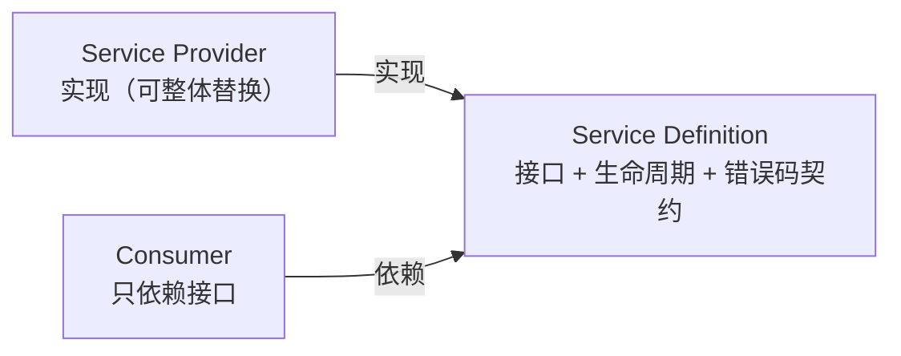

# 第 6 章：进阶接缝（选做，任选其一深入）

> 对应 dsh 真实源码：`docs/capability-seams.md` + 各子系统页（sandbox / credentials / subagent）
> 前置：第 1~5 章。产出文件：`miniharness/miniharness/seams.py` + `tests/test_seams.py`

## 6.1 本章目标

把"能力接缝三角色"亲手实现三遍，每一遍都在验证同一句话：

> **换一个 Provider，不改 Consumer，即换行为。**

三个接缝（各 2~3 天，任选其一做深）：

1. **沙箱**：`Sandbox` 接口 + `wrap(argv)` —— 把 argv 包裹进受限执行环境
2. **凭据**：`CredentialProvider` 接口 + `resolve(key)` —— 配置只存引用，每次操作解析
3. **子 agent**：`SubAgentProvider` 工厂接口 + `spawn(name, prompt)`

## 6.2 概念：接缝三角色



- 一个角色单独不构成接缝；新增能力 = 同时设计三个角色。
- Provider 之间通过"共享执行世界"联动：FS 与 subprocess 的 Provider 指向远程沙箱后，Bash/PTY/LSP 全部跟随迁移。

## 6.3 接缝 1：沙箱（Sandbox）

```python
class Sandbox:
    """Service Definition：把 argv 包裹进受限执行环境。"""
    def wrap(self, argv):
        raise NotImplementedError

class PassthroughSandbox(Sandbox):
    """本地直通（danger：不设防，等同 danger-full-access）。"""
    def wrap(self, argv):
        return argv

class ReadOnlySandbox(Sandbox):
    """模拟只读沙箱：含写操作标志的命令直接拒绝（失败即拒）。"""
    WRITE_MARKERS = ("-w ", "--write", "-o ", ">", ">>", "rm ", "mv ", "touch ", "mkdir ")

    def wrap(self, argv):
        cmd = " ".join(argv)
        if any(marker in cmd for marker in self.WRITE_MARKERS):
            raise PermissionError(f"只读沙箱拒绝写操作: {cmd}")
        return argv

class CommandConsumer:
    """Consumer：只依赖 Sandbox 接口。换 Provider 即换行为。"""
    def __init__(self, sandbox):
        self._sandbox = sandbox

    def run(self, command):
        if os.name == "nt":
            argv = self._sandbox.wrap([command])
            proc = subprocess.run(argv[0], shell=True, capture_output=True, text=True, timeout=10)
        else:
            argv = self._sandbox.wrap(shlex.split(command))
            proc = subprocess.run(argv, capture_output=True, text=True, timeout=10)
        return proc.stdout.strip() or proc.stderr.strip()
```

验收测试的关键：

```python
passthrough = CommandConsumer(PassthroughSandbox())
readonly = CommandConsumer(ReadOnlySandbox())
# Consumer 代码不变，只换 Provider
with self.assertRaises(PermissionError):
    readonly.run("echo a > tmp_evil.txt")
assert passthrough.run("echo ok") == "ok"
```

> 真实 dsh：`sandbox-local` 用 bwrap / Landlock / Seatbelt 后端；`native/landlock-run` 是 Node 插件。失败即拒（deny on failure）是共同契约。

## 6.4 接缝 2：凭据（Credentials）

```python
class CredentialProvider:
    """Service Definition：按操作解析凭据；配置只存引用，绝无明文。"""
    def resolve(self, key):
        raise NotImplementedError

class EnvCredentialProvider(CredentialProvider):
    """env-over-.env：配置项 -> 环境变量名（引用），每次调用解析。"""
    def __init__(self, mapping=None):
        self._mapping = mapping or {"api_key": "DEEPSEEK_API_KEY"}

    def resolve(self, key):
        env_name = self._mapping[key]
        value = os.environ.get(env_name, "")
        if not value:
            raise KeyError(f"凭据 {key}（环境变量 {env_name}）未配置")
        return value
```

纪律（报告 5.4 节）：配置里存的是 `apiKeyEnv` **引用**，不是明文；`ctx.credentials` 让 API key **每次调用**解析——改环境变量不用重启。

## 6.5 接缝 3：子 agent（SubAgent）

```python
class SubAgent:
    def run(self, task): raise NotImplementedError

class SubAgentProvider:
    """Service Definition：子 agent 工厂。"""
    def spawn(self, name, system_prompt): raise NotImplementedError

class InProcessSubAgentProvider(SubAgentProvider):
    """in-process Provider：复用主循环（真实还有 fork / ACP / Codex / Claude Code）。"""
    def __init__(self, make_loop):
        self._make_loop = make_loop
    def spawn(self, name, system_prompt):
        return _InProcessSubAgent(self._make_loop(system_prompt))

class _InProcessSubAgent(SubAgent):
    def __init__(self, loop):
        self._loop = loop
    def run(self, task):
        self._loop.followup(task)
        return self._loop.last_response()
```

> 真实 dsh 的 `ctx.subagents` Provider 有 in-process / fork / ACP / Codex / Claude Code / dsh-sdk 六个——Consumer（`subagent` 工具）只依赖接口。把我们的 `InProcessSubAgentProvider` 换成任何 Provider，`spawn + run` 的调用方代码一字不改。

## 6.6 验收

```bash
python -m unittest tests.test_seams -v
```

## 6.7 检查点练习（挑一个做深）

1. **沙箱**：实现 `DenyListSandbox`（基于 deny 黑名单）与 `AllowListSandbox`（基于 allow 白名单）两个 Provider，共享一个测试套件证明 Consumer 不变。
2. **凭据**：实现 `FileCredentialProvider`（从 `.env` 文件读取，逐行 `KEY=VALUE`），与 `EnvCredentialProvider` 共用同一接口测试。
3. **子 agent**：用第 4 章的 `DeepSeekAdapter` 实现 `RemoteSubAgentProvider`（真实 API），跑一次"主 agent 派发任务给子 agent"的完整链路。

## 6.8 回到 dsh：真实源码对照

打开 `deepseek-harness/docs/capability-seams.md`：

- 完整接缝列表与每个接缝的三角色实例
- "共享执行世界"的迁移机制（FS/subprocess Provider 指向远程沙箱 → Bash/PTY/LSP 跟随迁移）

## 6.9 手册收尾：三大心智模型

全部 6 章做完，你应当能用 Python 亲手证明这三件事（报告第 12 节同样强调）：

1. **事件溯源日志是唯一事实来源**（第 1、5 章）
2. **注册 = 可逆副作用 + waterfall 短路**（第 2、3 章）
3. **能力接缝三角色带来整体可替换性**（第 3、6 章）

如果这三件事你现在都能不查资料写出来，你对 dsh 的理解已经超过大多数读过一遍文档的人。接下来可以：

- 把 MiniHarness 换成异步（`asyncio` + 真正的 parallel/parallel barrier）
- 用官方 Python SDK（`deepseek-harness-sdk`）驱动真实 harness，对照你的契约
- 给 dsh 仓库提第一个插件 PR（`docs/cookbook/adding-a-tool.md`）