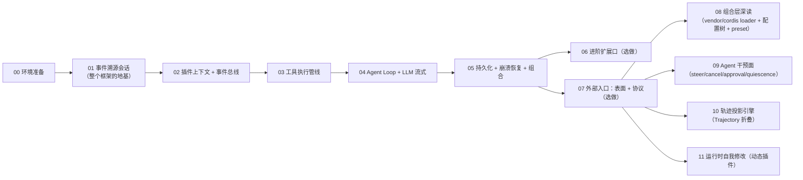

# Mini DeepSeek Harness（Python）— 文档入口

> 用 Python（stdlib 优先，关键协议层精选第三方如 httpx）从 0 到 1 复现 [DeepSeek Harness](https://github.com/deepseek-ai/deepseek-harness) 核心能力的教学项目。
> 仓库：https://github.com/ZZKeepCurious/mini-deepseek-harness-python

## 这是什么

本手册用**纯 Python（stdlib 优先；DeepSeek SSE 传输层用 `httpx`，YAML 可选 `pyyaml`）**从零实现一个 `MiniHarness`：一个最小可用的 Agent 运行时核心子集，逐条复现 DeepSeek Harness（`dsh`）的**约定与硬性规定**。

复现目标不是逐行移植 TypeScript，而是**掌握约定**：

| 保留（技术核心本身） | 跳过（非核心） |
|---|---|
| 事件溯源会话 + `deriveMessages` 投影 | 声明合并（`declare module`） |
| 插件可逆副作用 + waterfall 短路 | 双面打包 / 生成器门禁 |
| 能力扩展口三角色 | HMR 热重载 |
| 作用域化注册 + 工具管线 | typert 类型图 |
| turn/step 状态机 + LLM 流式协议 | Web 客户端 / UI 卡片 |

## 架构与对齐（代码组织设计）

- **[架构说明与上游对应](architecture.md)** —— `miniharness/` 代码自身的"建筑图纸"：目录组织（家族镜像原则）、模块 ↔ 上游映射表、依赖方向规则、公共 API 白名单/黑名单与教学扩展清单。

## 分析报告（主文档 · 体系化解读）

- **[报告首页（阅读地图）](report/index.md)** —— 体系化入口：六个主题子页导航 + 四维对照表（上游包 ↔ mini 模块 ↔ 手册章节 ↔ 报告页面）。
  - [01 项目全景与分层架构](report/01-overview.md)
  - [02 系统架构与内核](report/02-architecture.md)
  - [03 关键处理流程](report/03-flows.md)
  - [04 产品面全解读](report/04-product-surface.md)（模式设计、外部入口、Trajectory、干预面、审批、自我修改、resume、plan/goal、压缩与后台）
  - [05 路线图与 Python 复现](report/05-roadmap.md)
  - [06 附录与 HOWTO](report/06-appendix.md)

## 教程手册（step-by-step · 施工图纸层）

> 引导式教程：每章 = 概念讲解 → 最小可运行 Python 代码 → 逐段解释 → 硬性规定/测试验证 → 检查点练习。

### 学习地图



### 章节表

| 章节 | 内容 | 对应 dsh 真实源码 | 预计 |
|---|---|---|---|
| [00 环境准备](chapters/00-setup.md) | 运行环境、包结构、跑通测试 | — | 1 小时 |
| [01 事件溯源会话](chapters/01-event-sourced-session.md) | `Session` 追加式日志、seq 连续、deep-freeze、`derive_messages` 投影、崩溃修复 | `packages/core/session` | 2-3 天 |
| [02 插件上下文 + 事件总线](chapters/02-plugin-context-and-event-bus.md) | `Context` 服务仓库、四种派发（emit/waterfall/parallel/serial）、可逆副作用、作用域、依赖驱动激活 | `vendor/cordis` + `core/scope` | 2 天 |
| [03 工具执行管线](chapters/03-tool-execution-pipeline.md) | 作用域化注册表、schema 校验、pre/execute/post waterfall、超时、规范化 | `packages/core/tools` | 2 天 |
| [04 Agent Loop + LLM 流式](chapters/04-agent-loop-and-llm-streaming.md) | turn/step 状态机、inbox、StreamChunk 协议、DeepSeek SSE 适配器、模型请求重试/退避（§4.10：retry-policy + llm-retry + agent/request-error） | `core/agent-loop` + `llm/llm` + `llm/llm-deepseek` + `llm/llm-retry` | 3 天 |
| [05 持久化 + 崩溃恢复 + 组合](chapters/05-persistence-recovery-composition.md) | JSONL/SQLite 双后端、flush 栅栏、fail-closed、interrupted 修复、boot + patch | `session/session-persistence` + `boot` | 2 天 |
| [06 进阶扩展口](chapters/06-advanced-seams.md) | 沙箱 / 凭据 / 子 agent —— "换 Provider 不改 Consumer"；§6.9 进阶实现（真沙箱后端 / 凭据四层 / 远程三通道） | `capability-seams` 各页 | 2-3 天 |
| [07 外部入口](chapters/07-external-entry-points.md) | 两个产品表面（web/headless）+ 三个协议入口（ACP/SDK/hooks）、headless 深读与复现、web 传输层复现（§7.5：HTTP 载体 + mux/host SSE + approval 通道 + 静态服务 + vanilla SPA）、JSON-RPC 信封子集（§7.6）、ACP 最小子集（§7.7）与 hooks 桥（§7.8）复现 | `apps/cli` + `bundle/{headless,web-app}` + `host/apiproxy` + `host/frontend-static` + `{acp,sdk,hooks}` | 2-3 天 |
| [08 组合层深读](chapters/08-composition-layer.md) | vendor/cordis loader、host/agent plane、isolate realm、配置树三层归属、preset 四模式；mini：preset roster + 挂载视图 | `vendor/{cordis,loader}` + `packages/preset` + `apps/cli/config/agent-presets` | 3-4 天 |
| [09 Agent 干预面](chapters/09-agent-intervention.md) | steer/inject/cancel/whenIdle/runMaintenance、pre-step/request 瀑布、quiescence 语义、审批能力 seam（ask/never + 审计对）；mini：loop 干预面五方法 + approval.py | `core/agent` + `core/agent-loop` + `interaction/user-approval` | 2-3 天 |
| [10 轨迹投影引擎](chapters/10-trajectory-projection.md) | 折叠定义 → TrajectorySnapshot，Python 复现；headless summarize 的演进 | `packages/client/ui-trajectory` | 2-3 天 |
| [11 运行时自我修改](chapters/11-runtime-self-modification.md) | extensions 七工具、进程内存动态插件生命周期（define/run/stop） | `packages/extensions/*` | 2 天 |
| [12 异步化与并行工具](chapters/12-async-parallel-tools.md) | asyncio 事件总线、并行调度器（屏障/滚动池/模型序提交/取消排干）、`is_concurrency_safe` 分类 | 
| [13 Cordis 进阶：Service 基类与 intercept](chapters/13-cordis-service-interceptor-logger.md) | `Service` 基类（构造即登记 / 可调用 `_invoke` / `_check` / `_init`）、`_resolve_config` 沿 intercept 链合并、`LoggerService` 内置日志（exporter / 绑定视图）、`extend`/`isolate`/`intercept` 三兄弟 | `vendor/cordis/src/service.ts` + `context.ts` + `logger.ts` |
| [14 dsh_scope 载波派发模型](chapters/14-dsh-scope-carrier.md) | `ScopeKey` 身份键、`scopeParents` 关系（注册向下 / 事件向上）、`scopeTarget` 载波、`ScopedLayers`/`NamedEntries`/`AnonymousEntries` 注册表存储 | `packages/core/scope/src/index.ts` + `store.ts` |`core/agent-loop` 并行编排 + `core/context` 并发模型 | 2-3 天 |

## 快速开始

```bash
# 在仓库根目录执行（代码包 miniharness/ 与测试 tests/ 都在根下）

# 1. 跑全部测试（Python 3.10+；httpx 为 SSE 传输依赖，可选 pyyaml）
python -m unittest discover -s tests -t .

# 2. 体验一个真实回合（无需 API key，用内置假模型）
python -m miniharness.demo
```

> 每章开头都有"先动手再读解释"的最小代码；读完一章就运行一次该章测试，感受硬性规定被测试钉住的感觉。

## 手册与报告的关系

- **报告**（Markdown 体系，站点已统一为 MkDocs）回答"系统长什么样、为什么这样设计"：分层架构、ctx 服务地图、技术核心、关键流程、**产品面九大议题**（模式/preset、外部入口、Trajectory、干预面、审批、自我修改、resume、plan/goal、压缩与后台）——全部配 Mermaid 图，按主题分页。
- **本手册**回答"系统怎么从零长出来"：一章一个主题，代码逐步构建，测试即硬性规定。
- 报告 `index.md` 的四维对照表（上游包 ↔ mini 模块 ↔ 手册章节 ↔ 报告页面）是定位各主题的索引。
- 报告第二部分 §7.3 的 6 个复现项目清单，就是本手册 01~05 章的骨架索引。

## 学完你能做到什么

完成后你应当能：

1. 用一句话讲清"模型可见 ⟺ 已记录"为什么是事件溯源的根本约束；
2. 手绘 turn/step 时序，解释 reject 分支为何留下持久化记录；
3. 解释 waterfall 的 `next()` 短路语义，并说出四种派发模式各自适用场景；
4. 解释能力扩展口三角色为什么缺一不可；
5. 跑通一个"文本 + 一个工具 + 会话持久化 + 崩溃恢复"的端到端 demo（第 05 章验收）。