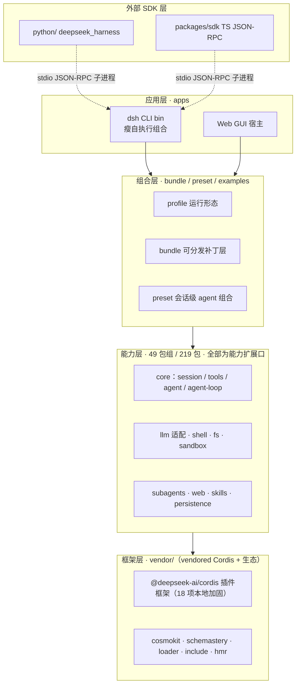

# 01 · 项目全景与分层架构

全仓库面貌与五层架构：既看清整个 monorepo 的构成，也看清系统运行时每一层承担什么。

  everything is a plugin
  event-sourcing
  capability seams
  TypeScript strict
  Cordis vendored
  Python SDK 存在

## 1. 项目全景

**DeepSeek Harness（`dsh`）** 是 DeepSeek AI 开源的一款 **Agent 运行时（agent harness）**：它把"大模型对话 + 工具调用 + 会话管理 + 权限策略 + 沙箱执行"组装成一个可配置、可替换、可组合的运行时产品。通常的 agent 框架把主循环、工具注册、会话存储写死在框架里，只留少量扩展点；dsh 的定位反过来——它介于"框架"与"应用"之间：既提供完整可运行的 CLI / Web 产品，又提供可编程的插件生态。

**三个标志性设计决策**

1. **无特权内核（no privileged core）**。常规框架里总有几个"核心模块"是不可替换的；dsh 连模型适配器、工具注册表、会话日志、甚至 Agent 主循环本身都做成插件。扩展方式 = 在旁边再挂一个插件，而非修改内核。
2. **事件溯源会话（event-sourced session）**。常规会话存储"最终状态"，dsh 存"发生了什么"：会话是**追加式事件日志**，模型可见的历史由日志 `deriveMessages()` 投影得出，绝不另存一份副本。"模型可见 ⟺ 已记录"是始终成立的性质。
3. **框架层完全自持（vendored Cordis）**。常规项目把插件框架当作 npm 依赖引入；dsh 把底层插件框架 Cordis 源码直接 vendored 进仓库并改名 `@deepseek-ai/*`，附 18 项本地加固，因此整个框架层可审计、可补丁、可发布。

!!! info "当前状态"
    **当前状态**：developer preview（`0.1.0-rc.7`），MIT 协议。演进策略是"地基优先，不做兼容垫片"：后端拒绝旧磁盘格式；SQLite 使用单调 `SCHEMA_VERSION`；会话格式版本保持 `SESSION_FORMAT_VERSION`。学习时不必顾虑历史包袱——你看到的就是当前唯一事实。

## 2. 分层架构

仓库是 pnpm monorepo（Node ^22.19 || >=24，全 ESM）。自上而下分五层（各层之间只通过接口约定连接，这是它和"按目录分层的单体框架"的本质区别）：

| 层 | 位置 | 职责 | 关键事实 |
|---|---|---|---|
| **应用层** | `apps/cli`、`apps/web` | CLI bin（`dsh`）与 Web GUI | CLI 源码经 `node --import tsx/esm` 启动；bin 是"瘦自执行组合" |
| **组合层** | `packages/bundle`、`preset`、`examples` | profile / bundle / preset 三种组合原语 | bundle = 可分发补丁层；preset = 会话级 agent 组合；覆盖所有运行形态 |
| **能力层** | `packages/<group>/<pkg>` | 49 个包组、219 个包级 package.json（workspace glob `packages/*/*`），全部能力扩展口 | 每包遵循 Service Definition / Provider / Consumer 三段式 |
| **框架层** | `vendor/` | vendored Cordis + 生态（cosmokit、schemastery、loader、include、hmr 等） | 全部改名 `@deepseek-ai/*`；18 项本地修改有详单与测试 |
| **外部 SDK** | `python/`、`packages/sdk` | Python SDK 与 TypeScript JSON-RPC SDK，跨进程驱动运行时 | 协议：stdio 换行分隔 JSON-RPC；Python 侧有官方 `deepseek_harness` 包 |

图 1：五层架构总览（应用 / 组合 / 能力 / 框架 / 外部 SDK）

注：分层为本报告的学习归纳视角；上游架构文档（docs/architecture.md）以"核心包表 + 事件 + 能力扩展口 + 扩展点"组织，并无五层说法。图 1~15 均为此归纳视角下的示意。注意：能力层向上提供"扩展口"，组合层用 profile / bundle / patch 挑选具体 Provider，因此"换一个 Provider 就换掉整个产品"。所有图表需联网加载 Mermaid 渲染。

!!! note "核心分层约束（最重要的一条架构纪律）"
    **扩展插件只依赖 Service Definition，绝不依赖具体 Provider。** 例如 UI、hook、工具插件只依赖 `dsh-agent`（接口），从不依赖 `dsh-agent-loop`（实现），所以主循环可整体替换。这是"换一个 Provider 就把整个产品换掉"的根本原因——文件系统/子进程/终端/LSP 共享一个执行世界，把 FS 与子进程 Provider 指向远程沙箱，Bash、PTY、LSP 全部随之迁移。