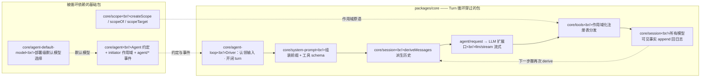
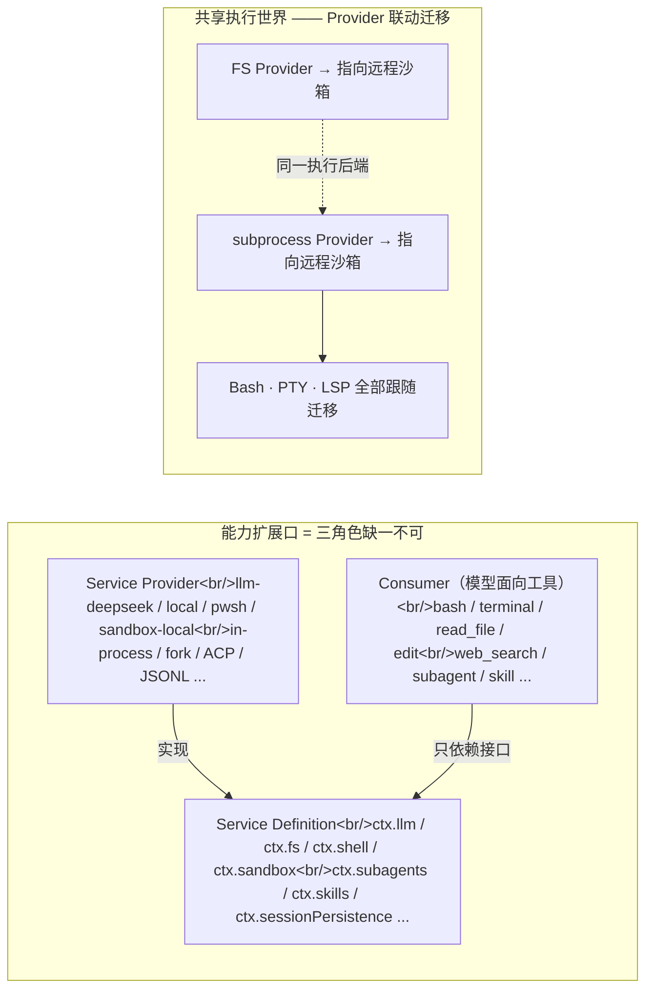
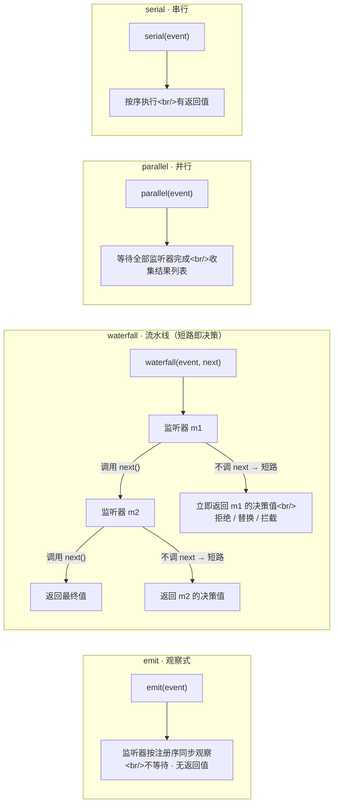
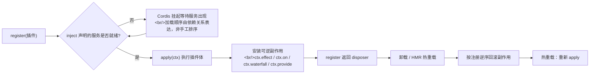
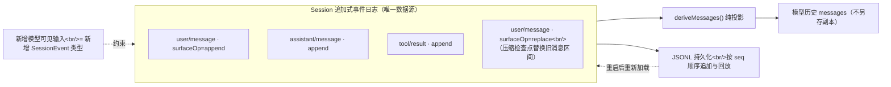
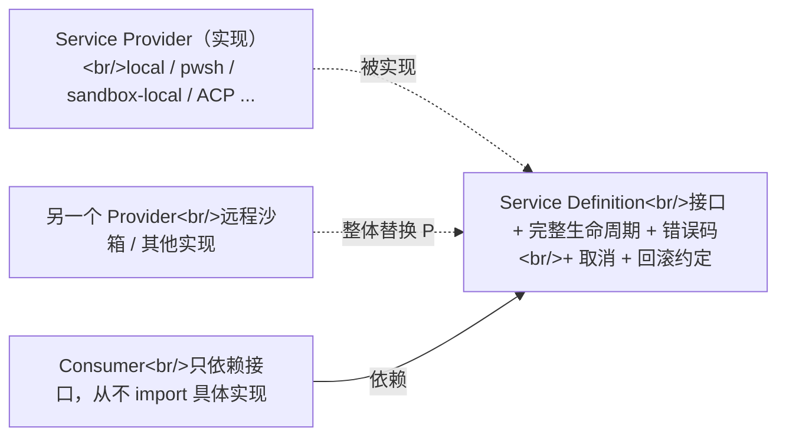
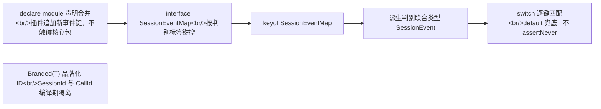
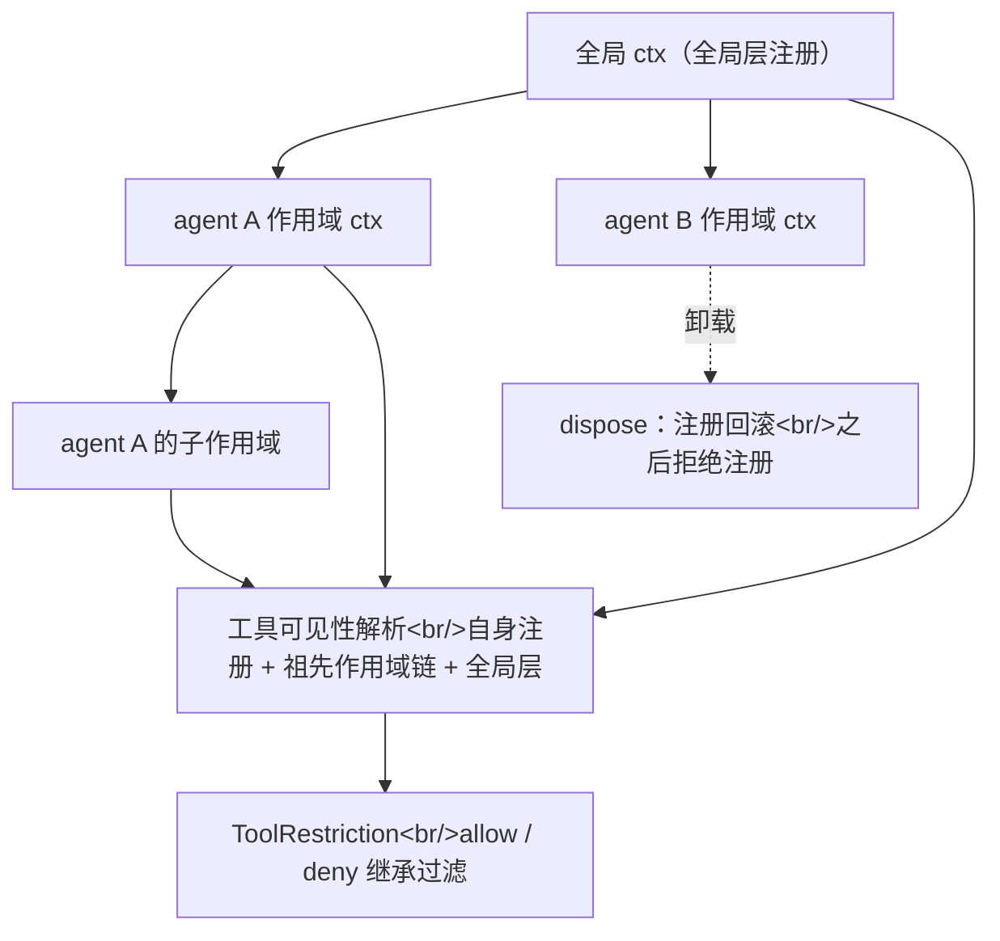
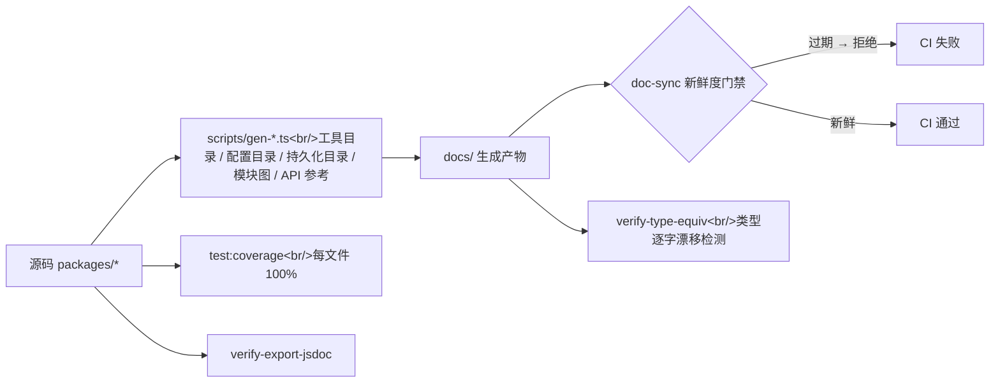

# 02 · 系统架构与内核

核心包脊柱、ctx 服务地图、事件体系与外围接入面；技术核心：Cordis 插件模型、事件溯源日志、能力扩展口、类型技术、作用域注册与生成器门禁。

  everything is a plugin
  event-sourcing
  capability seams
  TypeScript strict
  Cordis vendored
  Python SDK 存在

## 3. 系统架构与核心包

### 3.1 核心包脊柱（packages/core）——Turn 循环穿过的包

| 包 | ctx key | 职责 |
|---|---|---|
| `core/session` | `ctx.sessions` | 追加式 `SessionEvent` 日志 + 内存 store（唯一数据源） |
| `core/system-prompt` | `ctx.systemPrompt` | Prompt 分节 + 工具 schema 组装 |
| `core/tools` | `ctx.tools` | 作用域化工具注册表 + 守卫执行管线 |
| `core/agent` | `ctx.agents` | `Agent` 接口、注册表、initiator 作用域、`agent/*` 事件 |
| `core/agent-loop` | `ctx.agentLoop` | 默认具体 Driver，唯一实现 `Agent` 约定 |
| `core/agent-default-model` | `ctx.agentDefaultModel` | Agent 入口点共用的部署级默认模型选择 |
| `core/scope` | 无（纯库） | 作用域注册原语 `createScope/scopeOf/scopeTarget` |

循环流程：driver 认领排队输入 → 打开 turn → 经 system-prompt 组装前缀 + 从日志 derive 历史 → 经 LLM 扩展口流式调用 → 经工具注册表分发工具调用 → 把所有模型可见事实 append 回日志 → 下一步骤再次从日志 derive。

图 2：核心包脊柱——Turn 循环一次往返穿过的包

agent-loop 是 `Agent` 约定的唯一默认实现（Provider）；换一个 Provider 即换掉整个主循环。

### 3.2 ctx 服务地图（能力扩展口速览）

| 能力 | Service（ctx key） | Provider 实现示例 | Consumer（模型面向工具） |
|---|---|---|---|
| LLM | `ctx.llm` | llm-deepseek（官方）、llm-pi-ai | —（对话直接经 loop） |
| Shell | `ctx.shell` | local、pwsh | `bash` 工具 |
| 子进程 | `ctx.subprocess` | local 进程树 | shell 等依赖者 |
| 终端 | `ctx.terminals` | local PTY | `terminal` 工具 |
| 文件系统 | `ctx.fs` | local | `read_file/write_file/edit` 等 |
| 沙箱 | `ctx.sandbox` | sandbox-local（bwrap / Landlock / Seatbelt 后端；Landlock 对应 `native/landlock-run` Node 插件）、sandbox-policy | 消费者包裹 argv |
| 子 agent | `ctx.subagents` | in-process / fork / ACP / Codex / Claude Code / dsh-sdk | `subagent` 等 |
| Web | `ctx.web` | search / fetch | `web_search` 等 |
| Skills | `ctx.skills` | local | `skill` 目录/加载工具 |
| 持久化 | `ctx.sessionPersistence` | JSONL（`session-persistence-jsonl`；released 旧格式经相邻迁移链读入） | —（订阅 `session/event`） |
| 审批/交互 | `ctx.approval` / `ctx.userQuestions`（`ask()` API） | — | —（`tools/pre-execute` 拦截） |
| 凭据 | `ctx.credentials` | env-over-.env | —（按操作解析） |
| 设置 | `ctx.settings` | file 后端 | —（配置热更新） |
| 后台任务 | `ctx.jobs` | — | `job_*` 控制工具 |
| Workflow | `ctx.workflow` | worker-thread | `workflow` / `ralph` |
| 压缩 | `ctx.compaction` | basic | 命令 Consumer |
| 会话标题 | `ctx.sessionTitle` | log-backed | — |

图 3：ctx 服务地图的结构——能力扩展口三角色 + 共享执行世界

上表是这张图的"完整点名"：约三分之二的包属于接入面（host / client / api / sdk / session / 协作包），但它们全部消费同一核心脊柱。

### 3.3 事件体系（扩展点第一决策）

| 域 | 例子 | 用途 |
|---|---|---|
| **Session 事件**（持久化事实） | `turn/*`、`step/*`、`user/message`、`assistant/*`、`tool/*` | 追加到日志并广播 `session/event`；必须跨重载存活的事实用它 |
| **Agent 事件**（携带活体 `Agent`） | `agent/inbox/*`、`agent/status`、`agent/pre-step`、`agent/request`、`agent/request-error`、`agent/turn-stopping` | 观察/拦截进行中的工作 |
| **能力事件**（附着策略与适配器） | `fs/*`、`tools/*`、`telemetry/*` | 不改 loop 即可给扩展口挂策略 |

**四种派发模式**（Cordis 语义，报告的公共约定）。流水线事件（`agent/pre-step`、`agent/request`、`llm/stream`、三个 `tools/*`）全部用 waterfall：

1. `emit`——同步广播，不等待、无返回值、按注册序观察。通知类事件专用。
2. `waterfall`——around-middleware，监听器必须 `next()` 委派；不调 `next` 即短路，返回值就是唯一决策。
3. `parallel`——等待全部并行监听器完成，收集结果列表。横切动作专用。
4. `serial`——按序执行，有返回值。依赖前序结果的变换专用。

图 4：Cordis 四种事件派发模式的语义对比

经验法则：流水线类事件（要做出唯一决策）用 waterfall；通知类用 emit；必须全部生效的横切动作用 parallel；依赖前序结果的变换用 serial。

### 3.4 外围接入面（Web GUI、远程 RPC、外部协议与数据面）

报告的上面几节聚焦"技术核心"；但仓库约三分之二的包属于接入面。它们全部消费同一核心脊柱，因此值得建立一张地图：

| 面 | 包组（包数） | 职责 |
|---|---|---|
| **Web GUI 宿主端** | `packages/host`（8） | HTTP 路由载体 `ctx.webServer`（webserver）+ SPA 静态托管（frontend-static）+ 目录选择扩展口 `ctx.directoryPicker` + 插件清单远程接口（plugin-inventory）。演进：共享 API 网关 `ctx.apiProxy`（apiproxy）已在 alpha.1 删除，web 载体职责收敛到 `packages/api/gateway`（WS mux）+ `packages/api/session-controller`（typert 一元 RPC）。配套 `docs/subsystems/web-server.md`、workspace.md |
| **Web GUI 浏览器端** | `packages/client`（40） | 浏览器 shell（web）、对象层（runtime：ConnectionController→SessionManager→Session，React-free）、**slot 组合系统**（`ctx.slots.register`，声明式 UI 扩展点）、connection（浏览器↔宿主 HTTP + WebSocket：POST 一元 RPC + `/api/remote.mux` 流）、30+ 个 `ui-*` 功能插件（会话、工具调用树、子 agent、goal、job、权限、计划、模型选择等）。纪律：组件只见四份 props 派生数据，业务数据永远在对象层，UI 从不写 session 日志 |
| **远程 BFF / RPC** | `packages/api`（2）、`packages/typert`（4） | typert 从 Host 类型生成调用描述与 Client Remote 投影；gateway 实现 `ctx.typertGateway` 一元 RPC；remotes 拥有 Agent/Session 查找 BFF 策略。方向：remotes → gateway → connection → webserver。配套 `docs/subsystems/typert.md`、`docs/api-gateway.md` |
| **跨进程 SDK** | `packages/sdk`（3） | JSON-RPC 协议栈：protocol（wire 协议定义）、client（TS 客户端）、server（stdio JSON-RPC 服务器插件）。Python 侧 `python/sdk` 是同协议的另一实现 |
| **ACP / Hooks** | `packages/acp`（1）、`packages/hooks`（3） | acp = 仅自动化用途的 Agent Client Protocol 服务器；hooks = Claude Code / Codex hook 桥接（SessionStart、PreToolUse、PostToolUse、Stop）+ 共享 wire 协议库 |
| **会话数据面** | `packages/session`（18）、`packages/session-query`（4） | 持久化扩展口 + JSONL 后端（`session-persistence-jsonl`）+ 相邻格式迁移链（`session-format` / `-catalog` / `-v0-to-v1` / `-v1-to-v2`）+ 投影扩展口 + 标题 + 上报 + session-query（逻辑语料、lineage 血缘、事件关系、语义过滤、SQLite FTS 全文检索）。配套 docs/subsystems/persistence.md、session-projection.md、session-query.md |
| **协作与状态** | `packages/goal`、`schedule`、`feedback`、`plan`、`todo`、`context`、`guard`、`identity`、`storage`、`workspace` | 同会话目标（goal）、定时跟进（schedule）、人类反馈（feedback）、计划模式（plan）、todo 工具、注入式上下文（context）、循环卫生守卫（guard：重复调用提醒 + tools/execute 超时执行器）、匿名身份、存储中心、工作区实体 |
| **互操作与早期包** | `packages/mcp`（1）、`packages/e2b`（3）、`packages/extensions`（4） | mcp-client 把外部 MCP 服务器工具注册进 `ctx.tools`；e2b = 沙箱 POC（sandbox + FS/subprocess 适配器）；extensions = agent 自我修改（实时插件/服务检视 + 模型编写的插件挂载/卸载） |
| **支撑基础设施** | `packages/boot`、`test-support`、`util`、`examples`、`runtime-diagnostics` | 共享 app-bin 启动胶水；dev/test 基础设施（testkits、invariants、replay、mock LLM、Loader smokes）；零依赖工具库（`Branded<B>`、home 路径、超时、保留期）；演示 bundle；运行时诊断/硬性规定注册表 |

!!! note "一条贯穿所有接入面的纪律"
    UI/工具展示是纯投影——"如何绘制"（工具卡片、队列状态）永远不进 session 日志；宿主按帧计算或实时推送，回放时重算。而**任何新的模型可见输入**仍必须新增 session 事件（仓库级硬规则）。Web 客户端据此成为"日志驱动的重放投影"，而非第二份事实来源。

## 4. 技术核心

### 4.1 Cordis 插件模型——"一切皆插件"的地基

通常的插件框架只解决"注册与发现"；Cordis 更进一步，把"装载什么、何时装载、如何卸载"全部形式化。四个核心机制：

1. **插件是实现了 Service 的对象**：函数插件形如 `{ name, inject, Config, apply(ctx) }`；Service 子类插件由 Cordis 挂载进当前上下文。
2. **Context 是服务仓库**：服务声明稳定的 `ctx.<key>`（如 `ctx.tools`），插件按 key 查找而非 import 具体实现。
3. **依赖用 `inject` 声明**：命名所需服务，Cordis 等待其出现后再激活插件 → 加载顺序由依赖关系表达，而非手工 boot 排序。常规的"启动脚本按行排列"在这里被依赖图取代。
4. **注册 = 可逆副作用（effects）**：一切贡献经 `ctx.effect()` / `ctx.on()` / `ctx.waterfall()` 安装，`register()` 返回 disposer，插件卸载时按序回滚。这是 HMR 与热重载能可靠工作的根基——常规做法里"卸载"往往只能靠重启进程。

另外一条：**作用域化事件派发**——事件携带 subject 载体，监听器可以只收到指定 agent / 作用域的事件（`@deepseek-ai/dsh-scope`）。

图 5：Cordis 插件完整生命周期（注册 → 激活 → 副作用 → 回滚 / 热重载）

"注册 = 可逆副作用"是热重载与故障清理能可靠工作的根基：任何贡献都能被 disposer 精确撤销。

**图 5 逐节点走读（插件完整生命周期）**：

1. **register(插件)**：注册一个函数插件或 Service 插件，声明 `name` / `inject` / `Config` / `apply(ctx)`。
2. **inject 服务就绪?**：检查插件 `inject` 声明的服务是否已在该上下文出现——这是依赖图的仲裁点。
3. **否 → 挂起等待**：服务未就绪时 Cordis 挂起插件，等服务被其它插件提供后再回来检查（等待边 `WAIT → INJ` 回环）；加载顺序因此由依赖关系决定，而非手工 boot 排序。
4. **是 → apply(ctx)**：服务齐备后执行插件体，插件在此安装它的一切贡献。
5. **安装可逆副作用**：贡献经 `ctx.effect` / `ctx.on` / `ctx.waterfall` / `ctx.provide` 安装——每条副作用都登记了逆操作。
6. **返回 disposer**：`register` 返回一个可调用对象，作为撤销该插件全部副作用的句柄。
7. **卸载 / HMR 热重载**：调用 disposer 或触发热重载，进入卸载路径。
8. **按注册逆序回滚**：副作用按栈序（后装先卸）逆序撤销，保证不留残余注册。
9. **热重载 → 重新 apply**：HMR 场景下回滚完成后立刻对新版本插件重新执行第 4 步，实现免重启换插件。

### 4.2 事件溯源会话日志（整个框架的地基）

通常的会话实现是保存一份聊天记录，需要上下文时直接读它。dsh 恰好反过来：`Session` 只记录"发生了什么"，模型历史是每次现算的投影——这个结构在 `packages/core/session` 的 `SessionEvent` + `deriveMessages()` 组织方式里一目了然。它的六条约定拆开讲：

1. **唯一数据源。**`Session` 是一条只追加、不修改的 `SessionEvent` 日志。模型的消息历史不是另外存出来的，而是每次用 `deriveMessages()` 从日志现算——回放也等于重新派生一遍。相比"内存一份、磁盘一份"的常规做法，没有第二份副本，就没有两份数据对不上的问题。
2. **模型可见 ⟺ 已记录。**这是唯一数据源的直接推论：历史是派生视图，那么模型能看到的任何内容，都必须能从日志重建。反过来，想给模型加一种新输入，就必须先加一种新的 session 事件（扩展 `SessionEventMap`，再写"从日志渲染它"的代码）。
3. **可合并扩展。**常规框架加事件类型往往要改核心包；dsh 用 TypeScript 的 `declare module` 声明合并，插件就能把新类型直接"塞"进 `SessionEventMap`——类型系统本身成了扩展点，这是相当少见的设计。
4. **表面（surface）机制。**三种"产生消息"的事件（`user/message`、`assistant/message`、`tool/result`）都带 `surfaceOp`，取值 `append` 或 `{op:'replace', start, end}`（区间遮蔽）。投影时 `append` 按序排列，`replace` 整体替换旧的那一段。后面 5.2 节会看到，上下文压缩就是靠 `replace` 落地的——压缩不改日志，只追加一条替换事件（检查点载体是 `user/message`，不是被替换的 assistant 消息）。
5. **无损 JSON 强制。**`append()` 在写入源头做深度校验并冻结，序列化不了的东西（包括非有限浮点数）当场抛错。坏事件在源头就被拦住，进不了日志——日志里永远只有合法的数据。
6. **崩溃恢复。**重载时发现 turn 没闭合（进程半路崩了），常规做法是截断或回滚；dsh 不这么做——大 turn 可能非常巨大，截断会丢内容。做法是合成一条 `turn/end { reason: {kind:'interrupted'} }` 把括号补平衡：宁可标记"这次被打断了"，也不能悄悄丢掉已经发生过的事实。

图 6：事件溯源会话——append 记录、投影派生、持久化回放三者关系

读图顺序：日志永远是起点，投影和持久化都是它的下游，两者互不直接打交道。建议拿支笔，沿一条 user/message → assistant/message → tool/result 的路径把 seq 编号手推一遍，比盯着图看十遍有用。

!!! example "示例走查（surfaceOp=replace）"
    常见的疑问是"replace 之后历史还完整吗"。走一遍就清楚了：上下文压力触发压缩后，日志会追加一条压缩检查点 `user/message`，其 `surfaceOp: {op:'replace', start, end}` 指向被摘要替换的消息区间——投影时它整体遮蔽该区间并替换为摘要，但日志本身只做追加，`seq` 依然连续。于是模型下一次请求看到的历史，永远是"从完整日志实时派生"的版本，绝不会读到过期快照。这也是"不另存"的用意所在：只要派生是纯函数，持久化和恢复就永远不用操心一致性问题。

### 4.3 能力扩展口三角色（产品可替换性的来源）

一个**扩展口（seam）** = 三种角色：**Service Definition**（声明接口）、**Service Provider**（实现）、**Consumer**（使用者，通常是模型面向工具）。一个角色单独不构成扩展口；新增能力 = 同时设计三个角色。Provider 之间通过"共享执行世界"联动——例如 FS 与 subprocess 的 Provider 指向远程沙箱后，Bash/PTY/LSP 全部跟随迁移。

!!! note "与普通插件框架的区别"
    插件框架通常只解决"注册/发现"，而 dsh 的扩展口还解决了**语义一致替换**——接口覆盖完整的生命周期、错误码、取消、回滚约定，使一次 Provider 替换不留下行为死角。

图 7：能力扩展口三角色——接口、实现、使用者的关系

新增能力 = 同时设计三个角色；只注册一个 Provider 不构成扩展口。

### 4.4 类型技术（TypeScript 层）

常规 TS 项目的扩展靠"给接口留可选字段"；dsh 把类型系统本身做成扩展机制，三件套：

1. **`…Map → derived-union` 模式**：接口按判别标签键控，`keyof` 派生联合类型，插件用声明合并扩展。五个规范 map：`ContentBlockMap`、`MessageSourceMap`、`FinishReasonMap`、`TurnEndReasonMap`、`SessionEventMap`（前两者在 `llm/llm/src/types.ts`，后两者在 `core/session/src/types.ts:155,236`）。合并可扩展的联合在 `switch` 后落到文档化 default——联合随时可能被插件追加新键，穷尽性的 `assertNever` 断言在这里不成立。注意：turn/start 的 `trigger` **不是**规范 map，而是内联判别对象（`{kind:'message', source:{kind:'user'}}`），只在单个 turn 内静态使用，不参与插件声明合并。
2. **品牌化 ID（`Branded<B>`）**：跨包 ID 结构上是 string、类型上不可互换（`SessionId` ≠ `CallId`）。纯类型包 `util/brand` 零运行时依赖。
3. **严格类型纪律**：`strict` + `noImplicitAny`；跨边界强制运行时校验（parser、wire、worker、持久化），同进程类型边界信任 TS 不重复校验。

图 8：类型技术——Map → derived-union → 声明合并扩展的闭环

五个规范 map 同构复用此模式：ContentBlockMap / MessageSourceMap / FinishReasonMap / TurnEndReasonMap / SessionEventMap。turn/start 的 trigger 为内联判别对象，非合并 map。

### 4.5 作用域化注册（per-agent 能力隔离）

`dsh-scope` 提供 `createScope/scopeOf/scopeTarget` 原语，使每个 agent 拥有独立 ctx：作用域内注册对自身可见、卸载时回滚、之后拒绝注册。Preset（会话级组合）通过 `isolate` realm 发布宿主不可见的隔离服务。工具注册表以此实现"全局层 + 祖先作用域链 + 自身注册"的可见性解析，并用 `ToolRestriction`（allow/deny）做继承过滤。

图 9：作用域化注册——per-agent 能力隔离与可见性解析

工具目录 / 配置目录 / 持久化日志目录 / 模块图 / Cordis API 参考均由生成器产出，作用域原语（`core/scope`）本身是零依赖纯库。

**图 9 逐节点走读（作用域化注册与可见性解析）**：

- **ROOT 全局 ctx（全局层注册）**：能力层的"全局层"，注册对所有 agent 作用域都可见的全局服务（如全局工具、持久化背板）。
- **A / B agent 作用域 ctx**：每个 agent 拥有独立 ctx，`createScope` 派生；作用域内注册只对自身（含后代）可见。
- **SUB agent A 的子作用域**：A 之下可再派生子作用域（如子代理），继承 A 的可见性。
- **VIS 工具可见性解析**：解析一个 agent 实际能看到哪些工具 = **自身注册 + 祖先作用域链 + 全局层** 三者的并集（`ROOT/A/SUB → VIS` 三条边）。这是 dsh 与"全进程共享一张工具表"的常规做法的本质区别。
- **REST ToolRestriction（allow / deny 继承过滤）**：可见性算出的候选集还要过一层 allow/deny 过滤，且该限制沿作用域链**继承**（父作用域的 deny，子作用域同样被约束）。
- **ROLL dispose：注册回滚**：作用域卸载时回滚其全部注册，之后拒绝再注册（`B -.卸载→ ROLL`）——配合"注册 = 可逆副作用"保证隔离可精确撤销。

> **mini 对照**：`miniharness/core/scope.py` —— 作用域原语（`createScope/scopeOf/scopeTarget/intercept`）与可见性解析；`miniharness/core/agent_loop/agent.py:46,131` 用 `scope_target` 给 agent 事件派发绑定作用域载体；工具注册表的"全局层 + 祖先链 + 自身"解析实现在 `miniharness/core/tools.py`。

### 4.6 生成器驱动 + 门禁文化

常规项目的文档靠人手同步，改一次源码往往要手动改三处文档，漂移是常态。dsh 用生成器把"文档落后于源码"从概率事件变成不可能事件：工具目录、配置目录、持久化日志目录、模块图、Cordis API 参考全部由 `scripts/gen-*.ts` 从源码生成，并经 `doc-sync` 新鲜度门禁校验。另有每文件 100% 覆盖率门禁（`test:coverage`）、`verify-export-jsdoc`、`verify-type-equiv`（文档内类型与源码逐字漂移检测）等数十个验证脚本。

图 10：生成器 + 门禁文化——"源码即唯一真相"

门禁不是事后检查，而是"提交前必须通过"的纪律：生成产物与源码的任何漂移都会在 CI 显式失败。
