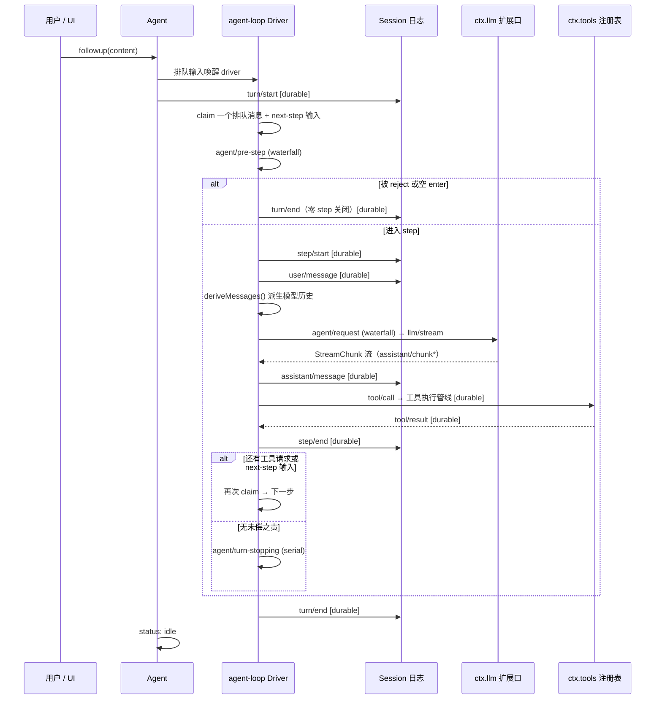
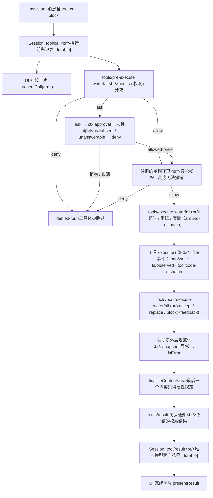
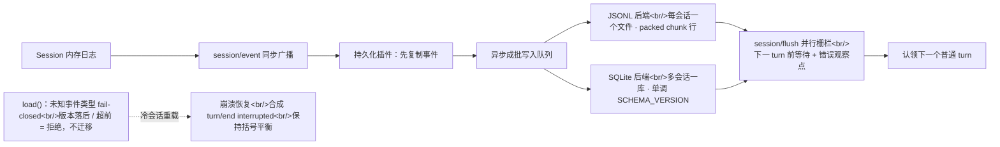
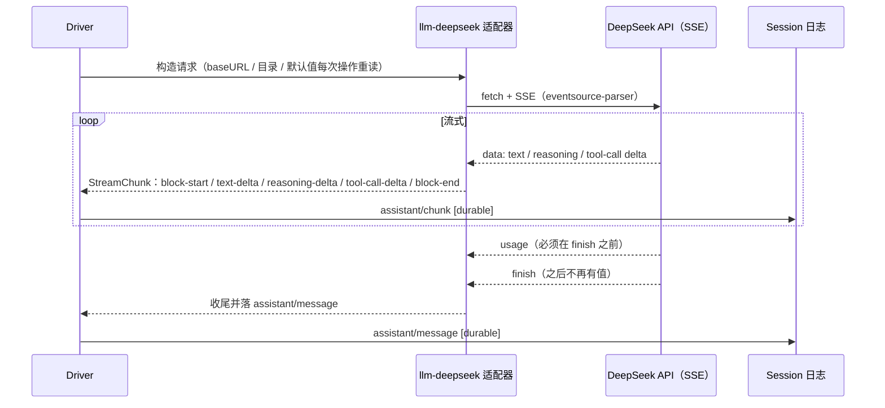
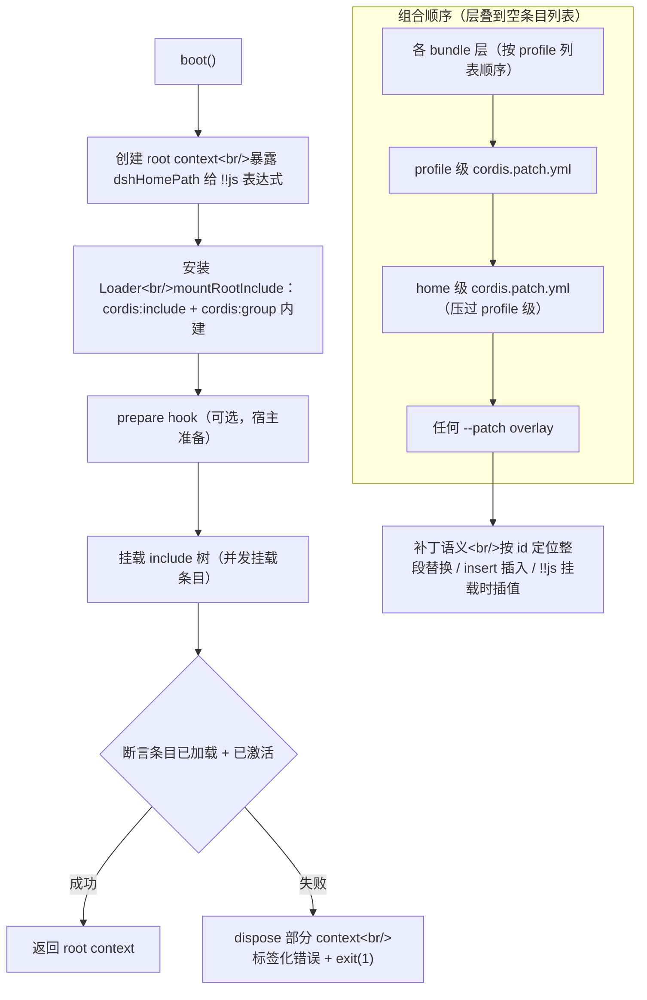

# 03 · 关键处理流程

五条核心时序：Turn/Step 循环、工具执行管线、会话持久化、LLM 流式适配、启动与组合。每条给出事件序列与源码路径。

  everything is a plugin
  event-sourcing
  capability seams
  TypeScript strict
  Cordis vendored
  Python SDK 存在

## 5. 关键处理流程

### 5.1 Turn / Step 循环

**step** = 一次模型请求 + 它调用的工具；**turn** = 零或多个 step，打开于首次输入被认领前，关闭于再无未偿之责。输入经唯一 inbox 送达，部分消息立即唤醒 driver，注入上下文在 inbox 等待。

图 11：Turn / Step 完整时序（含 reject 与 turn-stopping 分支）

完整时序见 docs/agent-lifecycle.md（同款 Mermaid sequenceDiagram）；`turn/start` 在认领输入前就打开，因此"被拒绝的尝试"也会留下持久化记录。

**图 11 逐箭头走读（一次完整 turn）**：

1. `U→A: followup(content)`：用户 / UI 向 Agent 投递一次输入，进入唯一 inbox。
2. `A→D: 排队输入唤醒 driver`：部分输入（普通 followup）立即唤醒 driver 认领；注入式上下文则留在 inbox 等待（详见 §5.2 之前的小节）。
3. `A→S: turn/start [durable]`：**在认领输入之前**先落 `turn/start`，建立持久化括号起点——因此"之后被拒绝的尝试"也留档。
4. `D→D: claim 一个排队消息 + next-step 输入`：driver 认领一条消息，同时把是否还有 next-step 输入作为分支依据。
5. `D→D: agent/pre-step (waterfall)`：进入 step 前的可扩展拦截点（守卫 / 权限 / 拒绝逻辑在这里挂载）。
6. **reject 分支**：被 reject 或空 enter → 不产生任何 step，直接 `turn/end`（零 step 关闭）。
7. **进入 step 分支**：`step/start` → `user/message` 落盘 → `deriveMessages()` 现算模型历史。
8. `D→LLM: agent/request (waterfall) → llm/stream`：模型请求经扩展口；`LLM→D` 流式返回 `StreamChunk*`。
9. `D→S: assistant/message [durable]`：流式结果合并落盘；如含 tool-call 则 `D→T: tool/call` 进入工具管线（§5.2），`T→D` 回 `tool/result`。
10. `D→S: step/end [durable]`：本 step 收尾。
11. **还有未偿之责？** 还有工具请求或 next-step 输入 → 回到第 4 步再次 claim；无 → `agent/turn-stopping (serial)` 让关闭期可观察。
12. `D→S: turn/end [durable]` + `A→A: status: idle`：turn 关闭、括号平衡，agent 回到 idle。

> **mini 对照**：`miniharness/core/agent_loop/agent.py` —— turn/step 编号从 1 起、`turn/start` 先落盘、pre-step 拦截、`{kind:'blocked'}` 拒绝语义均对齐（`core/agent_loop/agent.py` 与 `invariant.py`）。

!!! example "示例走查（一次被拒绝的 turn）"
    用户 `followup("删除 /etc")` → driver 认领输入 → `turn/start` 先落盘 → `agent/pre-step` 上的守卫插件不调用 `next()`，直接返回 `reject` → driver 不产生任何 step，直接 `turn/end`（零 step 关闭）。日志里留下了 `turn/start + turn/end` 两条记录——"被拒绝的尝试"也是事实，必须可审计。

### 5.2 工具执行管线（可扩展 waterfall + 单调守卫）

图 12：工具执行管线全流程（策略 → 守卫 → 执行 → 后处理 → 权威结果）

!!! example "示例走查（一次 bash 调用）"
    模型流式返回 `tool-call(bash)` → 先落 `tool/call` 事件，UI 挂起卡片 → `pre-execute` 权限插件返回 allow → 单调守卫（30s 超时 wrapper 挂在 `execute` 上）→ 工具体执行 → `post-execute` 接受结果 → 注册表规范化（异常统一 `isError`）→ `tools/result` 通知冻结结果 → 落 `tool/result`，UI 渲染完成卡片。全程参数只物化一次并深度冻结，任何一步抛错都不会让回合中断。

- 参数在策略前一次性**无损 JSON 物化并冻结**；结果 `value` 是执行局部的，持久层只存 `content`/`error`/`meta`。
- 工具可声明 `isConcurrencySafe` 加入并行组；否则 `exclusive` 形成串行屏障；`timeoutMs` 由 `tools/execute` wrapper 强制，绝不发给模型。
- 内置 JSON Schema DSL（16 层容器精确推断后回退 `JsonValue`）与受强制子集的 raw schema 校验器（`assertSupportedJsonSchema`）。

**图 12 逐节点走读（策略 → 守卫 → 执行 → 后处理 → 权威结果）**：

1. **M 模型产出 tool-call** → **TC 先落 `tool/call` [durable]**（执行前就记录，绝不静默失败）+ 并行 **PC 挂起卡片 `presentCall(args)`**。
2. **PRE `pre-execute` waterfall**（hooks / 权限 / 沙箱）：`allow` → 前进；`deny` → 直接 **DEN**；`ask` → **ASK**（`ctx.approval` 一次性询问；absent / unanswerable → 当 deny）。
3. **ASK** 结果：`allowed-once` → 前进；拒绝 / 取消 → **DEN**（工具体被跳过，回合不中断）。
4. **G 注册的单调守卫**：只能减权、乱序无法撤销；`allow` → 前进，`deny` → **DEN**。
5. **EX `execute` waterfall**（超时 / 重试 / 度量，around-dispatch）→ **BODY 工具本体**（自有事件：todo/write、fs/observed、tool/code-dispatch）。
6. **POST `post-execute` waterfall**：`accept` / `replace` / `block(+feedback)`。
7. **NORM 注册表外层规范化**：任何 snapshot 阶段异常统一转 `isError`。
8. **FIN `finalizeContent`**：最后一个内容只读（硬性规定），不可再被后置编辑。
9. **RES `tools/result` 同步通知**（冻结的权威结果）→ **TR 落 `tool/result` [durable]**（唯一模型面向结果）→ **PR 完成卡片 `presentResult`**。

> **mini 对照**：`miniharness/core/tools.py` —— 管线分 `pipeline_policy`（schema / pre-execute / ask / guards，返回拒绝或 None）与 `pipeline_body`（execute / post-execute）+ 外层规范化；`Tool` 含 `render`、`ToolExec` 含 `signal`/`agent`、`ToolResult` 含 `_aborted`/`error_info`/`concludes_turn`（教学期早期形态见手册 03 章横幅）。

### 5.3 会话持久化（durability seam）

常规做法是"每次变化立刻写库"；dsh 把持久化做成订阅者，异步成批写入。四个要点：

- **扩展口**：`ctx.sessionPersistence` 抽象（locate / create / append / 逻辑 load/inspect / 物理后缀读）+ 两个可互换后端：**JSONL**（每会话一个文件，支持 packed chunk 行）与 **SQLite**（多会话一库，单调 `SCHEMA_VERSION`）。
- **flush 检查点**：`session/event` 是同步通知，持久化插件先复制事件再异步成批写入；`session/flush` 是等待的并行栅栏，用于认领下一个普通 turn 前的排序与错误观察点。
- **格式拒绝，不迁移**：版本落后 = "升级 harness"；版本超前 = "使用更新的 harness 打开"。未知事件类型若未带 `ignorable: true` 则整体拒绝加载（防止静默丢事件改变后续解读）。
- **崩溃恢复**：关闭孤儿 turn（合成 `interrupted`），只作用于冷会话；活会话 `load` 等待权威内存快照持久化。

图 13：会话持久化——双后端、flush 栅栏与崩溃恢复

!!! example "示例走查（进程崩溃）"
    `turn/start` 已落库但 `turn/end` 未及写入时进程被杀 → 重启后 JSONL/SQLite 后端的 `load()` 发现括号不平衡 → 不截断日志，而是追加合成 `turn/end { reason: "interrupted" }` → 会话回到可继续状态。若日志里混入未知事件类型（未带 `ignorable: true`），则整体拒绝加载——宁可不打开，也不能静默丢事件改变后续解读。

### 5.4 LLM 流式适配扩展口

常规做法是"官方 SDK 直接调用，错误各自处理"；dsh 把模型厂商差异收敛到统一流协议里。四个要点：

- **统一流协议 `StreamChunk`**：`block-start / text-delta / reasoning-delta / tool-call-delta / block-end / usage / finish`。块索引关联交错增量；`block-end` 携带完整块；`usage` 必须在 `finish` 前、之后不再有值。
- **DeepSeek 官方适配器**（`dsh-llm-deepseek`）：直接 `fetch` + SSE（eventsource-parser）翻译官方 wire 格式。支持 thinking / reasoningEffort / contextWindow / maxTokens 输出上限 / 重试策略（normal|always + 退避）。
- **动态配置**：baseURL、目录、请求默认值经 thunk **每次操作**重读；`ctx.settings` 支持无重启覆盖；`ctx.credentials` 让 API key **每次调用**解析（配置只存 `apiKeyEnv` 引用，绝无明文）。
- **两种授权错误路径统一为 `LlmFailure`**；上下文溢出统一编码 `CONTEXT_WINDOW_EXCEEDED`；空响应视为可重试错误 `EMPTY_RESPONSE`；每次请求携带 app attribution 头。

图 14：LLM 流式适配——统一 StreamChunk 协议与官方适配器

!!! example "示例走查（一次带思考的流式回合）"
    driver 每次请求都经 thunk 重读 `ctx.settings` 与 `ctx.credentials`（配置只存 `apiKeyEnv` 引用，绝无明文）→ 适配器 `fetch` 官方 SSE 端点 → 逐块翻译成统一 `StreamChunk`：`block-start` → `reasoning-delta`* → `text-delta`* → `tool-call-delta` → `block-end`（携带完整块）→ `usage` → `finish`。每次 delta 同步落 `assistant/chunk`，最后合并成一条 `assistant/message`。键过期与余额不足两条错误路径统一收口为 `LlmFailure`，上下文溢出编码 `CONTEXT_WINDOW_EXCEEDED`。

### 5.5 启动与组合（profile / bundle / patch 层）

图 15：boot() 启动流程与组合层叠顺序

**关键设计**：组合、配置导出（`--dump-config`）、标志派发共用同一个补丁算法（include 的 `applyEntryPatches` 导出为纯函数），因此三者永不漂移。

**图 15 逐节点走读（boot 启动与组合层叠）**：

1. **BOOT `boot()`**：统一启动入口，被 CLI / Web / SDK 三个外用面共用。
2. **ROOT 创建 root context**：同时把 `dshHomePath` 暴露给 `!!js` 表达式（补丁里可引用真实安装目录）。
3. **LDR 安装 Loader**：`mountRootInclude` 装上 `cordis:include` / `cordis:group` 两个内建，作为 include 树展开的引擎。
4. **PREP `prepare` hook（可选）**：宿主若有准备步骤在此执行。
5. **MNT 挂载 include 树**：按组合顺序**并发挂载**各条目（bundle / patch 层）。
6. **CHK 断言条目已加载 + 已激活**：每个条目都必须既加载成功又激活成功。
7. **成功 → OK**：返回就绪的 root context。
8. **失败 → FAIL**：`dispose` 掉已部分创建的 context，抛标签化错误并 `exit(1)`。

组合层叠顺序（下到上，后压先）：**L1 各 bundle 层**（按 profile 列表顺序）→ **L2 profile 级 cordis.patch.yml** → **L3 home 级 cordis.patch.yml**（压过 profile 级）→ **L4 任何 `--patch` overlay**（层叠到空条目列表结束）。**SEM**：补丁语义 = 按 id 定位**整段替换** / `insert` 插入 / `!!js` 挂载时插值。

> **mini 对照**：`miniharness/boot/boot.py` —— boot 启动链、补丁层叠、`--dump-config` 共用同一补丁算法均对齐；`vendor/cordis` 为上游，mini 以 `core/scope.py` 承载作用域、`boot/composition.py` 承载组合（`core/schema.py` 为 schemastery 全量移植）。