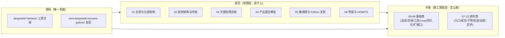

# DeepSeek Harness 深度掌握指南 · 体系化报告

本报告由<b>六个主题子页</b> + 本阅读地图构成。每个子页独立可维护、可锚点直达。本页同时承载<b>四维对照表</b>（上游包 ↔ mini 模块 ↔ 手册章节 ↔ 报告页面），作为解读完整性的检查清单。

  everything is a plugin
  event-sourcing
  capability seams
  TypeScript strict
  Cordis vendored
  Python SDK 存在

## 阅读地图

图 A：三层阅读结构——源码是唯一权威，报告回答"是什么/为什么"，手册回答"怎么亲手做出来"。

| 子页 | 内容 | 规模 |
|---|---|---|
| [01 项目全景与分层架构](01-overview.md) | 仓库构成、五层架构（应用/组合/能力/框架/外部 SDK） | 14 KB |
| [02 系统架构与内核](02-architecture.md) | 核心包脊柱、ctx 服务地图、事件体系、外围接入面；技术核心六节（Cordis 模型/事件溯源/扩展口/类型/作用域/门禁） | 35 KB |
| [03 关键处理流程](03-flows.md) | Turn/Step、工具管线、持久化、LLM 流式、启动组合五条时序 | 21 KB |
| [04 产品面全解读](04-product-surface.md) | **九大议题**：模式设计、外部入口、Trajectory、干预面、审批、自我修改、resume、plan/goal、压缩与后台 | 60 KB |
| [05 路线图与 Python 复现](05-roadmap.md) | 学习路线、概念映射表、迷你复现清单、实操资源索引 | 26 KB |
| [06 附录与 HOWTO](06-appendix.md) | Python SDK、添加插件、HOWTO、参考速查、结语 | 25 KB |

## 四维对照表（主题索引）

每一行是一个解读主题；mini 模块列给出对应实现位置，手册/报告列给出深入阅读的入口。

| 上游包 / 文件（唯一权威） | mini 模块 | 手册章节 | 报告页面 |
|---|---|---|---|
| `packages/core/session` | `core/session/` | 01 | 02 §3-4 |
| `packages/core/context + vendor/cordis(core)` | `core/scope.py` | 02 | 02 §4.1 |
| `packages/core/tools + tool-group` | `core/tools.py` | 03 | 03 §5.2 |
| `packages/llm/llm + llm-deepseek` | `llm/` | 04 | 02 §3 + 03 §5.4 |
| `packages/core/agent-loop + agent-invocation` | `core/agent_loop/agent.py` | 04 / 06 | 03 §5.1 |
| `packages/core/session-persistence` | `core/session/persistence.py` | 05 | 03 §5.3 |
| `packages/cordis-host + boot` | `boot/boot.py` | 05 | 03 §5.5 |
| `bundle/headless + apps/cli/src` | `cli/headless.py + cli/main.py` | 07 | 04 议题 2 |
| `apps/cli/config/agent-presets/*` | `preset/presets.py` | 08 | 04 议题 1 |
| `packages/core/agent（runtime-types）` | `core/agent_loop/agent.py（干预面）` | 09 | 04 议题 4 |
| `packages/interaction/user-approval` | `interaction/approval.py` | 09 | 04 议题 5 |
| `packages/client/ui-trajectory` | `client/trajectory.py` | 10 | 04 议题 3 |
| `packages/extensions（tool-cordis 等）` | `extensions/dynamic.py` | 11 | 04 议题 6 |
| `packages/sdk/protocol（transport + types）` | `protocol/sdk.py` | 07 §7.6 | 04 议题 2 |
| `packages/acp/acp` | `protocol/acp.py` | 07 §7.7 | 04 议题 2 |
| `packages/hooks（hook-protocol + hooks-claude-code）` | `protocol/hooks.py` | 07 §7.8 | 04 议题 2 |
| `core/agent-loop 并行编排 + core/context 并发模型` | `core/agent_loop/tool_calls.py + core/scope.py` | 12 | 02 §2 + 03 §5.1 |
| `packages/sandbox/sandbox + sandbox-local + sandbox-windows-acl` | `seams/sandbox_local.py` | 06 §6.9 | 02 §2 |
| `packages/credentials/credentials-local` | `seams/credentials_local.py` | 06 §6.9 | 03 §5.4 |
| `packages/subagent/subagent-fork-in-process + subagent-acp + subagent-dsh-sdk` | `seams/subagent/providers.py + seams/subagent/worker.py` | 06 §6.9 | 04 议题 2 |
| `packages/llm/llm-retry + llm/llm（retry-policy）+ core/agent（agent/request-error）` | `llm/retry.py + llm/retry_policy.py（+ core/agent_loop/agent.py 接线）` | 04 §4.10 | 04 议题 2 |
| `packages/boot/app-boot（loadOverlayPatches / loadEnv / config-dump）+ apps/cli/src/args.ts` | `boot/composition.py + cli/main.py` | 05 + 07 | 03 §5.5 |
| `web 表面会话管理（上游无 CLI）` | `cli/session_cmds.py` | 07 | 04 议题 2 |
| （工程化） | `.github/workflows/ci.yml + tests/test_real_api.py` | 00 | — |
| `packages/bundle/web-app` | （观察清单，见 ROADMAP） | 07（入口总览） | 04 议题 2 |

## 与教程手册的关系

**报告（md 章节体系）**＝ 地图层：解释"是什么、为什么、影响面"，按主题读，Mermaid 图渲染完整。

**手册（md 章节体系）**＝ 施工图纸层：step-by-step 从 0 到 1 亲手实现，与 `miniharness/` 真实代码逐字一致（`docs/index.md` 首页有完整索引）。

手册入口：站点首页 `docs/index.md`（统一了原 README.md 总览与入口，双入口问题已收敛）。章节 08-11 与报告 04 页议题一一对应（08 组合层↔议题 1，09 干预面↔议题 4，10 轨迹↔议题 3，11 动态插件↔议题 6）。

---

配套教程手册：docs/chapters/（从 0 到 1 实现核心系统）· 图表由 Mermaid.js 渲染。
