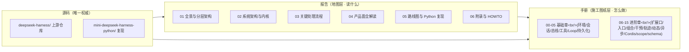

# DeepSeek Harness 深度掌握指南 · 体系化报告

本报告由<b>六个主题子页</b> + 本阅读地图构成。每个子页独立可维护、可锚点直达。本页同时承载<b>四维对照表</b>（上游包 ↔ mini 模块 ↔ 手册章节 ↔ 报告页面），作为解读完整性的检查清单。

  everything is a plugin
  event-sourcing
  capability seams
  TypeScript strict
  Cordis vendored
  Python SDK 存在

## 阅读地图

图 A：三层阅读结构——源码是唯一权威，报告回答"是什么/为什么"，手册回答"怎么亲手做出来"。基础章沿主线把核心约定立起来；进阶章每章独立，可按需选读。

| 子页 | 内容 |
|---|---|
| [01 项目全景与分层架构](01-overview.md) | 仓库构成、五层架构（应用/组合/能力/框架/外部 SDK） |
| [02 系统架构与内核](02-architecture.md) | 核心包脊柱、ctx 服务地图、事件体系、外围接入面；技术核心六节（Cordis 模型/事件溯源/扩展口/类型/作用域/门禁） |
| [03 关键处理流程](03-flows.md) | Turn/Step、工具管线、持久化、LLM 流式、启动组合五条时序 |
| [04 产品面全解读](04-product-surface.md) | **十大议题**：模式设计、外部入口、Trajectory、干预面、审批、自我修改、resume、plan/goal、压缩与后台、skills |
| [05 路线图与 Python 复现](05-roadmap.md) | 学习路线、概念映射表、迷你复现清单、实操资源索引 |
| [06 附录与 HOWTO](06-appendix.md) | Python SDK、添加插件、HOWTO、参考速查、结语 |

## 四维对照表（主题索引）

每一行是一个解读主题；mini 模块列给出对应实现位置，手册/报告列给出深入阅读的入口。

| 上游包 / 文件（唯一权威） | mini 模块 | 手册章节 | 报告页面 |
|---|---|---|---|
| `packages/core/session` | `core/session/` | 01 | 02 §3-4 |
| `packages/context + vendor/cordis(core)` | `core/scope.py` | 02 | 02 §4.1 |
| `packages/core/tools` | `core/tools.py` | 03 | 03 §5.2 |
| `packages/llm/llm + llm-deepseek` | `llm/` | 04 | 02 §3 + 03 §5.4 |
| `packages/core/agent-loop` | `core/agent_loop/agent.py` | 04 / 06 | 03 §5.1 |
| `packages/session/session-persistence` | `core/session/persistence.py` | 05 | 03 §5.3 |
| `packages/extensions/cordis-host-runner + packages/boot` | `boot/boot.py` | 05 | 03 §5.5 |
| `packages/bundle/headless + apps/cli/src` | `cli/headless.py + cli/main.py` | 07 | 04 议题 2 |
| `apps/cli/config/agent-presets/*` | `preset/presets.py` | 08 | 04 议题 1 |
| `packages/core/agent（runtime-types）` | `core/agent_loop/agent.py（干预面）` | 09 | 04 议题 4 |
| `packages/interaction/user-approval` | `interaction/approval.py` | 09 | 04 议题 5 |
| `packages/client/ui-trajectory` | `client/trajectory.py` | 10 | 04 议题 3 |
| `packages/extensions（tool-cordis 等）` | `extensions/dynamic.py` | 11 | 04 议题 6 |
| `packages/sdk/protocol（transport + types）` | `protocol/sdk.py` | 07 §7.6 | 04 议题 2 |
| `packages/acp/acp` | `protocol/acp.py` | 07 §7.7 | 04 议题 2 |
| `packages/hooks（hook-protocol + hooks-claude-code）` | `protocol/hooks.py` | 07 §7.8 | 04 议题 2 |
| `core/agent-loop 并行编排 + core/context 并发模型` | `core/agent_loop/tool_calls.py + core/scope.py` | 12 | 03 §5.1 |
| `packages/sandbox/sandbox + sandbox-local + sandbox-windows-acl + native/landlock-run` | `seams/sandbox_local.py + seams/landlock_run.py + seams/sandbox_windows_acl/` | 06 §6.9 | — |
| `packages/sandbox/sandbox-policy` | `seams/sandbox_policy.py` | 06 §6.9 | — |
| `packages/shell/shell + bash-local + bash-sandbox` | `shell/`（bash_local + bash_sandbox + helpers） | 06 §6.9 | — |
| `packages/credentials/credentials-local` | `seams/credentials_local.py` | 06 §6.9 | — |
| `packages/subprocess/subprocess（环境清洗）` | `seams/subprocess_env.py` | — | — |
| `packages/subagent/*（subagent + 三通道 provider + in-process-driver + control/report 工具）` | `seams/subagent/`（descriptor + providers + worker + continuation + tool） | 06 §6.9 | — |
| `packages/llm/llm-retry + llm/llm（retry-policy）+ core/agent（agent/request-error）` | `llm/retry.py + llm/retry_policy.py（+ core/agent_loop/agent.py 接线）` | 04 §4.9 | — |
| `packages/boot/app-boot（loadOverlayPatches / loadEnv / config-dump）+ apps/cli/src/args.ts` | `boot/composition.py + cli/main.py` | 05 + 07 | 03 §5.5 |
| `web 表面会话管理（上游无 CLI）` | `cli/session_cmds.py` | 07 | 04 议题 2 |
| （工程化） | `.github/workflows/ci.yml + tests/test_real_api.py` | 00 | — |
| `packages/host/apiproxy（rpc.ts + api-proxy.ts + fetch/handler.ts + api/approvals.ts）+ host/frontend-static + host/webserver` | `web/`（envelope + api + streams + approvals + server + frontend + launcher） | 07 §7.5 | 04 议题 2 |
| `packages/host/apiproxy/session-export.ts + api/downloads.*` | `web/downloads.py` | 07 §7.5 | — |
| `packages/bundle/web-app` + `packages/client` | `web/static/`（vanilla SPA：会话/Trajectory/审批/命令/队列作业面板；React monorepo 复现标注教学简化） | 07 §7.5.5 | 04 议题 2 |
| `packages/skill/（skill + skill-filesystem + tool-skill + skill-badge）` | `skills/`（registry + filesystem + tool_skill） | 13 | 04 议题 10 |
| `vendor/schemastery/src/index.ts` | `core/schema.py` | 15 | — |
| `packages/core/scope（dsh-scope 协议原语）` | `core/dsh_scope.py` | 14 | 02 §4.5 |
| `vendor/hmr + packages/boot/app-boot（watchUserPatches）` | `core/hmr.py + boot/boot.py（watch_user_patches）` | 02 | 02 §4.1 |
| `packages/core/session（SessionStore 服务层）` | `core/session_store.py` | — | 04 议题 7 |
| `packages/attachment/（attachment + attachment-local）` | `attachment/`（types + error + image + store） | 07 §7.7 | — |
| `packages/token-meter` | `llm/token_meter.py` | — | 04 议题 9 |
| `packages/compaction/（compaction-basic + compaction-tool-result-pruner）` | `compaction/`（config + region + summarizer + engine + tool_result_pruner） | — | 04 议题 9 |
| `packages/jobs/（jobs-local + tool-jobs）` | `jobs/`（types + registry + tools） | — | 04 议题 9 |
| `packages/plan/plan-mode` | `plan/`（config + mode + review + projection） | — | 04 议题 8 |
| `packages/goal/（goal + goal-round-driver + tool-goal + command-goal）` | `goal/`（domain + service + prompt + driver + tools + commands） | — | 04 议题 8 |
| `packages/interaction/commands` | `commands/`（CommandRegistry + command/run|done 配对） | — | 04 议题 8 |

## 与教程手册的关系

**报告（md 章节体系）**＝ 地图层：解释"是什么、为什么、影响面"，按主题读，Mermaid 图渲染完整。

**手册（md 章节体系）**＝ 施工图纸层：step-by-step 从 0 到 1 亲手实现，与 `miniharness/` 真实代码逐字一致（`docs/index.md` 首页有完整索引）。

手册入口：站点首页 [docs/index.md](../index.md)。章节 08-11 与报告 04 页议题一一对应（08 组合层↔议题 1，09 干预面↔议题 4，10 轨迹↔议题 3，11 动态插件↔议题 6）。

---

配套教程手册：docs/chapters/（从 0 到 1 实现核心系统）· 图表由 Mermaid.js 渲染。
